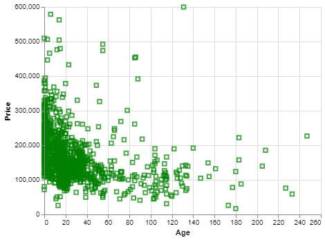
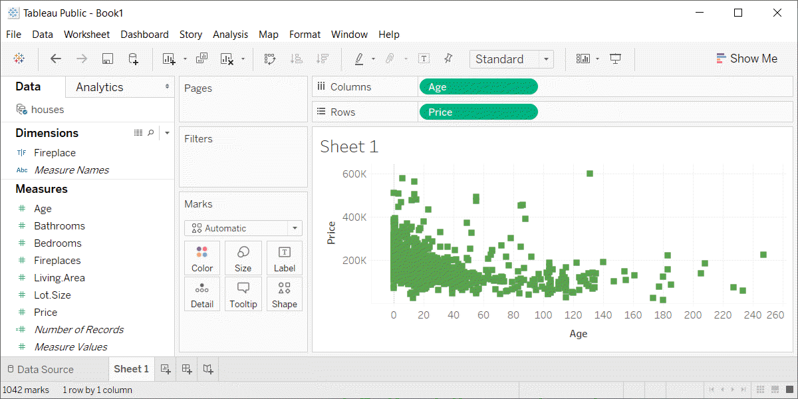

```{r child="../../common-files/src/component-header.Rmd"}
```

### Exercise, change the color and shape
+ Use the Saratoga housing data set.
+ Change the default color to any color you like
+ Change the default shape to any shape you like

<div class="notes">

Take the scatterplot that you have already drawn and change the color of the points. Any color is fine as long as it is different from the default color. Change the shape of the points as well to any shape you want.

</div>

### Exercise, Python code
+ Here's the Python code.
```
ch = alt.Chart(df).mark_point(
    shape="square",
    color="green"
).encode(
    x='Age',
    y='Price'
)
```

<div class="notes">

In Python, you change defaults inside the mark_point function.

</div>

### Exercise, Python output

```{python}
import pandas as pd
import altair as alt
df = pd.read_csv("../../common-files/data/houses.csv")
ch = alt.Chart(df).mark_point(
    shape="square",
    color="green"
).encode(
    x='Age',
    y='Price'
)
ch.save("../images/python/change-default.html")
```



<div class="notes">

Here's what my output looks like. You are welcome to experiment with different colors and different shapes.

</div>

### Exercise, R code
+ Here's the R code
```
ggplot(saratoga_houses, aes(x=Age, y=Price)) +
  geom_point(shape="square", color="green")
```

<div class="notes">

The change in default shape and color are found in the geom_point function.

</div>

### Exercise, R output

```{r change-default}
initiate_image()
saratoga_houses <- read.csv("../../common-files/data/houses.csv")
ggplot(saratoga_houses, aes(x=Age, y=Price)) +
  geom_point(shape="square", color="green")
finalize_image()
```

`r display_image`

<div class="notes">

This is the R output. Try other options if you have time.

</div>

### Exercise, Tableau output



<div class="notes">

Here is the Tableau output.

</div>