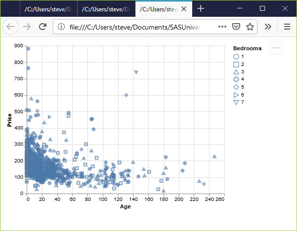
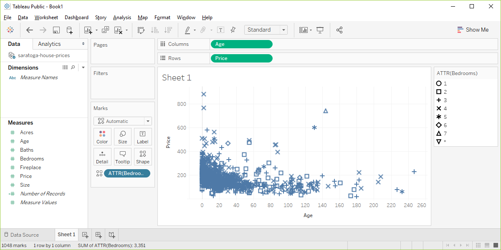

```{r child="../../common-files/src/component-header.Rmd"}
```

### Exercise, change the shape

+ Use the Saratoga housing data set.
+ Draw a plot of all of the data where
  + X=Age,
  + Y=Price,
  + Symbol=number of bedrooms.
  
<div class="notes">

Revisit your scatterplot. Draw a plot with x representing the age of the house, y representing the price, and the symbol representing the number of bedrooms.

</div>

### Exercise, Python code 
+ Here's the Python code.

```{}
ch = alt.Chart(df).mark_point().encode(
    x='Age',
    y='Price', 
    shape='Bedrooms:N'
)
```

<div class="notes">

In Python, when you want the shape to vary by the levels of a particular variable, you specify this in the encode function. This Python program has three variables that are mapped. Age is mapped to the X location, Price is mapped to the Y location, and Bedrooms is mapped to various shapes.

Bedrooms is on a continuous scale, and you have to tell Python that you want to treat it as if it were nominal.

</div>

### Exercise, Python output



<div class="notes">

This is what the plot looks like. There is a terrible mix of shapes with no obvious pattern.

</div>

### Exercise, R code 
+ Here's the R code.

```{}
ggplot(saratoga_houses, aes(x=Age, y=Price)) + 
  geom_point(aes(shape=factor(Bedrooms)))
```

<div class="notes">

Here is the R code. When the shape of a point is dependent on a variable, you need to specify that variable inside the aes function. You could have defined it inside the existing aes function in the first line of code, but you can also add an aes function to the geom_point function.

I like the second option because it makes the code a bit easier to read.

Bedrooms is numeric, and by default in R is treated as a continuous variable. You can convert it to a nominal variable with the factor function.

</div>

### Exercise, R output

```{r shape-bedrooms}
saratoga_houses <- read.csv("../../common-files/data/houses.csv")
initiate_image()
ggplot(saratoga_houses, aes(x=Age, y=Price)) + 
  geom_point(aes(shape=factor(Bedrooms)))
finalize_image("R scatterplot mapping bedrooms to shape")
```

`r display_image`

<div class="notes">

Here is what the R graph looks like. I don't particularly like this graph. It is confusing, especially with all the overprinting.

</div>

### Exercise, Tableau output



<div class="notes">

Here are the steps in Tableau. First revert to the earlier scatterplot where Age is in the Column fields and Price is in the Rows field. Then drag and drop Bedrooms on top of the Shape icon. Change from SUM(Bedrooms) to Dimension Categorical. 

</div>
