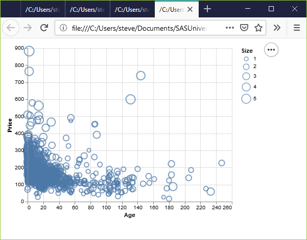

```{r child="../../common-files/src/component-header.Rmd"}
```

### Exercise, change the size
+ Use the Saratoga housing data set.
+ Draw a plot of all of the data where
  + X=Age,
  + Y=Price,
  + Size=Living.Area.
  
<div class="notes">

Revisit your scatterplot. Draw a plot with x representing the age of the house, y representing the price, and the size representing the living area.

</div>

### Exercise, Python code
+ Here's the Python code
```{}
ch = alt.Chart(df).mark_point().encode(
    x='Age',
    y='Price',
    size='Living.Area'
)
```

<div class="notes">

For Altair/Python, you define the variable associated with size in the encode function.

</div>

### Exercise, Python output



<div class="notes">

This plot is a bit of a jumble, but you do notice that the very very high prices are all large circles, meaning spacious houses.

</div>

### Exercise, R code
+ Here's the R code.
```
ggplot(saratoga_houses, aes(x=Age, y=Price)) + 
  geom_point(aes(size=Living.Area))
```

<div class="notes">

With R, you put the variable associated with size in the aes function. Here, I placed this particular aes function in the geom_point function, but it would be okay to specify it as part of the earlier aes function inside the ggplot function.

</div>

### Exercise, R output

```{r size-living-area}
load("../../common-files/data/houses.RData")
initiate_image()
ggplot(saratoga_houses, aes(x=Age, y=Price)) + 
  geom_point(aes(size=Living.Area))
finalize_image("R graph using size to represent Living Area")
```

`r display_image`

<div class="notes">

This plot shows the same pattern as earlier. The spacious houses tend to be clustered near the top of the graph, the expensive part of the graph.

</div>

### Exercise, Tableau steps
+ Drag Age to the Columns field, Price to Rows field
  + Change to Dimension, Continous (green pill)
+ Drag Living.Area to the Shape button

<div class="notes">

Here are the steps to create a scatterplot in Tableau where the size of the data points varies.

</div>

### Exercise, Tableau output


<div class="notes">

In Tableau, you drag and drop the Living.Area variable on the Size icon. The results are pretty much the same.

</div>