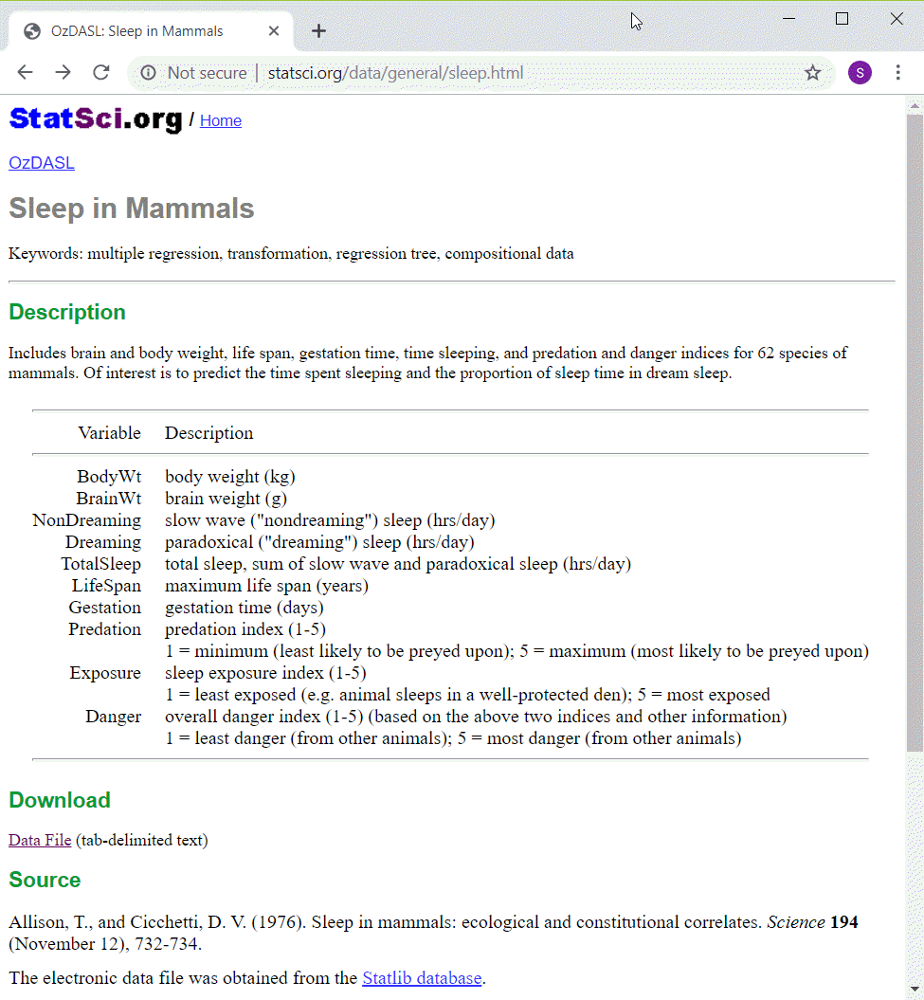
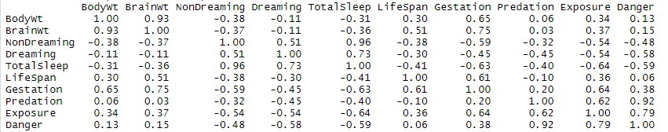

### Advanced exercise

+ There is a second data set on sleep in 
mammals. You can find a brief description of
this data set at
  + http://www.statsci.org/data/general/sleep.html
+ You can download the actual data at
  + http://www.statsci.org/data/general/sleep.txt

This is an interesting data set. You can download from the web, or I can provide a comma separated value format for you to use.

### Data dictionary

This is the data dictionary for this file, from the website listed above.

### Advanced exercise
+ There are some interesting relationships among the variables. Explore whatever strikes you as interesting. Some possibiilities include
  + bodywt and predation
  + gestation and lifespan
  + exposure and totalsleep
+ Draw a visualization
  + illustrates an intersting interrelationships
  + use a third variable for shape, size, or color

### Correlations

You might find this table of correlations helpful when deciding what relationships to explore.

