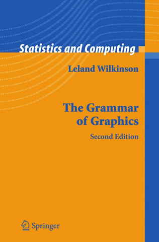
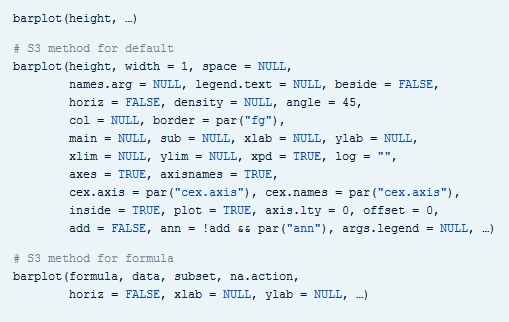
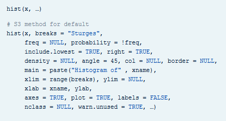
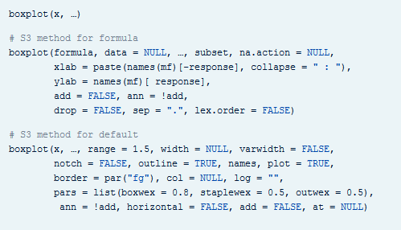
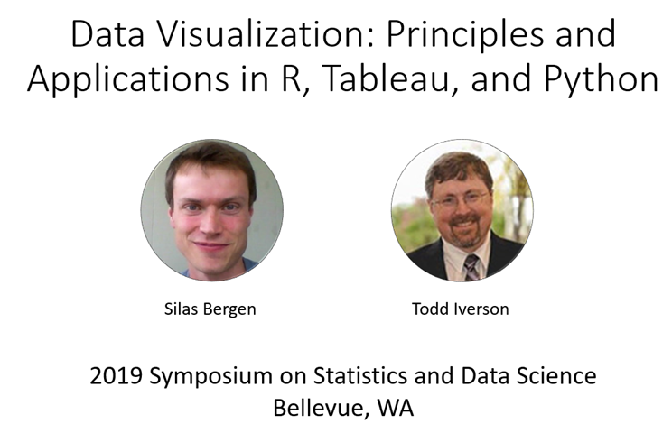
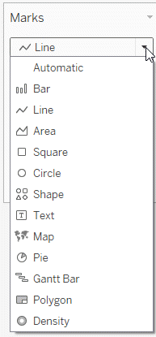
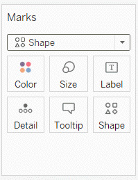
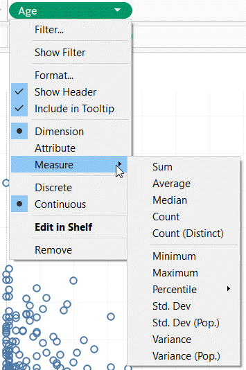

### Grammar, Theoretical foundation of data visualization

Most of the current designers of data visualization software have based their work on the theoretical foundations of Leland Wilkinson. This includes ggplot2 in r, altair in Python, and Tableau, among others. Dr. Wilkinson wrote a book, The Grammar of Graphics, in 1999 (second edition in 2006) that laid out the principles for the development of pretty much any data visualizaton that you could imagine. The work is mathematically rigorous, and I do not recommend that you read this book unless you enjoy that sort of thing. I do want to highlight a few of the fundamental ideas in the book

### Grammar, Visualization before Wilkinson (1 of 3)

I'm going to do one of those bad things that a presenter should never do. I'm going to show you a series of three slides that is intended to create a sense of confusion. I'm doing this because I want you to appreciate how bad things were before Leland Wilkinson came along.

There's a saying that a camel is a horse designed by a committee. Well, this slide and the next two slides represent some very ugly looking camels.

Here's the help function from the program R for the barplot function. This function and the following were developed before Wilkinson's work and show the problem without using his framework.

I don't want you to study this help file closely. I just want to emphasize two points.

First, there are a dizzying number of options, 30 for the barplot. Maybe this is unavoidable. But what follows when you look at the next help function is the real problem.

When you switch from one function to another, from one visualization method to another, the options change. This is bad because it makes it harder for you to learn new graphical display methods. Even after you learn them, you will have a difficult time remembering which options and which defaults go with which graphical displays.

### Grammar, Visualization before Wilkinson (2 of 3)

Here's the help function from the program R for the hist function. The default option for the borders of the bars of a barplot differ from the option for the borders of the bars of a histogram. This makes no sense. A histogram is different than a bar chart, but not that much different.

The way that you determine the limits for the x-axis and the y-axis differ. Again, how is a histogram so much different from a barplot that you need different methods for deciding something like this?

### Grammar, Visualization before Wilkinson (3 of 3)

If that isn't confusing enough, look at the help file for the boxplot.

It's pure chaos. Each function has a different set of arguments, listed in a different order and with different default options. This continues when you look at help for the pie function for pie charts, the contour function for contour plots, the persp3d function for three dimensional surfaces, the stem function for stem and leaf diagrams, and many others.  

Adopting the framework developed in The Grammar of Graphics provides you with one stop shopping. It is a bit daunting at first, because it includes everything and the kitchen sink. But once you get comfortable with it, you will find that each new visualization that you try uses the same syntax, more or less. 

### Grammar, Helpful resource

In this section, I am going to borrow heavily from a short course presented at the 2019 Symposium on Statistics and Data Science. The presenters are nice enough to share their materials on their github site. You can find it easily with a google search of bergen iverson sdss2019 data visualization.

### Grammar, Definition of data visualization
+ "A mapping of data to the visual aesthetics of geometries/marks" 
  + Bergen and Iverson 2019
  

A definition of visualization, based on the Grammar of Graphics framework is provided in the Bergan and Iverson presentation that I mentioned on the previous slide.

There are four nouns in this definition.

Data. I hope I don't have to define data other than to say that it is an interesting set of numbers. I won't talk about non-numeric data like text in this workshop. Ideally these numbers have enough structure that you can put them into a rectangular grid like a spreadsheet or database table.

Aesthetics is a work that Dr. Wilkinson likes, but I'm not so sure that I care for it. An aesthetic is a visual feature.

The compound noun geometries/marks is a deliberate choice of Bergen and Iverson. If you use ggplot2 in R, you will be more comfortable with the noun geometries. If you use altair in Python, or if you use Tableau, you will be more comfortable with the noun marks.

Mapping means a transformation. You are taking data and converting it into various visual features.

It will help to see some examples.

  
### Grammar, Examples  
+ Geometries/marks
  + Points
  + Lines
  + Bars
+ Aesthetics
  + Position
  + Shape
  + Size
  + Color

Think of geometries/marks are ink placed on a sheet of paper. They could represent points, lines, or bars, among other things. 

Geometries/marks have several major visual properties, known as aesthetics. The aesthetics include position, shape, size, and color.

Not every geometry/mark will have every possible aesthetic. Some of these aesthetics can be combined to great effect, but sometimes they work antagonistically. Do consider every possible aesthetic in your graph, but intentionally ignoring an aesthetic can sometimes work to your advantage. Some aesthetics map very nicely to continuous data, but others only work well with categorical data.

### Grammar, Geometries/marks in Python
+ mark_point
+ mark_line
+ mark_bar

You specify the type of geometry/mark in Python using a range of mark functions.

### Grammar, Geometries/marks in R
+ geom_point
+ geom_line
+ geom_bar

You specify the type of geometry/marks in R using a range of geom functions.

### Grammar, Geometries/marks in Tableau

  

Tableau will try to guess what type of marks to use, but if it guesses wrong, you can correct things with the Marks pull down menu. This menu gives you options for (among other things) Bar, Line, and Shape (points).

Note that square and circle are special cases of points. This makes things a bit confusing, unfortunately. Always choose Shape because it gives you more latitude to change things.

### Grammar, Mapping to aesthetics in Python
+ encode function
  + x=
  + y=
  + shape=
  + size=
  + color=
+ Example
  + alt.Chart(*data*).mark_point().encode(
    x='*var1*', y='*var2*', size='*var3*',
    shape='*var4*', color='*var5*')
    

In Python, the mapping is done with the encode function. The location is represented by x= and y= arguments. Size, shape, and color are mapped using the size=, shape=, and color= arguments.

### Grammar, Mapping to aesthetics in R
+ aes function
  + x=
  + y=
  + size=
  + shape=
  + color=
+ Example
  + ggplot(*data*, aes(x=*var1*, y=*var2*)) +
  + geom_point(aes(size=*var3*, shape=*var4*, color=*var5*))

In R, the mapping is done with the aes (short for aesthetics) function. The location is represented by x= and y= arguments. Size, shape, and color are mapped using the size=, shape=, and color= arguments.

### Grammar, Mapping to aesthetics in Tableau

Tableau accomplishes mapping through a drag and drop interface. Drag a variable to the Columns field and a second variable to the Rows field to specify the x and y locations. Drag a variable on top of the size, shape, and color icons to map those variables appropriately.

### Grammar, changing variable types in Python
+ Q: Quantitative
  + Use for continuous variables
+ O: Ordinal
  + Use for ordered categories
+ N: nominal
  + Use for unordered categories
+ T: Temporal
  + Use for time variables
  

All of these graphic packages will make assumptions about what the data represents, and set certain default graphic types on the basis of these guesses. Those choices are usally good, but when they are not, then you can override these guesses.

In Altair/Python, you use letter codes.

The letter Q (quantitative) will tell the system that you want to treat this variable as continuous.

The letter O (Ordinal) will tell the system that you want to treat this variable as ordered categories.

The letter N (Nomina) will tell the system that you want to treat this variable as unordered categories.

The letter T (Temporal) will tell the system that you want to treat this variable as a measure of time.

### Grammar, Changing variable types in R
+ as.numeric()
  + Use for continuous variables
+ as.character(), as.factor()
  + Use for categorical variables
+ as.Date()
  + Use for date variables

There are lots of conversion functions in R, and it beyond the scope of the class to cover them. But sometimes you will find in R that you need to convert the variable type before you do certain analyses. If you want to represent a variable as continuous, the as.numeric function will often do the trick. If you want to represent a variable as categorical, then try the as.character or as.factor functions. For temporal data, try the as.Date function.

### Grammar, Changing variable types in Tableau
+ Dimension Discrete (blue pill)
  + Use for categorical variables
+ Dimension Continuous (green pill)
  + Use for continuous variables
+ Measure
  + Use for summary measures (average, count, etc.)

In Tableau, use Dimension Discrete to designate catergorical data. The color of the "pill" for your variable will change to blue when you make this choice. Use Dimension Continuous for continuous data. The color of the "pill" for your variable will change to green when you make this choice.

Use Measure when you want to display not the invidual values within a group but rather an aggregate or summary statistic, such as a mean or a count.

### Grammar, Changing variable types in Tableau

This image shows the pull down menu for a variable with the choices you get.

### Grammar, Summary
+ "A mapping of data to the visual aesthetics of geometries/marks" 
+ Geometries/marks
  + Point
  + Bar
  + Line
+ Aesthetics
  + Location
  + Size
  + Shape
  + Color
  

Data visualization is a mapping of data.

Geometries/marks include points, bars, and lines. Aesthetics include location, size, shape, and color.

These ideas are implemented in Python (Altair), R (ggplot2), and Tableau.

