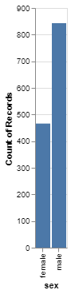
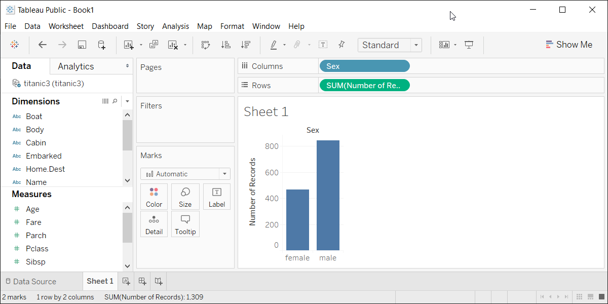

```{r child="../../common-files/src/component-header.Rmd"}
```

```{r}
load("../../common-files/data/titanic.RData")
```

### Exercise, Gender barchart
+ Draw a bar chart showing the number of people in each gender (use the Sex variable).

<div class="notes">

Now try to draw a different bar chart, one that shows the count for each Gender.

</div>

### Exercise, Python code
+ Here's the Python code
```{}
ch = alt.Chart(df).mark_bar().encode(
    x='sex',
    y='count()'
)
```

<div class="notes">

Here is the Python code. You insert sex and count into the encode function.

</div>

### Exercise, Python output

```{python}
import pandas as pd
import altair as alt
df = pd.read_csv("../../common-files/data/titanic3.csv")
ch = alt.Chart(df).mark_bar().encode(
    x='sex',
    y='count()'
)
ch.save("../images/python/gender-barchart.html")
```



<div class="notes">

Here is the Python output.

</div>

### Exercise, R code
+ Here's the R code
```
ggplot(titanic, aes(sex)) +
  geom_bar()
```

### Exercise, R output

```{r gender-barchart}
initiate_image()
ggplot(titanic, aes(sex)) +
  geom_bar()
finalize_image()
```

`r display_image`

<div class="notes">

This the R code. You put the sex variable inside the aesthetic (aes) function. The count is implied as the default.

</div>

### Exercise, Tableau steps
+ Drag Sex to the columns AND the rows.
  + Change Sex in the columns to Dimension, Discrete (blue pill)
  + Change Sex in the rows to Measure, Count.
  
<div class="notes">

You use drag and drop to create a gender barchart. Drag Sex to both the rows and the columns. In the columns, change it to a blue pill, representing a discrete dimension. In the rows, change it to a count summary.

</div>


### Exercise, Tableau output



<div class="notes">

Here is the Tableau output.

</div>
