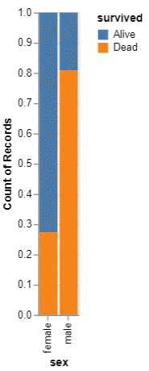
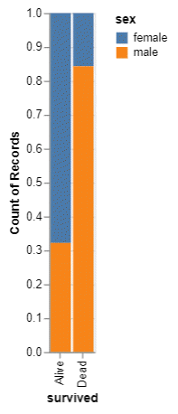

```{r child="../../common-files/src/component-header.Rmd"}
```

```{r}
load("../../common-files/data/titanic.RData")
```

### Exercise, Mortality by gender
+ Draw a bar chart showing counts involving both mortality and gender. Use normalized bars.

<div class="notes">

Mortality on the Titanic reflects the fact that this was an era when people really did believe in the concept of "women and children first." Someone like me, I'd be shoving the little kids aside so I could get on one of the lifeboats.

Anyway, examine how mortality is related to gender. It's a spoiler alert, but on the Titanic, Kate survives, but Leonardo, I am so sad to say this, didn't make it.

</div>

### Exercise,Python code
+ Python code
```
ch = alt.Chart(df).mark_bar().encode(
    x='sex',
    y=alt.Y('count()', stack='normalize'),
    color='survived'
)
```
+ Alternative
```
ch = alt.Chart(df).mark_bar().encode(
    x='survived',
    y=alt.Y('count()', stack='normalize'),
    color='sex'
)
```

<div class="notes">

Here is the Python code. Notice that there are two different approaches.

</div>

```{python}
import pandas as pd
import altair as alt
df = pd.read_csv("../../common-files/data/titanic3.csv")
ch = alt.Chart(df).mark_bar().encode(
    x='sex',
    y=alt.Y('count()', stack='normalize'),
    color='survived'
)
ch.save("../images/python/mortality-by-sex.html")
ch = alt.Chart(df).mark_bar().encode(
    x='survived',
    y=alt.Y('count()', stack='normalize'),
    color='sex'
)
ch.save("../images/python/sex-by-mortality.html")
```

### Exercise, Python output, Mortality by sex



<div class="notes">

This is what the Python normalized barchart looks like.

</div>

### Exercise, Python output, Sex by mortality



<div class="notes">

This is what the alternate version of the Python normalized barchart.

</div>

### Exercise, R code
+ R code
```
ggplot(titanic, aes(x=survived, fill=sex)) +
  geom_bar(position="normalize")
```
+ Alternate version
```
ggplot(titanic, aes(x=sex, fill=survived)) +
  geom_bar(position="normalize")
```

### Exercise, R output, Mortality by sex

```{r mortality-by-sex}
initiate_image()
ggplot(titanic, aes(x=survived, fill=sex)) +
  geom_bar(position="fill")
finalize_image()
```

`r display_image`

<div class="notes">

Here is the R output.

</div>

### Exercise, R output, Sex by mortality

```{r sex-by-mortality}
initiate_image()
ggplot(titanic, aes(x=sex, fill=survived)) +
  geom_bar(position="fill")
finalize_image()
```

`r display_image`

<div class="notes">

Here is the alternate version.

</div>

### Exercise, Tableau output, mortality by sex


<div class="notes">

Here is the Tableau output.

</div>

### Exercise, Tableau output, sex by mortality


<div class="notes">

Here is the alternate version.

</div>