```{r child="../../common-files/src/component-header.Rmd"}
```

### Fundamentals
+ Fewer in numbers than points
+ Usually a summary statistic
  + Count
  + Percent
  + Average
  + Total
+ A bar chart is NOT a histogram
  
<div class="notes">

Bar charts are different than point charts. There are usually only a few bars. These bars usually represent a summary statistic, like a count, percent, average, or total.

There is a technical distinction between a bar chart and a histogram. Histograms are a great diagnostic tool, but usually ends up on the cutting room floor. So I won't be talking about it much, if at all, in this workshop.

</div>

### Fundamentals, Aesthetics for bars
+ Review
  + Location
  + Size
  + Color
  + NOT shape!!!
  
<div class="notes">

Recall that aesthetics are visual attributes associated with a geometry/mark. You can map variables to the location, size, and/or color of bars, but you cannot assign a variable to the shape of a bar.

There is a bit of potential ambiguity on bar charts. If you are looking at a vertical bar chart (the bar chart shown earlier is a vertical bar chart), then the location on the x-axis represents which category. For the vast majority of bar charts, the bars are anchored on the x-axis, though there are a few exceptions.

The location of the Y-axis, then, is the measure of the bar's height. You could, if you wanted to, call this the bar's size, but most people think of the bar's size as the width of the bar. For the vast majority of cases, the width of a bar is constant, but there are a few exceptions.

The color of a bar can refer to the interior of the bar or the border of the bar. Usually these two colors are the same, but there are some exceptions.

 We won't talk about the exceptions in this lecture, but you are welcome to ask about them, if you are curious.

You cannot vary the shape of a bar. A bar is a bar.

</div>

### Fundamentals, Basic barchart
+ Python code
```
ch = alt.Chart(df).mark_bar().encode(
    x='pclass:N',
    y='count()'
```
+ R code
```
ggplot(ti, aes(x=pclass)) +
  geom_bar()
```
+ Tableau
  + Drag and drop

<div class="notes">

The Python/Altair code uses the mark_bar function instead of mark_point. You encode the passenger class on the x axis, but you have to remind Python/Altair that the values of 1, 2, and 3 represent categories of first class, second class, and third class. The y axis represents the count.

The code in R uses the geom_bar function. You can get away with specifying only a single location, the x-axis, because the default in geom_bar is to use the count as the location on the y-axis.

</div>

### Fundamentals, Python output for basic barchart


<div class="notes">

This is the Python version of the barchart.

This is data from the Titanic, a ship that was as massive as its name. It was considered unsinkable, but on its maiden voyage in 1912, the ship hit an iceberg and sank. It sank during an era where people really believed in women and children first, and this shows quite clearly in the mortality statistics. There was a difference, though, between third class passengers like Leonardo diCaprio and first class passengers like Kate Winslet.

This shows a simple bar chart. The x-axis is passenger class and the y-axis is count. Note that there are about the same number of first and second class passengers, but the two combined does not come close to the number of third class passengers.

</div>

### Fundamentals, R output for basic barchart

```{r basic-barchart-again}
initiate_image()
load("../../common-files/data/titanic.RData")
ggplot(titanic, aes(pclass)) +
  geom_bar()
finalize_image()
```

`r display_image`

<div class="notes">

This is the R version of the barchart.

</div>

### Fundamentals, Tableau output for basic barchart


<div class="notes">

Here is the Tableau output. Notice the columns (the x-axis) is a blue pill. That tells Tableau that passenger class is a discrete dimenion (or categorical). The rows (y-axis) is the count summary function.

</div>

<!--- Exercise --->

```{r child="exercise-gender-barchart.Rmd"}
```

### Fundamentals, changing the default
+ Python code
```
ch = alt.Chart(df).mark_bar(
    color='#FF0000', 
    size=5
).encode(
    x='pclass:N',
    y='count()'
)
```
+ R code
```
ggplot(titanic, aes(pclass)) +
  geom_bar(fill="#FF0000", width=0.5)
```
+ Tableau
  + Point and click

<div class="notes">

Here is the code to change the color and the size of all the bars. In Altair/Python, you place color and size arguments inside the mark_bar function. The size represents the number of pixels (not counting a one pixel border), so a value of 5 will produce a 7 pixel barrather narrow bar. The default in Python is to leave a 3 pixel gap between each bar.

In R, the arguments are different. You specify the color of a bar with the fill argument. If you tried to use the color argument, it would change the color of the border, and leave the interior of the bar as the default color.

R also uses the width argument rather than size. This might not be the best choice, but width is less ambiguous than size, which could just as easily refer to the height as the width of the bar.

In R, width is a relative measure, and a value of 1 would mean that the bars fill up the entire space without any gaps. The value of 0.5 shown here will make the bars fill 50% of the space, making the bar widths equal to the width of the gaps. The default in R is 0.8.

In Tableau, you click on the color button to change the color for every bar. You click on the size button to change the width of the bars. Slide all the way to the right to have the bars touching and all the way to the left to get a single pixel width bar.

</div>

### Fundamentals, Python output for changing the default

```{python}
import pandas as pd
import altair as alt
df = pd.read_csv("../../common-files/data/titanic3.csv")
ch = alt.Chart(df).mark_bar(
    color='#FF0000',
    size=5
).encode(
    x='pclass:N',
    y='count()'
)
ch.save("../images/python/red-bars.html")
```

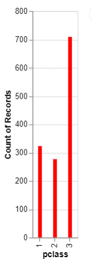

### Fundamentals, R output for changing the default

```{r red-bars}
load("../../common-files/data/titanic.RData")
initiate_image()
ggplot(titanic, aes(pclass)) +
  geom_bar(fill="#FF0000", width=0.5)
finalize_image("Bar chart of passenger class count")
```

`r display_image`

<div class="notes">

Here is the output in R. Notice that the gaps between the bars are equal to the widths of the bars themselves.

</div>

### Fundamentals, Tableau output for changing the default

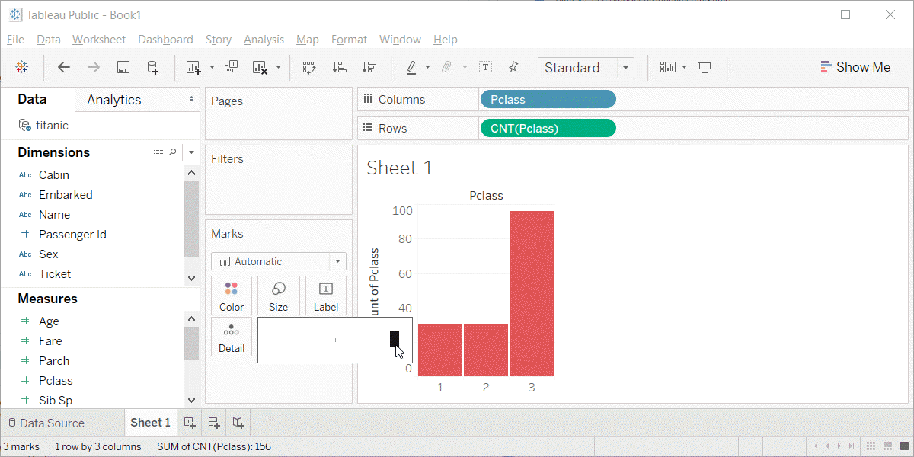

<div class="notes">

This is what Tableau produces. I am showing the slider bar that appears when you click on the size button. It is almost all the way to the right, so the bars are very fat and there is only a very tiny gap between the bars.

</div>

### Fundamentals, Color
+ Use for emphasis in simple bar charts
+ Very important for stacked or side-by-side bar charts

<div class="notes">

For simple bar charts like all the ones we've seen so far, color is not really needed. You already can distinguish between the passenger classes using the location. If you do use color in a simple bar chart, it is often to emphasize a point. In the previous bar chart, I used red for third class, because Kate Winslet, a rich first class passenger, found true love in third class, with the adorable Leonardo di Caprio.

Color becomes very important in just a minute when we add another layer of complexity.

</div>

### Fundamentals, Coding colors
+ Python code
```
ch = alt.Chart(df).mark_bar().encode(
    alt.Color('pclass:N'),
    x='pclass:N',
    y='count()'
)
```
+ R code
```
ggplot(titanic, aes(x=pclass)) +
  geom_bar(aes(fill=pclass))
```
+ Tableau
  + Point and click

<div class="notes">

If you want each bar to be a different color, then in Python, you have to include the color inside the encode function.

In R, you have to place the variable inside the aes function.

In Tableau, you have to drag and drop the variable on top of the color button.

</div>

### Fundamentals, Choosing your own colors
+ Python code
```
ch = alt.Chart(df).mark_bar().encode(
    alt.Color(
        'pclass:N',
        scale=alt.Scale(
            range=['#00FF00', '#FFFF00', '#FF0000']
        )
    ),
    x='pclass:N',
    y='count()'
)
```
<div class="notes">

While the default colors chosen by your software are almost always good, you should experiment with different color combinations. A common choice for a three level ordinal variable is the traffic light colors of red, yellow, and green.

In Python, you add a scale argument to encode.

</div>

### Fundamentals, Choosing your own colors
+ R code
```
ggplot(titanic, aes(x=pclass)) +
  geom_bar(aes(fill=pclass)) +
  scale_fill_manual(values=c("#00FF00", "#FFFF00", "#FF0000"))
```
+ Tableau
  + Point and click

<div class="notes">

In R, you have to add another layer to the graph with the scale_fill_manual function. 

In Tableau, you click on each color in the legend, then click in the upper corner to lock in that bar only. Then click on the color button to change that bar to the desired color.

</div>


### Fundamentals, Python output for coding colors
```{python}
import pandas as pd
import altair as alt
df = pd.read_csv("../../common-files/data/titanic3.csv")
ch = alt.Chart(df).mark_bar().encode(
    alt.Color(
        'pclass:N',
        scale=alt.Scale(
            range=['#00FF00', '#FFFF00', '#FF0000']
        )
    ), 
    x='pclass:N',
    y='count()'
)
ch.save("../images/python/traffic-light.html")
```

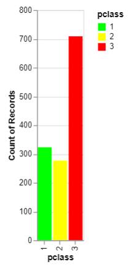

<div class="notes">

This is what the Python bar chart looks like.

</div>

### Fundamentals, R output for coding colors

```{r bar-color}
load("../../common-files/data/titanic.RData")
initiate_image()
ggplot(titanic, aes(x=pclass)) +
  geom_bar(aes(fill=factor(pclass))) +
  scale_fill_manual(values=c("#00FF00", "#FFFF00", "#FF0000"))
finalize_image("Barchart with traffic light colors")
```

`r display_image`

<div class="notes">

This is what the R graph looks like.

</div>

### Funadamentals, Tableau output for coding colors

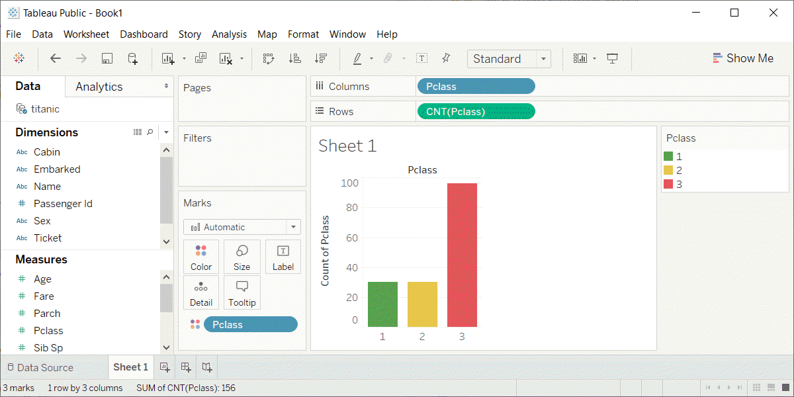

<div class="notes">

Here is the Tableau output.

</div>

<!--- Exercise --->

```{r child="exercise-first-class-red.Rmd"}
```

### Fundamentals, Stack, Dodge, Normalize
+ Summarize by two categories
+ Dodge
  + Side by side
+ Stack
  + One on top, one on bottom
+ Normalize
  + Stack and set full bar to 100%

<div class="notes">

Bar charts that represent a summary across a single categorical variable are fairly simple and easy to handle. But when you want to summarize by two categories simultaneously, things get interesting. Interesting in a good way.

You can present the extra category in side by side comparisons. This is called "dodge" in R, but is handled indirectly in Python and Tableau.

The stack option, where one category level is placed above another category level above another, is the default in all three packages, though you should take the trouble of specifying stack if you are using R.

The normalize option creates stacked bars, but then forces each stack to have a height of 1 (or 100%).

</div>

### Fundamentals, code for stack
+ Python code
```
ch = alt.Chart(df).mark_bar().encode(
    x='pclass:N',
    y='count()',
    color='sex'
)
```
+ R code
```
ggplot(titanic, aes(x=pclass, fill=sex)) +
  geom_bar(position="stack")
```
+ Tableau steps
  + Point and click

<div class="notes">

if you specify a third variable in the color argument, Python will, by default, create a stacked chart. In R, you have to specify position="stack" inside the geom_bar function.

</div>

### Fundamentals, Python output for stacked bars
```{python}
import pandas as pd
import altair as alt
df = pd.read_csv("../../common-files/data/titanic3.csv")
ch = alt.Chart(df).mark_bar().encode(
    x='pclass:N',
    y='count()',
    color='sex'
)
ch.save("../images/python/stack.html")
```

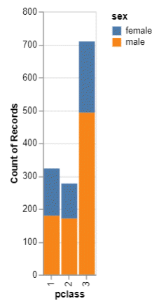

<div class="notes">

This is the Python output.

</div>

### Fundamentals, R output for stacked bars

```{r count-by-stack}
load("../../common-files/data/titanic.RData")
initiate_image()
ggplot(titanic, aes(x=pclass, fill=sex)) +
  geom_bar(position="stack")
finalize_image()
```

`r display_image`

<div class="notes">

This is the R output.

</div>

### Fundamentals, Tableau output for stacked bars

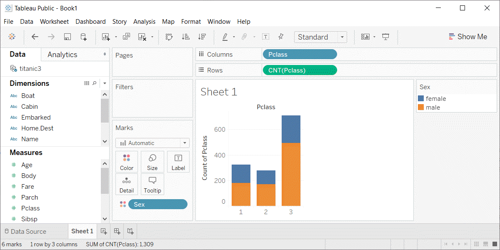

<div class="notes">

Here is the stacked barchart in Tableau. Drag pclass to the x-axis, count of pclass to the y-axis, and sex to the color button.

</div>

### Fundamentals, code for dodge
+ Python code
```
ch = alt.Chart(df).mark_bar().encode(
    x='sex',
    y='count()',
    color='sex',
    column='pclass:N'
```
+ R code
```
ggplot(titanic, aes(x=pclass, fill=sex)) +
  geom_bar(position="dodge")
```
+ Tableau
  + Point and click
  
<div class="notes">

Here is the code in Python for dodged bars. You code sex as you x location and your color. Then you code the column argment as pclass.

In R, you change the argument inside the geom_bar function to position="dodge".

Tableau uses point and click, which I will describe below.

</div>

### Fundamentals, Python output for dodged bars

```{python}
import pandas as pd
import altair as alt
df = pd.read_csv("../../common-files/data/titanic3.csv")
ch = alt.Chart(df).mark_bar().encode(
    x='sex',
    y='count()',
    color='sex',
    column='pclass:N'
)
ch.save("../images/python/dodge.html")
```

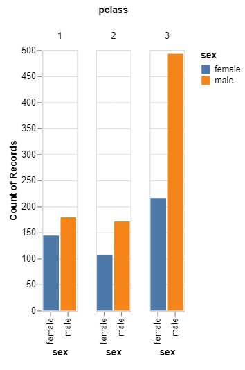

<div class="notes">

Here is the dodged bar chart in Python.

</div>

### Fundamentals, R output for dodged bars

```{r count-by-dodge}
load("../../common-files/data/titanic.RData")
initiate_image()
ggplot(titanic, aes(x=pclass, fill=sex)) +
  geom_bar(position="dodge")
finalize_image()
```

`r display_image`

<div class="notes">

This is what the dodged bar chart looks like in R.

</div>

### Fundamentals, Tableau steps for dodged bars

+ Drag pclass to columns
  + Set to Dimension Discrete
+ Drag pclass to columns
  + Set to measure, count.
+ Drag sex to columns (to the right of pclass)
  + Set to Dimension Discrete
+ Drag sex to color button
  + Set to Dimension Discrete

<div class="notes">

Here are the steps in Tableau for a dodged bar chart. You have to double up on the columns field. 

</div>

### Fundamentals, Tableau output for dodged bars

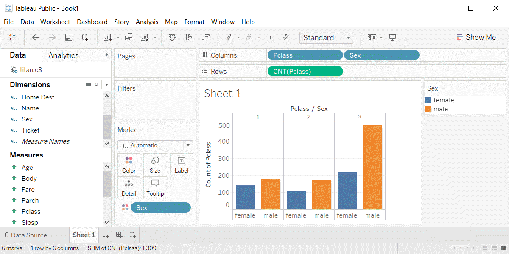

<div class="notes">

This is what the Tableau output looks like.

</div>

### Fundamentals, Code for normalize
+ Python code
```
ch = alt.Chart(df).mark_bar().encode(
    x='sex',
    y=alt.Y('count()', stack='normalize'),
    color='pclass:N'
)
```
+ R code
```
ggplot(titanic, aes(survived)) +
  geom_bar(aes(fill=sex), position="fill")
```
+ Tableau
  + Drag and drop

<div class="notes">

If you want a stacked barchart in Altair/Python, you need to use the alt.Y function with the stack='normalize' argument.

In R, you use the position='fill' argument in the geom_bar function. Note that this argument falls outside of the aes function.

In Tableau, you right click on the count summary, and pick Add Table Calculation from the drop down menu. In the dialog box, select Percent of Total and Compute Using Cell.

</div>

### Fundamentals, Python output for normalized bars

```{python}
import pandas as pd
import altair as alt
df = pd.read_csv("../../common-files/data/titanic3.csv")
ch = alt.Chart(df).mark_bar().encode(
    x='sex',
    y=alt.Y('count()', stack='normalize'),
    color='pclass:N'
)
ch.save("../images/python/normalize.html")
```

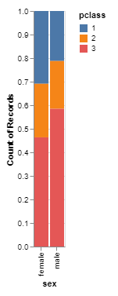

<div class="notes">

This is what the Python normalized barchart looks like.

</div>

### Fundamentals, R output for normalized bars

```{r count-by-normalize}
load("../../common-files/data/titanic.RData")
initiate_image()
ggplot(titanic, aes(x=pclass, fill=sex)) +
  geom_bar(position="fill")
finalize_image()
```

`r display_image`

<div class="notes">

This is what the normalized bar chart looks like in R.

</div>

### Fundamentals, Tableau output for normalized bars

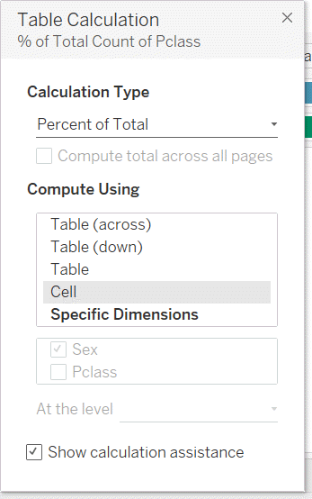

<div class="notes">

In Tableau, you right click on the count summary, and pick Add Table Calculation from the drop down menu. In the dialog box, select Percent of Total and Compute Using Cell.

</div>

### Fundamentals, Tableau output for normalized bars

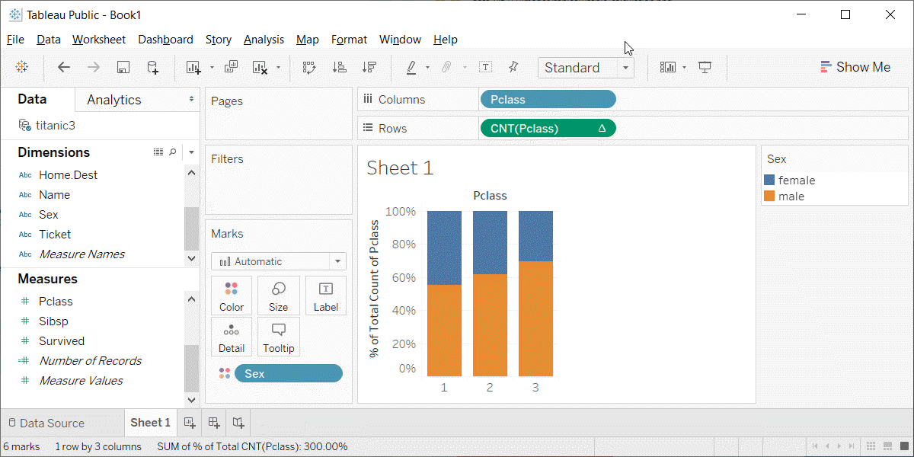

<div class="notes">

This is what the visualization looks like in Tableau.

</div>

<!--- Exercise --->

```{r child="exercise-mortality-by-sex.Rmd"}
```

### Fundamentals, Summaries other than count
+ Summaries vary by package
+ All three include
  + Mean
  + Sum
  + Minimum
  + Maximum
  
<div class="notes">

There are more summaries that you can create bar charts for. The summary functions vary by package, but all of them allow you to compute a mean, sum, minimum value, and maximum value.

</div>

### Fundamentals, Code for mean summary
+ Python code
```
ch = alt.Chart(df).mark_bar().encode(
    x='sex',
    y='mean(age)'
)
```
+ R code
```
  stat_summary(fun.y=mean, geom="bar")
```
+ Tableau
  + Choose Summary, Mean
  
<div class="notes">

In Python, you change the count function to the mean function. In R, you replace the geom_bar function with the stat_summary function. In Tableau, you change the variable from Measure, Count to Measure, Average.

</div>


### Fundamentals, Python output for mean bars

```{python}
import pandas as pd
import altair as alt
df = pd.read_csv("../../common-files/data/titanic3.csv")
ch = alt.Chart(df).mark_bar().encode(
    x='sex',
    y='mean(age)'
)
ch.save("../images/python/mean-barchart.html")
```

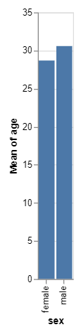

<div class="notes">

Here is the Python output.

</div>

### Fundamentals, Example with means

```{r mean-barchart}
load("../../common-files/data/titanic.RData")
initiate_image()
complete_cases <- titanic[!is.na(titanic$age), ]
ggplot(complete_cases, aes(x=sex, y=age)) +
  stat_summary(fun.y=mean, geom="bar")
finalize_image("Barchart of mean ages by sex")
```

`r display_image`

<div class="notes">

Here is the R output.

</div>

### Fundamentals, Tableau output of mean barchart

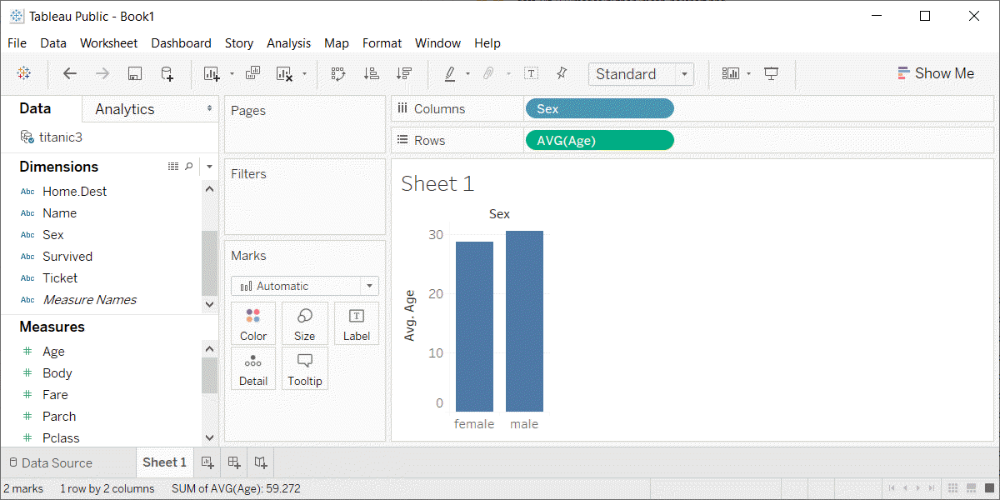

<div class="notes">

Here is the Tableau output.

</div>

### Fundamentals, Summary
+ "A mapping of data to the visual aesthetics of geometries/marks" 
  + Bars are a type of geometry/mark
  + Aesthetics for bars include location, size, color
  + Stack versus dodge versus normalize
  
<div class="notes">

Recall the definition of data visualization, the mapping of data ro the visual aesthetics of geometries/marks. Bars are a type of geometry or mark and you can vary the location, size, and color, though size (meaning width) is usually held constant.

You can control the placement of different color bars using dodge, stack, or normalize. Note that the terminology here is not standardized across the different packages.

(Note to myself) If I have time, it might be nice to include error bars and boxplots at the end of this section.

</div>

```{r save-everything}
save.image("../data/barcharts-fundamentals.RData")
```