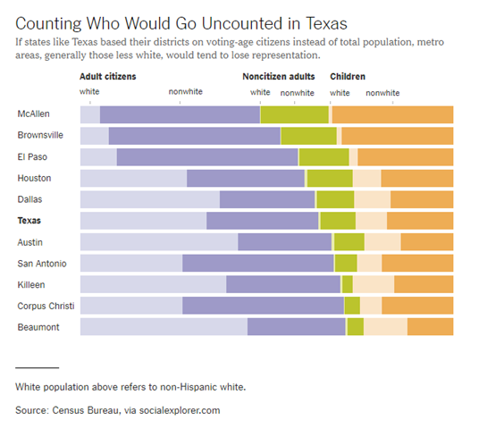
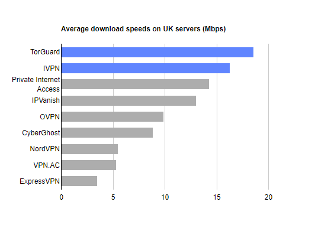
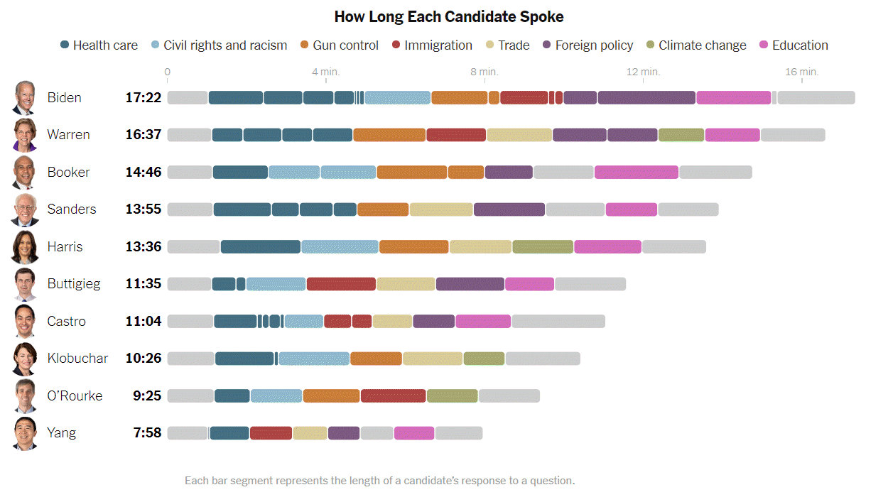

### Group exercise
+ These bar charts come from recent newspaper articles.
  + [People Who Can’t Vote Still Count Politically in America. What if That Changes?](https://www.nytimes.com/2019/06/22/upshot/america-who-deserves-representation.html)
  + [Attacks by White Extremists Are Growing. So Are Their Connections](https://www.nytimes.com/interactive/2019/04/03/world/white-extremist-terrorism-christchurch.html).
  + [The Best VPN Service](https://thewirecutter.com/reviews/best-vpn-service/).

The following images are taken from various newspaper articles or press releases. Look at the graph and read/skim the article.

### Graphs in the news, Voters in Texas

This graph was published in a newspaper article,

Badger, E. (2019). People Who Can’t Vote Still Count Politically in America. What if That Changes? Retrieved June 24, 2019, from The New York Times website: https://www.nytimes.com/2019/06/22/upshot/america-who-deserves-representation.html

### Graphs in the news, White extremist terrorism attacks

This graph was published in a newspaper article,

Weiyi Cai, Simone Landon. Attacks by White Extremists Are Growing. So Are Their Connections. The New York Times, April 3, 2019. Retrieved August 8, 2019 from https://www.nytimes.com/interactive/2019/04/03/world/white-extremist-terrorism-christchurch.html

### Graphs in the news, VPN speeds

The graph was published in a web news article,

Mark Smirniotis. The Best VPN Service. Wirecutter, February 8, 2019. Retrieved August 14, 2019 from https://thewirecutter.com/reviews/best-vpn-service/.

### Graphs in the news, Debate speaking time

This graph was published in a newspaper article,

Weiyi Cai, Jasmine C. Lee, Jugal K. Patel. Speaking Time in the Democratic Debate. The New York Times, Sept. 12, 2019. Retrieved September 12, 2019 from https://www.nytimes.com/interactive/2019/09/12/us/elections/debate-speaking-time.html. 

