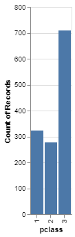
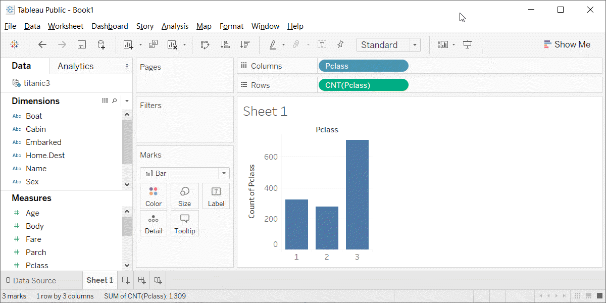

```{r child="../../common-files/src/component-header.Rmd"}
```

### Preparation, overview

+ Follow these steps to get ready for lecture #2 in data visualization.
  + Download and import Titanic data
  + Draw a barchart
    + Count for pclass
  
<div class="notes">

The titanic data set shows mortality results (lived or died) for the 1,313 passengers onboard the Titanic. The data includes information about passenger class (third class fared poorly relative to first or second class), sex (men fared poorly compared to women), and age (children fared better than adults).

Draw a simple bar chart showing the count of the number of passengers in first, second, and third class.

</div>


### Preparation, Pyhton Code
+ Python code
```
import pandas as pd
import altair as alt
df = pd.read_csv("data/titanic3.csv")
ch = alt.Chart(df).mark_bar().encode(
    x='pclass:N',
    y='count()'
)
ch.save("images/python/basic-barchart.html")
```
<div class="notes">

Here is the Python code to read in the data and produce a bar chart showing the number of passengers in each passenger class.

</div>

### Preparation, Python output

```{python}
import pandas as pd
import altair as alt
df = pd.read_csv("../../common-files/data/titanic3.csv")
ch = alt.Chart(df).mark_bar().encode(
    x='pclass:N',
    y='count()'
)
ch.save("../images/python/basic-barchart.html")
```



<div class="notes">

Here is the Python output.

</div>

### Preparation, R code
+ R code
```
ti <- read.csv(file="data/titanic3/csv")
ggplot(ti, aes(pclass)) +
  geom_bar()
```

<div class="notes">

Here is the R code to read in the data and produce a bar chart showing the number of passengers in each passenger class.

</div>

### Preparation, R output

```{r basic-barchart}
initiate_image()
ti <- read.csv(file="../../common-files/data/titanic3.csv")
ggplot(ti, aes(pclass)) +
  geom_bar()
finalize_image()
```

`r display_image`

<div class="notes">

Here is the R output.

</div>

### Preparation, Tableau steps
+ Import titanic3.csv
+ Drag pclass to columns
  + Change to Discete Dimension
+ Drag pclass to rows
  + Change to Measure(Count)
+ If needed, change Marks to Bar

<div class="notes">

Here are the steps in Tableau to create a barchart.

</div>

### Preparation, Tableau output



<div class="notes">

Here is the Tableau output.

</div>
