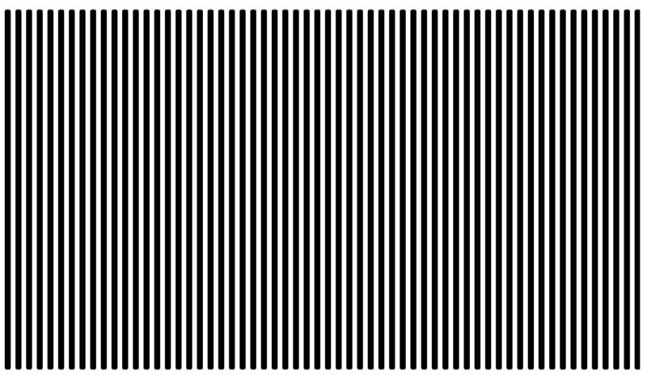
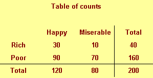
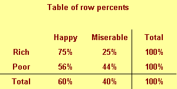
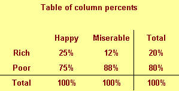
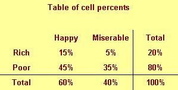

```{r child="../../common-files/src/component-header.Rmd"}
```

```{r}
load("../../common-files/data/titanic.RData")
```

### Recommendations, Don't make gaps equal to widths (1/2)



<div class="notes">

If the space between the bars is equal to the width of the bars themselves, you get an unsettling vibratory effect. This is because your eye is constantly shifting perspective. Sometimes it perceives the black as the foreground and the white as the background. Sometimes it perceives the white as the foreground and the black as the background.

"I'm ten years old, my life's half over. And I don't even know if I'm black with white stripes or white with black stripes." Marty the Zebra in the movie Madagascar.

</div>

### Recommendations, Don't make gaps equal to widths (2/2)


<div class="notes">

If the widths are the same and the bars are empty, then you can get a differnt problem. You might get confused as to what is the bar and what is the gap, as in this optical illusion.

As a general rule, the gap between bars should be about 10 to 20 percent of the width of the bars. Most visualization software has sensible defaults, but beware when you have a very large number of bars. There's always a bit of rounding when you place pixels on a screen or on a page. Your software is trying to fill the available plotting area, so it may have to squeeze or stretch one gap or another. This unevenness can become noticeable when the gaps are only a few pixels wide.

</div>

### Barchart fundamentals, Thoughts on location
+ Axis labels often fit better next to horizontal bars
+ Bar charts with many bars
  + Vertical bars allow more room
  + Beware of rounding artefacts
+ Do not cut off bar charts at the knees

<div class="notes">

The default for most visualization software is vertical bars, but you should give thoughtful consideration to horizontal bars. The labels often fit better when the bars are horizontal. You also often have more room left to right than you do up and down in a graph, so the bars can stretch out more, allowing you to more easily discern small and subtle differences.

If you have a very large number of bars, then a vertical format will allow those bars to fit better.

Remember the fault of default principle. Always try different ways of displaying your data. It costs nothing other than a few electrons to display a horizontal alternative to the typical vertical bar chart format, so why not indulge yourself?

</div>

### Recommendations, Labels on a barchart (1/3)

```{r location-vertical-1}
load("../../common-files/data/titanic.RData")
bw <- c("#000000", "#FFFFFF")
gyr <- c("#00E800", "#E8E800", "#E80000")
pb <- c("#FFC0C0", "#0000FF")
age_class <- case_when(
  titanic$age <= 10 ~ " 0 to 10",
  titanic$age <= 20 ~ "11 to 20",
  titanic$age <= 30 ~ "21 to 30",
  titanic$age <= 40 ~ "31 to 40",
  titanic$age <= 50 ~ "41 to 50",
  titanic$age <= 60 ~ "51 to 60",
  titanic$age <= 70 ~ "61 to 70",
  titanic$age <= 80 ~ "71 to 80",
  TRUE              ~ "???"
)
# age_class <- paste(age_class, "years")
initiate_image()
ggplot(titanic, aes(age_class, fill=survived)) +
  geom_bar(position="fill", color="#000000") +
  scale_fill_manual(values=rev(bw))
finalize_image()
```

`r display_image`

<div class="notes">

Labels will sometimes clash on a vertical bar chart.

</div>

### Recommendations, Labels on a barchart (2/3)

```{r location-vertical-2}
initiate_image()
ggplot(titanic, aes(age_class, fill=survived)) +
  geom_bar(position="fill", color="#000000") + 
  theme(axis.text.x = element_text(angle = 90)) +
  scale_fill_manual(values=rev(bw))
finalize_image()
```

`r display_image`

<div class="notes">

You can turn the x-axis text by 90 degrees to make it fit better. But it is harder to read text that is turned 90 degrees.

</div>

### Recommendations, Labels on a barchart (3/3)

```{r location-horizontal}
initiate_image()
ggplot(titanic, aes(age_class, fill=survived)) +
  geom_bar(position="fill", color="#000000") + 
  coord_flip() +
  scale_fill_manual(values=rev(bw))
finalize_image()
```

`r display_image`

<div class="notes">

A better solution is to turn the bars sideways. The labels fit better on a horizontal bar chart.

</div>

### Recommendations, Watch for rounding artefacts

```{r rounding-artefacts}
complete_cases <- titanic[!is.na(titanic$age), ]
age_class <- trunc(pmin(complete_cases$age, 65)/1.5)
initiate_image()
ggplot(complete_cases, aes(age_class, fill=survived)) +
  geom_bar(position="fill") + 
  coord_flip() + 
  scale_fill_manual(values=rev(bw))
finalize_image()
```

`r display_image`

<div class="notes">

With a large number of bars and a limited number of pixels in your image, you might end up seeing some artefacts caused by rounding. There is always some rounding error in the placement of bars, but this is mostly imperceptible when you only have a few bars. What is a pixel here or there when your bars are a hundred pixels wide and the gaps between the bars are 10 pixels wide?

But a large number of bars will shrink the width of the bars and the size of the gaps to the point where having to add or remove a pixel becomes noticeable.

Here's an example of a barchart with 44 bars. Now for this particular example, there is no compelling reason to have 44 bars, but bear with me, as there are situations, now and then, where you really want that many bars.

I drew the image as 480 pixels by 480 pixels. After allowing for margins, it looks like there are about 340 pixels for the 66 bars. 44 does not divide evenly into 340. You get something like 7.73. If you allocate 7 pixels per bar, that uses up 308 pixels, leaving you with 32 pixels to divide among the 43 gaps between the 44 bars. So some of the gaps will be one pixel wide and some will be zero pixels wide. 

</div>

### Recommendations, Solutions to rounding artefacts
+ Combine categories to reduce the number of bars.
+ Increase the resolution of your plot
+ Switch to a line graph

<div class="notes">

If you notice some rounding artefacts, you have several possible remedies.

First, if you can combine categories to reduce their numbers, this will help. This particular plot had very narrow age intervals, and if you could afford to widen the intervals to five years (0 to 4, 5 to 9, etc.) or even wider, that would help. Sometimes you can combine a large number of infrequently occuring categories into an "other" category.

Combining categories has the risk of losing important details, so you do need to be careful.

In this particular example, narrow intervals are needed for children, because the survival probabilities change a lot between a 2 year old, a 5 year old, and a 13 year old passenger. But they don't change as much for adults. So a chart with eighten bars for the first eighteen years of life plus a nineteenth bar showing survival for adults might be a good compromise.

I chose 480 by 480 pixels for most of the graphs in this talk because it is, for the most part, a good compromise between size of the file and quality of the image. But for a difficult graph with 44 bars, a resolution of 960 by 960 or even higher might be needed. Be careful, though. When I import these files into another program like PowerPoint, that software may reduce the resolution in order to fit within their own page size limits. Trial and error is often the only good solution here.

</div>

### Don't cut your barchart off at the knees

```{r truncated-barchart}
n <- c(124, 55, 49, 26) - 20
mar <- c("Married", "Single/Never married", "Divorced/Separated", "Widowed")
y_ticks <- (1:6)*20
marital_status <- data.frame(mar, n)
initiate_image()
ggplot(marital_status, aes(x=mar, y=n)) +
  geom_col() + 
  scale_y_continuous(breaks=y_ticks-20, labels=y_ticks)
finalize_image("Truncated Barchart")
```

`r display_image`

<div class="notes">

Bar charts almost always start at zero. If you start it at a higer value, you are cutting the barchart off at the knees. This makes it impossible to make relative assessments. So in the original bar chart, it was fairly easy to tell the the Single and the Divorced/Separated columns were a bit less than half of the Married column, but on this truncated bar chart, you might briefly gain an impression that these two bars were less than a third of the married column. It's even worse for the widowed column, which looks in this graph to be less than a quarter of the single and divorced/separated columns.

There are times where the zero value is so far away that you lose a lot of resolution by starting the bars at zero.

</div>

### Recommendations, sort your bars by size

```{r sorted-barchart}
n <- c(124, 55, 49, 26)
mar <- c("Married", "Single/Never married", "Divorced/Separated", "Widowed")
p <- n/sum(n)
st <- factor(1:4, labels=mar)
marital_status <- data.frame(st, n, p)
initiate_image()
ggplot(marital_status, aes(x=st, y=p)) +
  geom_col()
finalize_image("Sorted Bar chart")
```

`r display_image`

<div class="notes">

If you sort the bars by size, then comparisons between bars of approximately the same size are comparisons that are side by side. This shortens the distance that you have to project.

If your categories have a natural ordering, like the age groups we saw in an earlier example, you can't sort by size. A bar chart that starts with 30 to 40 year old passengers, jumps to 60 to 70 year old passengers, and then jumps again to 20 to 30 year old passengers will cause too much confusion. A Likert scale pretty much has to start with "strongly disagree" and follow the proper sequence through "disagree," "neutral," "agree," and end up at "strongly agree."

Some people like a nice orderly alphabetical order to their bars. It helps a little bit with "look up" or the process of quickly finding a particular bar of interest. But the value of look up is often overrated, as the more important visual tasks are comparisons of one bar to another rather than the rapid identification of a single bar.

</div>

### Recommendations, Multiple categories
+ Which bars get to snuggle?
  + Minimize distance between important comparisons
+ When should you stack?
+ Counts versus percentages
  + HOw to de-ephasize small categories
+ What percentage to use?
  + Row, column, or cell percentages

<div class="notes">

When you have two different categories, like gender and passenger class in the Titanic example, you have the opportunity to display the bar chart several different ways. It is more work, but it is often well worth your time to try your bar chart several different ways.

</div>

### Recommendations, Which bars get to snuggle? (1/2)

```{r passenger-class-adjacent}
initiate_image()
load("../../common-files/data/titanic.RData")
ggplot(titanic, aes(sex, fill=factor(pclass))) +
  geom_bar(position="dodge") +
  scale_fill_manual(values=gyr)
finalize_image("Dodged barchart with passenger classes adjacent")
```

`r display_image`

<div class="notes">

When you place the passenger classes next to one another, it both emphasizes and facilitates comparisons among the passenger classes. The rule is to place things close that you want to be compared. So this graph tells you that males tend to be found by far more often in third class than any other class. This is where Leonardo DiCaprio travelled. The distribution among passenger classes is uneven for women as well, but not to as great an extent.

</div>

### Recommendations, Which bars get to snuggle? (2/2)

```{r sex-adjacent}
initiate_image()
load("../../common-files/data/titanic.RData")
ggplot(titanic, aes(factor(pclass), fill=sex)) +
  geom_bar(position="dodge") +
  scale_fill_manual(values=pb)
finalize_image("Dodged barchart with sex adjacent")
```

`r display_image`

<div class="notes">

The emphasis changes when you place the men and women next to each other. Now the comparison that leaps out to you is that men outnumbered women in every passenger class, but down in thrid class, the gender disrepancy is the largest.

</div>

### Recommendations, When should you stack? (1/3)

```{r passenger-class-stacked}
initiate_image()
load("../../common-files/data/titanic.RData")
ggplot(titanic, aes(sex, fill=factor(pclass))) +
  geom_bar(position="stack") +
  scale_fill_manual(values=gyr)
finalize_image("Barchart with passenger class stacked")
```

`r display_image`

<div class="notes">

Stacking tends to emphasize how each individual piece contribute to a whole. Here you see the relative distribution of females across the three passenger classes in the bar on the left and the relative distribution of males across the three passenger classes in the bar on the right.

With the stacked chart, you also bring the third class females close to the third class males, the second class females close to the second class males, and the first class females close to the first class males. But notice that the comparison of the bottom components, the third class females to the third class males is the easiest comparison, because it is a projection. To compare third class females to third class males, you just slide the female blue bar horizontally to the male blue bar. For the others, the comparison is a superimposition, you have to shift one bar diagonally to compare it to another. The two salmon bars representing first class females and first class males are almost the same size, but it's hard to tell with this graph because the diagonal shift is slower and less accurate.

</div>

### Recommendations, When should you stack? (2/3)

```{r passenger-class-reverse-stacked}
initiate_image()
load("../../common-files/data/titanic.RData")
titanic$reverse_pclass <- factor(4-titanic$pclass, labels=3:1)
ggplot(titanic, aes(sex, fill=factor(reverse_pclass))) +
  geom_bar(position="stack") +
  scale_fill_manual(values=rev(gyr))
finalize_image("Barchart with passenger class stacked in reverse order")
```

`r display_image`

<div class="notes">

Notice how the comparison of first class females and first class males is so much easier when you place them at the bottom of the graph?

</div>

### Recommendations, When should you stack? (3/3)

```{r sex-stacked}
initiate_image()
load("../../common-files/data/titanic.RData")
ggplot(titanic, aes(factor(pclass), fill=sex)) +
  geom_bar(position="stack") +
  scale_fill_manual(values=pb)
finalize_image("Barchart with sex stacked")
```

`r display_image`

<div class="notes">

You can switch things so that gender is stacked for each passenger class. This barchart shows that setting up a co-ed volleyball team would be a lot easier in first or second class, which have a roughly equal distribution of mean and women compared to third class.

</div>

### Recommendations, Which percentage (1/8)



<div class="notes">

When you are computing percentages, you need to decide what particular percentage you want. The data set shown above is totally fictional, but it helps you understand what your options are.

This represents a sample of 200 people who are classified by income (rich or poor) and by outlook (happy or miserable). There are only 40 rich people in our sample, because there's only so much money in the world, and it is distributed unevenly. There's a more even split between happy and miserable people, but happy people, thankfully, are in the majority.

When you start calculating percentages for a table like this with two categorical variables, it gets a bit tricky.

</div>

### Recommendations, Which percentage (2/8)



<div class="notes">

You can compute row percentages which divide the entry in each row by the row total. Row percents add up to 100% within each row.

The 75% in the upper left corner is a conditional probability. The probability of being happy given that you are rich is 75%. Money can buy happiness, so it seems. But the probability below it, 56%, provides a different picture. That's the probability of being happy given that you are poor. It seems that poor people can be happy also because there are other things, like family and friends that can also buy happiness.

</div>

### Recommendations, Which percentage (3/8)


```{r outlook-stack}
n <- c(30, 10, 90, 70)
happy <- data.frame(
  income=rep(rep(c("Rich", "Poor"), each=2), n),
  outlook=rep(rep(c("Happy", "Miserable"), 2), n)
)
initiate_image()
ggplot(happy, aes(x=income, fill=outlook)) +
  geom_bar(position="fill") +
  scale_fill_manual(values=c("#FFFF00", "#0000FF"))
finalize_image()
# table(happy$income, happy$outlook)
```

`r display_image`

<div class="notes">

This arrangement of a stacked bar chart shows that the yellow regions, the regions associated with a happy outlook, are dominant in both the rich bar and the poor bar.

</div>

### Recommendations, Which percentage (4/8)



<div class="notes">

You get a different percentage and a different picture, though, with the column percents. You get a column percent by dividing each entry by the corresponding column total. Column percents add up to 100% within a column, This is a very different probability. The probability in the upper left corner is the probability of being rich given that you are happy. It is only 25%. The percentage next to it, 12%, is the probability of being rich given that you are miserable. That's also quite small.

</div>

### Recommendations, Which percentage (5/8)

```{r income-stack}
initiate_image()
ggplot(happy, aes(x=outlook, fill=income)) +
  geom_bar(position="fill") +
  scale_fill_manual(values=c("#FF0000", "#00FF00"))
finalize_image()
```

`r display_image`

<div class="notes">

This is a bar chart that illustrates these conditional probabilities. Notice the color coding. Green is for rich people, because green is the color of money. Red is for poor people because red is the color of indebtedness. Notice that red dominates this barchart. So if you find someone who is happy, don't presume that they are happy because they have money. It is far more likely 75% versus 25% that they are happy for a reason other than money.

</div>

### Recommendations, Which percentage (6/8)



<div class="notes">

There's a third percentage that you can compute, the cell percentage. That is the percentage that you get when you divided by the grand total. The cell percentages add up to 100% only when you add together all the percentages within the table.

It is unusual that you would want cell percentages in any visualization. It tells you haw frequently you see each possible cross classification. If you just randomly encountered someone, your best guess would be that they are poor but happy. That's almost half of the total. Your next best guess would be poor and miserable.

</div>

### Recommendations, Which percentage (7/8)

```{r cell-stack}
happy$cell <- paste(happy$income, happy$outlook)
initiate_image()
ggplot(happy, aes(x="Everyone", fill=cell)) +
  geom_bar(aes(y=(..count..)/sum(..count..)), position="stack") +
  scale_fill_manual(values=c("#FF0000", "#990000", "#00FF00", "#009900"))
finalize_image()
```

`r display_image`

<div class="notes">

This graph shows the relative percentages for poor happy, poor miserable, rich happy, and rich miserable people. I used the coding of red for poor, and green for rich, but made the happy outlooks a bright color and the miserable outlooks a dark color.

Now this is a rather artificial example, but it shows how different percentages and different barchart orientations provide different messages.

</div>

### Recommendations, Which percentage (8/8)
+ No hard and fast rules
+ Classify your categorical variables
  + What is the treatment, what is the outcome?
  + What is cause, what is effect?
  + What is precedent, what is antecedent?
+ Stack the outcome, effect, or antecedent.
  + Probability of outcome given the treatment
  
<div class="notes">

There are no absolute rules about how to stack the barchart, but here's some general guidance. There is usually a hierarchy to the categorical variables. One can usually be considered a treatment (a variable that you manipulate) and the other would be the outcome or the result of that treatment. Similarly, you could label one variable the cause and the other the effect or one the precedent (the categorical variable that comes first in time) and the antecedent (the variable that comes afterward). The second in the list, the outcome, the effect, or the antecedent is what you would normally consider placing in the stack.

This produces a conditional probability that makes sense from a pragmatic perspective, such as the probability of an outcome given a treatment.

Demographic variables are almost always treatments, causes, or precedents. You were a male or a female for your whole life, so it has to preceed what class ticket you bought or whether you lived or died.

</div>

### Recommendations, Summary
+ Don't make the gaps the same size as the bars
+ Labels often fit better on a horizontal barchart
+ With many bars, watch for rounding artefacts
+ Sort your bars by size
+ With two categorical variables, you have lots of options
  + Minimize distance between the most important comparisons
  + The bottom category in a stacked barchart is easiest to read
  + Stack outcomes/effects/antecedents

<div class="notes">

When you're designing a bar chart, make sure the gaps are smaller than the bars. If they are equal, you end up with a visually unpleasant effect or with potential confusion between what's a bar and what's a gap. With a lot of bars and long labels, you might try a horizontal bar chart, as the labels fit much easier. Also with many bars, watch out for rounding artefacts.

If your bars do not already have a natural ordering, sort them by size to make comparisons easy.

You have lots of options at your disposal when you are providing information about two categorical variables in a bar chart. Think about what comparisons are important and facilitate them by making them close.

The bottom category in a stacked barchart can be readily compared across stacks through projection, so it represents the easiest comparison.

It's not always clear what variable should be stack, but often it is the variable that could be considered the outcome, the effect, or the antecedent.

Always experiment with different arrangements and layouts. You should pick the chart that most clearly emphasizes the main message in the data set.

</div>