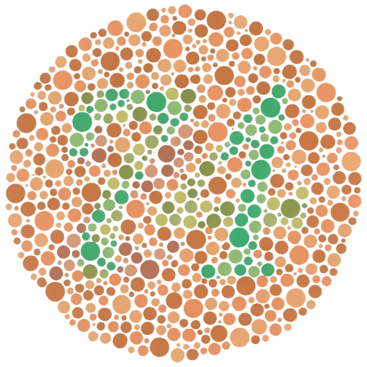

```{r child="../../common-files/src/component-header.Rmd"}
```

```{r}
load("../../common-files/data/titanic.RData")
```

### Recommendations, lessons from the world of fashion


<div class="notes">

It's a well known fasion mistake to wear too many colors at the same time. Maybe this guy could get away with it, but most of us would look like idiots if we tried to dress that way.

There's a similar lesson for data visualization.

</div>

### Recommendations, Don't overuse colors.


<div class="notes">

Naomi Robbins, an expert on data visualization, made an interesting observation. You would never make each word in a sentence a different color. So why would you make every bar, every point, and every line a different color?

Too many colors dilutes the impact that color can have.

You can use a second color to add emphasis. Or maybe a gradient between two different colors could work. Doing more than this is usually a big mistake.

</div>

### Recommendations, The power of a single color


<div class="notes">

Graphic designers have known for quite a while that a restrained use of colors can be very effective. Here is an image from a YouTube video clip, 

The Travelers - Look under the Umberella commercial (1986). Retrieved 2019-09-07 from https://www.youtube.com/watch?v=3zQX66jd_c0.

The single red umbrella in a sea of black umbrellas stands out. Your eye can't help but follow this umbrella as it travels across the screen from left to right. It's a very powerful image.

A small dollop of color in your visualizations can be far more effective than using a whole bunch of different colors.

</div>

### Recommendations, Count the fives (1/3)

```{r count-nine-colors}
initiate_image()
set.seed(123547)
n <- 30
x <- runif(n)
y <- runif(n)
z <- factor(1+floor(9*runif(n)))
df <- data.frame(x, y, z)
ggplot(df, aes(x, y, color=z)) +
  geom_text(label=z, size=10) +
  theme(legend.position="none")
finalize_image()
```

`r display_image`

<div class="notes">

Here's an exercise that adapted from Olson and Bergen.

How many fives are there in this picture. I've used a different color for each number to make it easier for you to pick out any particular number. It takes a while, but you can see that there are three 5's, clustered in the lower right corner of the graph.

Did the colors help? Well, not all that much. It is hard to pick out nine colors and not have a few of them look very similar. In particular, the 5's and the 6's are pretty close, as are the 8's and the 9's.

</div>

### Recommendations, Count the fives (2/3)

```{r count-two-colors}
initiate_image()
set.seed(123547)
n <- 30
x <- runif(n)
y <- runif(n)
z <- factor(1+floor(9*runif(n)))
df <- data.frame(x, y, z)
co <- ifelse(z==5, "red", "black")
ggplot(df, aes(x, y)) +
  geom_text(label=z, size=10, color=co) +
  theme(legend.position="none")
finalize_image()
```

`r display_image`

<div class="notes">

When you use a bit of restraint and only show two colors, you make the process of identifying all the fives much easier. The red fives are like the red umbrella in the Traveller's commercial.

</div>

### Count the fives (3/3)

```{r count-black-gray}
initiate_image()
set.seed(123547)
n <- 30
x <- runif(n)
y <- runif(n)
z <- factor(1+floor(9*runif(n)))
df <- data.frame(x, y, z)
co <- ifelse(z==5, "black", "gray")
ggplot(df, aes(x, y)) +
  geom_text(label=z, size=10, color=co) +
  theme(legend.position="none")
finalize_image()
```

`r display_image`

<div class="notes">

The same trick works with black versus gray. By making some features of your graph gray, you help them to fade into the background, making what remains in black more prominent.

Now why would you want to make something fade into the background? Why not just eliminate it? Sometimes that makes sense, but often you want to see the overall range that the emphasized points lie in.

</div>

### Recommendations, Problems with emphasis
+ Don't always know what to emphasize
  + Solution: interactivity
+ Let the data speak for itself
  + But sometimes data speaks too subtly
+ Potential for deception
+ Bias potential in EVERY visualization choice

<div class="notes">

Now, if you feel a bit of unease about this example, it is a feeling I share. I used bold colors for the 5's. Red versus black or black versus gray. Doesn't this hurt the feelings of the other numbers? I hear the 6 has a fragile ego.

Seriously, the effort to emphasize one group always results in the de-empahsis of other groups. You may feel uncomfortable with this because you don't really know what group is worth emphasizing. Fair enough. If you don't know, then there are interactive features like mouseover that allow the end user to change the emphasis on the fly to what they find intersting. Mouseover is a feature where the graph changes as you let the mouse hover over certain features of the graph. It is a very effective tool, but beyond the scope of this workshop.

There's also a common refrain, "LEt the data speak for itself." It sounds nice in theory, but in practice, data doesn't speak very well. It has a soft voice. It mumbles. It's message gets lost in the noise. You job as a data visualizer is to amplify the message. If you are afraid to do this, you are in the wrong job.

The other thing to keep in mind is that if you have the power to emphasize (or de-emphasize) certain features of the data, you have the power to deceive your reader. And this happens a lot. I won't share any deceptive plots with you, but you can find them easily with a Google search. Some of it is just plain stupidity, but you have to believe that some of it is malicious intent. The examples you see on the web are pretty easy to spot, but that doesn't mean that there aren't subtle ways to use graphics to deceive.

</div>

### Recommendations, Pure colors often appear too intense

```{r intense-example}
initiate_image()
g <- c("#FF0000", "#00FF00", "#0000FF")
c3 <- rep(g, each=3)[-c(1, 5, 9)]
d3 <- rep(g, 3)[-c(1, 5, 9)]
t <- c(" ",  paste0("F=", c3, ", B=", d3))
b <- rep(1,4)
o <- c(b, 2, b, b, 3, b, b, 4, b, b, 5, b, b, 6, b, b, 7, b)
df <- data.frame(
  y=rep((6:1)/2, each=9), 
  x=rep((0:8)/2, 6),
  b=rep(d3, each=9),
  f=rep(c3, each=9),
  t=t[o]
)
ggplot(df, aes(x, y)) +
  geom_point(size=37, color=df$b, shape="square") +
  expand_limits(y=c(0.37, 3.11)) +
  geom_text(color=df$f, label=df$t, size=12) +
  theme_void() +
  theme(
    panel.background=element_rect(fill="#808080")
  )
finalize_image()
```

`r display_image`

<div class="notes">

The pure colors: pure red, green, and blue are sometimes a bit harsh. This is especially true if they are placed in direct contrast. Here is an example. 

One theory why these colors appear harsh is that they tend to produce afterimages. An afterimage is a short term distortion of vision. If you stare at an image long enough, so of the retinal cells in your eye become "tired" and stop firing as often. When your focus finally move away from that image, the opposite pattern appears temporarily in your field of vision because only the non-tired cells that transmit the opposite color can fire. It fades away as your tired cells recover.

Sometimes the harshness is good. It is an attention grabber. But there are times when you want to soften the colors a bit. You can do this in two ways, making the colors a bit lighter or making the colors a bit darker.

</div>

### Recommendations, Pure color circle and alternatives (1/3)

```{r hsv-pure-circle}
initiate_image()
twist=0.03
n4 <- 600
t4 <- (0:(n4-1))/n4
x4 <- cos( 2*3.14159*t4+twist)
y4 <- sin(-2*3.14159*t4+twist)
c4 <- hsv(t4, 1, 1) 
dg4 <- data.frame(x=x4, y=y4, co=c4)
ggplot(dg4, aes(x, y)) + 
  geom_point(col=dg4$co) +
  expand_limits(y=c(-5, 1)) + 
  expand_limits(x=c(-1.2, 1.2)) + 
  theme_void() +
  theme(
    panel.background=element_rect(fill="#808080")
  )
finalize_image()
```

`r display_image`

<div class="notes">

This is the circle of pure colors on the hsv cylinder that you saw earlier.

</div>

### Recommendations, Pure color circle and alternatives (2/3)

```{r hsv-lighter-circle}
initiate_image()
d <- 0.5
twist=0.03
n5 <- 600
t5 <- (0:(n5-1))/n5
x5 <- d*cos( 2*3.14159*t5+twist)
y5 <- d*sin(-2*3.14159*t5+twist)
c5 <- hsv(t5, d, 1) 
dg5 <- data.frame(x=x5, y=y5, co=c5)
dg5 <- rbind(dg4, dg5)
ggplot(dg5, aes(x, y)) + 
  geom_point(col=dg5$co) +
  expand_limits(y=c(-5, 1)) + 
  expand_limits(x=c(-1.2, 1.2)) + 
  theme_void() +
  theme(
    panel.background=element_rect(fill="#808080")
  )
finalize_image()
```

`r display_image`

<div class="notes">

If you move the circle inward, all of the colors get lighter. They develop something of a pastel color to them. These are less harsh than the pure colors.

</div>

### Colors, Pure color circle and alternatives (3/3)

```{r hsv-darker-circle}
initiate_image()
d <- 0.75
twist=0.03
n6 <- 600
t6 <- (0:(n6-1))/n6
x6 <- cos( 2*3.14159*t6+twist)
y6 <- sin(-2*3.14159*t6+twist)-1
c6 <- hsv(t6, 1, d) 
dg6 <- data.frame(x=x6, y=y6, co=c6)
dg6 <- rbind(dg4, dg6)
ggplot(dg6, aes(x, y)) + 
  geom_point(col=dg6$co) +
  expand_limits(y=c(-5, 1)) + 
  expand_limits(x=c(-1.2, 1.2)) + 
  theme_void() +
  theme(
    panel.background=element_rect(fill="#808080")
  )
finalize_image()
```

`r display_image`

<div class="notes">

If you move the pure color circle down on the hsv cylinder, you get darker shades and these also are less harsh.

</div>

### Recommendations, Lighter and darker colors are calmer

```{r lighter-and-darker}
initiate_image()
g <- c("#800000", "#008000", "#000080")
h <- c("#FF8080", "#80FF80", "#8080FF")
c3 <- rep(g, each=3)[-c(1, 5, 9)]
d3 <- rep(h, 3)[-c(1, 5, 9)]
t <- c(" ",  paste0("F=", c3, ", B=", d3))
b <- rep(1,4)
o <- c(b, 2, b, b, 3, b, b, 4, b, b, 5, b, b, 6, b, b, 7, b)
df <- data.frame(
  y=rep((6:1)/2, each=9), 
  x=rep((0:8)/2, 6),
  b=rep(d3, each=9),
  f=rep(c3, each=9),
  t=t[o]
)
ggplot(df, aes(x, y)) +
  geom_point(size=37, color=df$b, shape="square") +
  expand_limits(y=c(0.37, 3.11)) +
  geom_text(color=df$f, label=df$t, size=12) +
  theme_void() +
  theme(
    panel.background=element_rect(fill="#808080")
  )
finalize_image()
```

`r display_image`

<div class="notes">

This chart shows lighter bacgrounds and darker foregrounds. The combination has a bit less contrast. The dark green foreground on the light blue background is perhaps the worst. But the softening of colors appears calmer and less harsh.

</div>

### Recommendations, Avoid the rainbow gradient

```{r rainbow-gradient}
initiate_image()
n <- 300
t <- seq(0, 2*pi, length=n)
x <- cos(t)
y <- sin(t)
x0 <- x/2
y0 <- y/2
co <- rainbow(n)
ggplot(data.frame(x, y), aes(x, y)) +
  geom_segment(xend=x0, yend=y0, color=co, size=2) +
  theme_void() +
  theme(
    panel.background=element_rect(fill="#808080"))
finalize_image()
```

`r display_image`

<div class="notes">

Most visualization experts recommend against the use of circular gradients. This gradient would make values at the low end of the scale look close in color to values on the high end of the scale. This almost never happens. The one prominent exception would be a variable like wind speed, where values of 0 degrees and 360 degrees are identical.

</div>

### Recommendations, Simple gradient can emphasize high values

```{r single-gradient}
initiate_image()
saratoga_houses <- read.csv("../../common-files/data/houses.csv")
ggplot(saratoga_houses, aes(Age, Price)) + 
  geom_point(aes(color=Bathrooms)) + 
  scale_color_gradient(low="#FFFFFF", high="#FF0000")
finalize_image()
```

`r display_image`

<div class="notes">

The single gradient can move from a light color to a dark color, and on a white background, this will tend to de-empahsize the small values and put greater emphasis on the large values.

</div>

### Recommendations, Simple gradient can empahsize low values

```{r single-gradient-reversed}
initiate_image()
saratoga_houses <- read.csv("../../common-files/data/houses.csv")
ggplot(saratoga_houses, aes(Age, Price)) + 
  geom_point(aes(color=Bathrooms)) + 
  scale_color_gradient(low="#FF0000", high="#FFFFFF")
finalize_image()
```

`r display_image`

<div class="notes">

If you reverse this, and move from a dark color to a light color, then (at least on a white background), you will tend to de-empahsize the large values and put greater emphasis on the small values.

</div>

### Recommendation, Divergent gradient empahsizes both extremes

```{r divergent-gradient}
initiate_image()
saratoga_houses <- read.csv("../../common-files/data/houses.csv")
ggplot(saratoga_houses, aes(Age, Price)) + 
  geom_point(aes(color=Bathrooms)) + 
  scale_color_gradient2(low="#FF0000", mid="#FFFFFF", high="#0000FF", midpoint=2.5)
finalize_image()
```

`r display_image`

<div class="notes">

The middle of a divergent gradient typically has a muted color like gray that fades into the background. The two extremes in a divergent gradient are colors that contrast sharply with the background and with each other. This produece an emphasis at both extremes and a de-empahsis in the middle.

</div>

### Recommendations, Unequal luminence causes optical illusions

```{r optical-illusion}
initiate_image()
x <- rep(0:9, each=10)
y <- rep(0:9, 10)
co <- ifelse(x < 4.5, "#FF0000", "#00FF00")
ggplot(data.frame(x, y), aes(x, y)) + 
  geom_point(color=co, size=22, shape="square") +
  geom_point(x=2, y=5, color="gray", size=22) +
  geom_point(x=7, y=5, color="gray", size=22) 
finalize_image()
```

`r display_image`

### Recommendations, Minimze illusions with equalized luminance

```{r equalize-luminance}
initiate_image()
x <- rep(0:9, each=10)
y <- rep(0:9, 10)
co <- ifelse(x < 4.5, "#FF0000", "#008000")
ggplot(data.frame(x, y), aes(x, y)) + 
  geom_point(color=co, size=22, shape="square") +
  geom_point(x=2, y=5, color="gray", size=22) +
  geom_point(x=7, y=5, color="gray", size=22) 
finalize_image()
```

`r display_image`

### Recommendations, Disadvantages of equal luminance
+ Limited contrast
+ Poor black and white reproduction
+ Possible problems for color blind viewers

<div class="notes">

Equal luminance does present some disadvantages that you need to be aware of. There is less contrast among equal luminance colors that there would be among colors that have variations in luminance.

Colors with equal luminance tend to produce the exact same gray shade in black and white reproductions of color graphs.

Equal luminance can, in some situations, produce more problems for color blind viewers. We'll discuss in greater detail in just a bit.

</div>

### Recommendations, Give categories same luminance, equi-spaced hues

```{r hcl-circle}
hcl_circle <- function(g, lum, rad, spin=1, o=0) {
  theta <- seq(0, 1, length=360)
  c2 <- hcl(360*theta, 100*rad, 100*lum, fixup=FALSE)
  dg2 <- data.frame(x=spin*cos(2*pi*theta), y=abs(spin)*sin(2*pi*theta), co=c2)
  m <- sum(is.na(dg2$co))
  if (m > 0) cat(paste0(m, " missing colors."))
  dg3 <- rbind(dg2[!is.na(dg2$co), ])
  g <-  g + 
    geom_point(x=dg3$x, y=dg3$y, color=dg3$co) +
    geom_point(x=dg2$x[1+o], y=dg2$y[1+o], color=c2[1+o], size=20) +
    geom_point(x=dg2$x[ 72+o], y=dg2$y[ 72+o], color=c2[ 72+o], size=20) +
    geom_point(x=dg2$x[144+o], y=dg2$y[144+o], color=c2[144+o], size=20) +
    geom_point(x=dg2$x[216+o], y=dg2$y[216+o], color=c2[216+o], size=20) +
    geom_point(x=dg2$x[288+o], y=dg2$y[288+o], color=c2[288+o], size=20) +
    expand_limits(x=c(-1.1, 1.1)) +
    expand_limits(y=c(-1.1, 1.1)) +
    theme_void() +
    theme(
      panel.background=element_rect(fill="#FFFFFF")
    )
  g
}
initiate_image()
g <- ggplot(data.frame(x=rep(0, 360), y=rep(0, 360)), aes(x, y))
g <- hcl_circle(g, 15/20, rad=0.50)
g
finalize_image()
```

`r display_image`

<div class="notes">


</div>

### Recommendations, For many categories add second level of luminance

```{r darker-hcl-circle}
initiate_image()
g <- hcl_circle(g, 11/20, rad=0.40, spin=0.75, o=36)
g
finalize_image()
```

`r display_image`

<div class="notes">


</div>

### Recommendations, Avoid crosshatching


<div class="notes">

In the era when color was expensive, grpahic designers would use different types of crosshatching in place of colors. This is not really needed today, so you see it less often. But crosshatching can often produce optical illusions like the one shown above.

</div>

### Recommendations, Consider color-blindness in your visualizations.



<div class="notes">

Many of the color palettes used here cause difficulty for color blind people.

</div>

### Recommedations, Color blindness simulator


<div class="notes">

This is one of many color blind simulators available on the web.

</div>

### Recommendations, Other steps to control for colorblindness

+ Categorical palettes are most troublesome
+ Use palettes described as color blind friendly
+ Use second visual cue (e.g., shape)
+ Deliberately vary luminance

<div class="notes">

In general, equal luminance palettes for categorical data are the most likely to cause difficulty for color blind viewers. The single gradients and divergent gradients will usually have other changes in luminance that can help color blind viewers. 

There are palettes that are known to be color blind friendly, meaning that the colors are easily distinguishable even for someone who is color blind.

It helps all of us, but especially color blind viewers if you can find a second way to code a variable. This is fairly easy to do using shape as well as color to encode a categorical variable.

You can also ignore the previous efforts to balance luminance and deliberately vary luminance, as this is easily perceived even by color blind viewers.

</div>

### Recommendations, summary
+ Don't overuse colors
+ Pure colors are often too intense
  + Darker/lighter combinations are better
+ Different gradients emphasize different features
+ Unequal luminance causes optical illusions
+ Consider colorblind viewers
