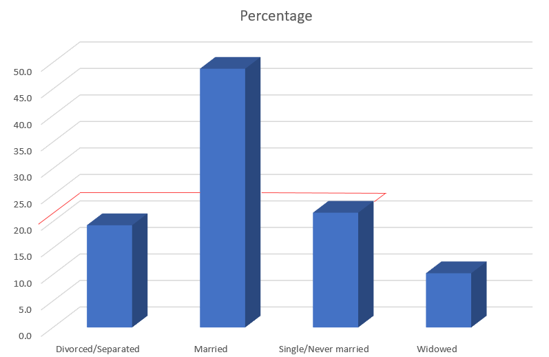
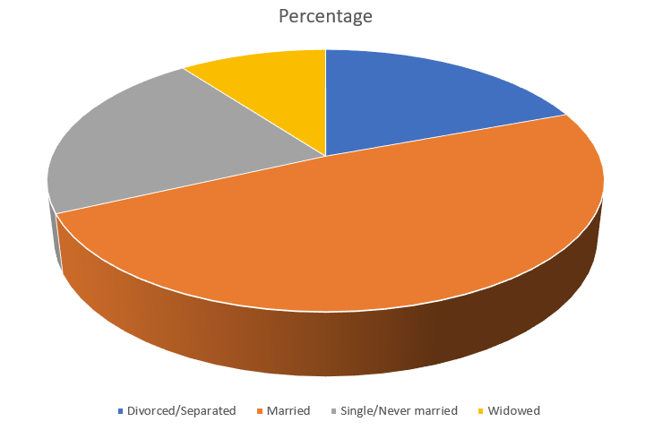

```{r child="../../common-files/src/component-header.Rmd"}
```

### Perception, Adding depth (1/4)


<div class="notes">

Some sotware packages allow you to add some depth to your pie chart. This can catch your eye, at first, but almost all experts hate this approach. The most common complaint is that the three dimensional effects make a graph worse.

Worse means that it slows you down and it decreases the accuracy of your response. So here's a question. What percentage of your sample is single/never married? THe three dimensional effects slow you down. So for this three dimensional bar chart, do you measure the height of the single/never married bar by projecting the front of the bar to the axis on the left or by projecting the back of the bar? Actually, you need to first project to the back "wall" because the bars are placed a small distance in front.

</div>

### Perception, Adding depth (2/4)



<div class="notes">

Once you realize that you need to project to the back wall, you have to do this accurately. Notice that it is not a simple horizontal or vertical projection. Instead you have to do a couple of superimpositions, shifts at a 45 degree angle. You can do this, but it degrades your accuracy.

</div>

### Perception, Adding depth (3/4)



### Perception, Adding depth (4/4)

```{r pie-3d-2}
fn <- initiate_image()
theta <- seq(0, 2*pi, length=200)
fn <- initiate_image()
plot(-1:1, -1:1, axes=FALSE, type="n", xlab=" ", ylab=" ")
lines(sin(theta), 0.5*cos(theta))
lines(c( 1,  1), c( 0, -0.3))
lines(c(-1, -1), c( 0, -0.3))
lines(sin(theta[51:150]), 0.5*cos(theta[51:150])-0.3)
lines(sin(theta[c( 25, 125, 125)]), 0.5*cos(theta[c( 25, 125, 125)])-c(0,0,0.3))
lines(sin(theta[c(175,  75,  75)]), 0.5*cos(theta[c(175,  75,  75)])-c(0,0,0.3))
finalize_image("Three dimensional pie chart split into four equal pieces")
```

`r display_image`

<div class="notes">

There are several issues with the three dimensional pie chart, and you can see this best when you split this pie chart into four equal pieces. Notice that the angles are no longer 90 degrees because the perspective view distorts the angles. So you lose the big advantage (and possibly the only advantage) of the pie chart, the ability to divide it easily into four pieces.

Also notice that the wedge in the foreground looks bigger than the wedge in the background, because you can see the side of the foreground wedge, but you can't see the side of the background wedge.

</div>

### Perception, review
+ Visual tasks
+ Hierarchy of perception

