```{r child="../../common-files/src/component-header.Rmd"}
```

### Colors, introductory tutorial
+ Kindergarten view of colors
+ Review hexadecimal codes
+ Color systems
  + RGB
  + HSV
  + HCL
  + CMYK
  
<div class="notes">

There are four major color systems used on computers, RGB, HSV, HCL, and CYMK. I'll discuss RGB in detail, and touch briefly on the other systems. But you need to realize that how colors work on a computer was not the way you learned in Kindergarten. A solid understanding of the RGB color system also requires you to work comfortably with hexadecimal codes, so I have a brief review of that as well.

</div>

### Colors, Everything I know about colors, I learned in Kindergarten.


<div class="notes">

It was probably in Kindergarten where you learned the basic way to combine primary colors. Yellow plus red equals orange, Yellow plus blue equals green. Red plus blue equals purple/violet.

It doesn't work that way on a computer screen because screens use light to create colors and lights blend in different ways than paints or crayons.

Before you tackle ths computer system for colors, you need to review binary and hexadecimal number systems.

</div>

### Colors, Binary codes
+ "There are 10 types of programmers in the world, those who undestand binary and those who don't."
  + 1001 1100 (base 2)
  + = $1*2^7+0*2^6+0*2^5+1*2^4+1*2^3+1*2^2+0*2^1+0*2^0$
  + = 128+16+8+4 = 156
+ Eight binary digits represent the numbers 0-255
  
<div class="notes">

Let me share a bad joke about binary numbers. Actually, you need to read it because the digits "1"-"0" represent something entirely different in the world of binary numbers.

Here's an example of how to decode the binary number 1001 1100.

Binary numbers use powers of two: 1, 2, 4, 8, 16, etc. Eight binary digits can represent any number from 0 to 255.

</div>

### Colors, Hexadecimal codes
+ Hexadecimal digits (base 16)
  + 0-9, A=10, B=11, C=12, D=13, E=14, F=15
  + 1001 1100 (base 2)
  + = 9C (base 16)
  + = $9*16^1+12*16^0$
+ Two hexadecimal digits represent the numbers 0-255.
  + 00 (base 16) = 0, FF (base 16) = 255
+ A # prefix implies hexadecimal in most computer languages.

<div class="notes">

Binary representations get unwieldy very quickly, and the hexadecimal format provides a much tighter representation that still has the spirit of binary. It is fairly easy to switch back and forth between binary and hexadecimal.

Hexadecimal means powers of 16 and you can represent numbers up to (but not including) 16 using four binary digits. The hexadecimal digits start out like normal digits, 0, 1, 2, etc. but once you get up to nine you run out of single digits. So the value of 10 is represented by the letter A, the value of 11 by B, etc. through the letter F which represents 15. At sixteen, you roll over to the next place.

So you count in hexadecimal like 0, 1, 2, 3, 4, 5, 6, 7, 8, 9, A, B, C, D, E, F, 10, 11, ...

Split the eight digit binary number 1001 1100 into groups of four binary digits. The binary 1001 is equal to 9 and the binary 1100 is equal to 12 or C. So the hexadecimal equivalent is 9C. You can represent this using powers of 16, 9 times 16 to the first power plus twelve times 16 to the zeroth power. That works out to 156.

Two hexadecimal digits, just like eight binary digits, can represent the numbers 0 to 255, with 00 hexadecimal equaling 0 and FF hexadecimal equaling 255 (15*16+15).

Use the prefix of a pound sign (hash tag) to tell the computer that you are speaking to it in hexadecimal.

</div>

### Colors, Codes for colors
+ #rrggbb format
  + #000000 is pure black
  + #FFFFFF is pure white
  + #FF0000 is pure red
  + #00FF00 is pure green
  + #0000FF is pure blue
+ You can mix and match to get 16,777,216 colors
  + #800080 is purple, #FF69B4 is pink, #40E0D0 is turquoise
  
<div class="notes">

The RGB format uses six hexadecimal digits to represent colors. A hexidecimal of all zeros is pure black and at the other extreme, a hexidecimal of all F's is pure white. 

The first two hexidecimal digits represent the red channel. The highest value FF for the red channel combined with zeros for the other two channels (#FF0000) equals pure red. 

The next two digits represent the green channel. #00FF00, giving the maximum to the green channel and the minimum to the other two channels produces a pure green. 

The last two digits represent the blue channel, and #0000FF represents pure blue.

You can combine these in a variety of ways. You end up with an almost unlimited number of colors. Six hexadecimal digits allow you to produce 16^6 or 16,777,216 different colors.

</div>

### Colors, Red plus green equals yellow

```{r red-plus-green}
add_colors <- function(c1, c2, c3) {
  df <- data.frame(
    x=rep(2, 3),
    y=3:1,
    b=c(c1, c2, c3)
  )
  ggplot(df, aes(x, y)) +
    geom_text(color=df$b, size=24, label=df$b) +
    expand_limits(x=c(0, 4), y=c(0, 4)) +
    geom_text(x=0.25, y=2, label="+", size=24) +
    geom_segment(x=0.75, y=1.5, xend=3.25, yend=1.5, size=3) +
    theme_void() +
    theme(
      panel.background=element_rect(fill="#808080"))
}
initiate_image()
add_colors("#FF0000", "#00FF00", "#FFFF00")
finalize_image()
```

`r display_image`

<div class="notes">

Whne you combine colors in the RGB system, they become lighter in color. So if you add red light (FF in the red channel) to green light (FF in the green chanel), you get yellow, which is FF in both the red and green channels.

</div>

### Colors, Red plus blue equals magenta

```{r red-plus-blue}
a3 <- c("#FF0000", "#FF0000", "#00FF00")
b3 <- c("#00FF00", "#0000FF", "#0000FF")
c3 <- c("#FFFF00", "#FF00FF", "#00FFFF")
initiate_image()
add_colors("#FF0000", "#0000FF", "#FF00FF")
finalize_image()
```

`r display_image`

<div class="notes">

Red plus blue gives you #FF00FF, which is magenta, a light purplish red.

</div>

### Colors, Green plus blue equals cyan

```{r green-plus-blue}
initiate_image()
add_colors("#00FF00", "#0000FF", "#00FFFF")
finalize_image()
```

`r display_image`

<div class="notes">

Green plus blue gives you #00FFFF, which is cyan, a greenish blue color.

</div>

### Colors, Yellow plus blue equals white

```{r yellow-plus-blue}
initiate_image()
add_colors("#FFFF00", "#0000FF", "#FFFFFF")
finalize_image()
```

`r display_image`

<div class="notes">

Yellow has FF in the red and green channels and 00 in the blue chanel. If you combine yellow with blue, you fill up all three channels and produce white.

Notice that this is not at all what happens with crayons or paints. In those settings, yellow plus blue gives you green.

</div>

### Colors, Magenta plus green equals white

```{r magenta-plus-green}
initiate_image()
add_colors("#FF00FF", "#00FF00", "#FFFFFF")
finalize_image()
```

`r display_image`

<div class="notes">

Similarly, magenta has FF in the red and blue channles. Add green to fill in the last channel and you get white.

</div>

### Colors, Cyan plus red equals white

```{r cyan-plus-red}
initiate_image()
add_colors("#00FFFF", "#FF0000", "#FFFFFF")
finalize_image()
```

`r display_image`

<div class="notes">

Finally, cyan has FF in the green and blue channels. Adding red to fill the last channel produces white.

</div>

### Colors, The color cube (1/2)

```{r color-cube-1}
initiate_image()
k <- data.frame(x= 0, y= 0, co="#000000")
r <- data.frame(x=-5, y=-5, co="#FF0000") 
g <- data.frame(x= 7, y= 0, co="#00FF00")
b <- data.frame(x= 0, y= 7, co="#0000FF")
y <- data.frame(x= 2, y=-5, co="#FFFF00")
z <- data.frame(x=-5, y= 2, co="#FF00FF")
m <- data.frame(x= 7, y= 7, co="#00FFFF")
w <- data.frame(x= 2, y= 2, co="#FFFFFF")

df <- rbind(k, r, g, b, y, z, w)
dg <- rbind(k, r, k, g, k, b)

ggplot(dg, aes(x, y)) + 
  geom_path(col="white") +
  geom_text(col=dg$co, label=dg$co, angle=-45, hjust=0.5) +
  expand_limits(x=c(-7, 9)) +
  expand_limits(y=c(-7, 9)) +
  theme_void() +
  theme(
    panel.background=element_rect(fill="#808080")
  )
finalize_image("The three axes of the color cube")
```

`r display_image`

<div class="notes">

The color cube shows the three dimensions (red, green, and blue) of the RGB color system as axes in a three dimensional space.

</div>

### Colors, The color cube (2/2)

```{r color-cube-2}
initiate_image()
dg <- rbind(k, r, y, g, k, b, m, g, m, w, y, r, z, w, z, b)

ggplot(dg, aes(x, y)) + 
  geom_path(col="white") +
  geom_text(col=dg$co, label=dg$co, angle=-45, hjust=0.5) +
  expand_limits(x=c(-7, 9)) +
  expand_limits(y=c(-7, 9)) +
  theme_void() +
  theme(
    panel.background=element_rect(fill="#808080")
  )
finalize_image("The full color cube with a front white vertex")
```

`r display_image`

<div class="notes">

The combination colors of yellow, magenta, cyan, and white represent different vertices of the color cube.

</div>

### Colors, Gradients of black to red

```{r gradient-black-to-red}
initiate_image()
h <- c("0", "3", "6", "9", "C", "F")

rg <- paste0("#", h, h, "0000")

n <- length(rg)
p <- (0:(n-1))/(n-1)
rx <- r$x*p
ry <- r$y*p

gg <- paste0("#00", h, h, "00")
gx <- g$x*p
gy <- g$y*p

bg <- paste0("#0000", h, h)
bx <- b$x*p
by <- b$y*p

da <- data.frame(
  x=c(rx, gx, bx), 
  y=c(ry, gy, by), 
  g=c(rg, gg, bg), 
  a=rep(c(-45, -45, -45), each=n),
  j=rep(c(0.5, 0.5, 0.5), each=n))
df <- da[1:n, ]

ggplot(dg, aes(x, y)) + 
  geom_path(col="white") +
  geom_text(data=df, col=df$g, label=df$g, angle=df$a, hjust=df$j) +
  expand_limits(x=c(-7, 9)) +
  expand_limits(y=c(-7, 9)) +
  theme_void() +
  theme(
    panel.background=element_rect(fill="#808080")
  )
finalize_image()
```

`r display_image`

<div class="notes">

You can develop gradients, gradual and continuous changes in color, by varying the channels from lowest to highest. If you let the red channel range from 00 to FF and keep the other channels at zero, you get a gradient from black through dark shades of red to pure red.

The figure only shows six values for the gradient (red channels ranging from 00 to 33, to 66 to 99 to CC), but you can produce 255 different shades between black and red.

</div>

### Colors, Gradients of black to green

```{r gradient-black-to-green}
initiate_image()

df <- da[(n+1):(2*n), ]

ggplot(dg, aes(x, y)) + 
  geom_path(col="white") +
  geom_text(data=df, col=df$g, label=df$g, angle=df$a, hjust=df$j) +
  expand_limits(x=c(-7, 9)) +
  expand_limits(y=c(-7, 9)) +
  theme_void() +
  theme(
    panel.background=element_rect(fill="#808080")
  )
finalize_image()
```

`r display_image`

<div class="notes">

Similarly, if you let the green channel vary from 00 to FF and hold the red and blue channels at zero, you get a gradient that goes from black through dark shades of green to pure green.

</div>

### Colors, Gradients of black to blue

```{r gradient-black-to-blue}
initiate_image()

df <- da[(2*n+1):(3*n), ]

ggplot(dg, aes(x, y)) + 
  geom_path(col="white") +
  geom_text(data=df, col=df$g, label=df$g, angle=df$a, hjust=df$j) +
  expand_limits(x=c(-7, 9)) +
  expand_limits(y=c(-7, 9)) +
  theme_void() +
  theme(
    panel.background=element_rect(fill="#808080")
  )
finalize_image()
```

`r display_image`

<div class="notes">

Varying the blue channel from 00 to FF while keeping the red and green channels at zero will produce a gradient of black through dark shades of blue to pure blue.

</div>

### Colors, Gradients of red to white

```{r gradient-red-to-white}
initiate_image()
h <- c("0", "3", "6", "9", "C", "F")

rg <- paste0("#FF", h, h, h, h)

n <- length(rg)
p <- (0:(n-1))/(n-1)
rx <- r$x + (w$x-r$x)*p
ry <- r$y + (w$x-r$x)*p

gg <- paste0("#", h, h, "FF", h, h)
gx <- g$x + (w$x-g$x)*p
gy <- g$y + (w$y-g$y)*p

bg <- paste0("#", h, h, h, h, "FF")
bx <- b$x + (w$x-b$x)*p
by <- b$y + (w$y-b$y)*p

da <- data.frame(
  x=c(rx, gx, bx), 
  y=c(ry, gy, by), 
  g=c(rg, gg, bg), 
  a=rep(c(0, 0, 0), each=n),
  j=rep(c(0.5, 0.5, 0.5), each=n))

df <- da[1:n, ]
ggplot(dg, aes(x, y)) + 
  geom_path(col="white") +
#  geom_text(col=dg$co, label=dg$co, angle=-45, hjust=0.5) +
  geom_text(data=df, col=df$g, label=df$g, angle=df$a, hjust=df$j) +
  expand_limits(x=c(-7, 9)) +
  expand_limits(y=c(-7, 9)) +
  theme_void() +
  theme(
    panel.background=element_rect(fill="#808080")
  )
finalize_image()
```

`r display_image`

<div class="notes">

To create a gradient from red through the lighter shades of red (pinkish, actually) to white, keep the red channel at full strength (FF) and vary the green and blue channels from 00 to FF.

</div>


### Colors, Gradient of green to white

```{r gradient-green-to-white}
initiate_image()
df <- da[(n+1):(2*n), ]
ggplot(dg, aes(x, y)) + 
  geom_path(col="white") +
  geom_text(data=df, col=df$g, label=df$g, angle=df$a, hjust=df$j) +
  expand_limits(x=c(-7, 9)) +
  expand_limits(y=c(-7, 9)) +
  theme_void() +
  theme(
    panel.background=element_rect(fill="#808080")
  )
finalize_image()
```

`r display_image`

<div class="notes">

Similary, you can create a gradient from pure green through the lighter shades of green to white.

</div>

### Colors, Gradient of blue to white

```{r gradient-blue-to-white}
initiate_image()
df <- da[(2*n+1):(3*n), ]
ggplot(dg, aes(x, y)) + 
  geom_path(col="white") +
  geom_text(data=df, col=df$g, label=df$g, angle=df$a, hjust=df$j) +
  expand_limits(x=c(-7, 9)) +
  expand_limits(y=c(-7, 9)) +
  theme_void() +
  theme(
    panel.background=element_rect(fill="#808080")
  )
finalize_image()
```

`r display_image`

<div class="notes">

And just as easily you can develop a gradient that goes from pure blue through the lighter shades of blue to white.

</div>

### Colors, Gradients of red to green via white

```{r gradient-red-white-green}
initiate_image()
h <- c("0", "3", "6", "9", "C", "F")

rg <- paste0("#FF", h, h, h, h)

n <- length(rg)
p <- (0:(n-1))/(n-1)
rx <- r$x + (w$x-r$x)*p
ry <- r$y + (w$x-r$x)*p

gg <- paste0("#", h, h, "FF", h, h)
gx <- g$x + (w$x-g$x)*p
gy <- g$y + (w$y-g$y)*p

df <- data.frame(
  x=c(rx, gx), 
  y=c(ry, gy), 
  g=c(rg, gg), 
  a=rep(c(-45, -45), each=n),
  j=rep(c(0.5, 0.5), each=n))

ggplot(dg, aes(x, y)) + 
  geom_path(col="white") +
#  geom_text(col=dg$co, label=dg$co, angle=-45, hjust=0.5) +
  geom_text(data=df, col=df$g, label=df$g, angle=df$a, hjust=df$j) +
  expand_limits(x=c(-7, 9)) +
  expand_limits(y=c(-7, 9)) +
  theme_void() +
  theme(
    panel.background=element_rect(fill="#808080")
  )
finalize_image()
```

`r display_image`

<div class="notes">

If you want to go from one pure color to another, there is more than one route that works. You can run red to white and then white to green.

</div>

### Colors, Gradients of red to green via yellow

```{r gradient-red-yellow-green}
initiate_image()
h <- c("0", "3", "6", "9", "C", "F")

rg <- paste0("#FF", h, h, "00")

n <- length(rg)
p <- (0:(n-1))/(n-1)
rx <- r$x + (y$x-r$x)*p
ry <- r$y + (y$y-r$y)*p

gg <- paste0("#", h, h, "FF00")
gx <- g$x + (y$x-g$x)*p
gy <- g$y + (y$y-g$y)*p

df <- data.frame(
  x=c(rx, gx), 
  y=c(ry, gy), 
  g=c(rg, gg), 
  a=rep(c(-45, -45), each=n),
  j=rep(c(0.5, 0.5), each=n))

ggplot(dg, aes(x, y)) + 
  geom_path(col="white") +
  geom_text(data=df, col=df$g, label=df$g, angle=df$a, hjust=df$j) +
  expand_limits(x=c(-7, 9)) +
  expand_limits(y=c(-7, 9)) +
  theme_void() +
  theme(
    panel.background=element_rect(fill="#808080")
  )
finalize_image()
```

`r display_image`

<div class="notes">

A common gradient for red to green relies on the fact that yellow is a combination of red and green. So start with red at full blast (FF), green at zero (and blue at zero). Move towards yellow by mixing in a bit more green. Once you get to pure yellow (FF in the green and red channels), reverse this process by keeping the green channel at full blast (FF) and gradually reduce the red channel to zero.

</div>

### Colors, Python categorical schemes

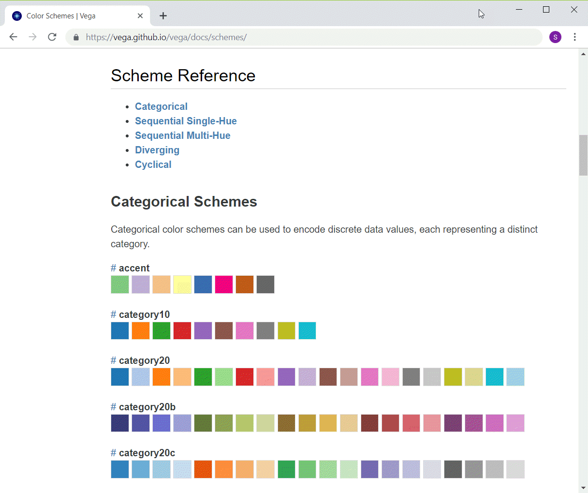

<div class="notes">

If you want to use colors to represent categories, you want every color value to be readily distinguishable from every other color value. Python/Altair offers some pretty good choices if you have 10 or less levels for your categories. If you have more than 10 categories, you have to live with some colors being only slightly different than the others.

</div>

### Colors, Python single hue schemes

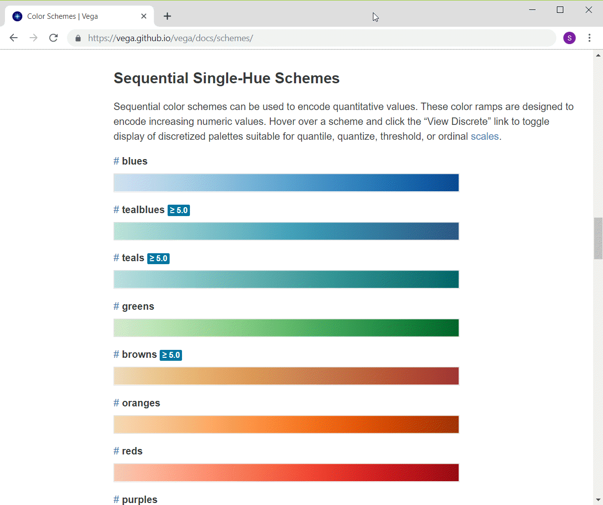

<div class="notes">

Python/Altair has several single hue gradients that go from a very light to very dark in a variety of hues.

</div>

### Colors, Python multi-hue schemes

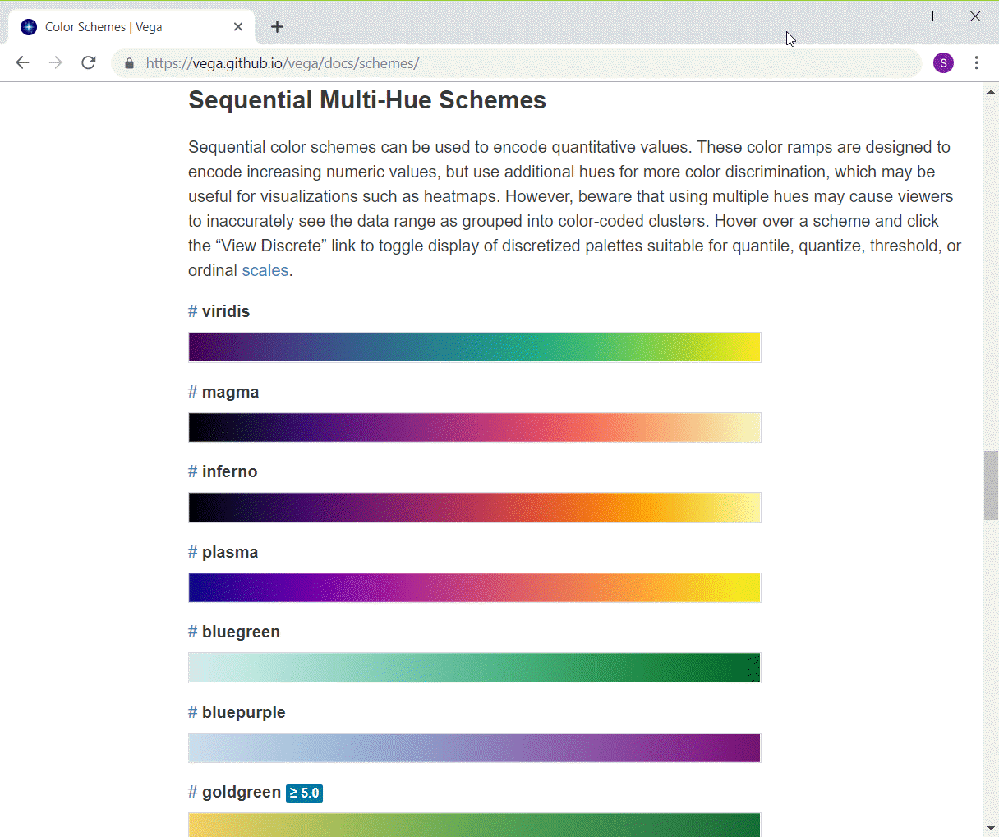

<div class="notes">

The multi-hue color schemes in Python/Altair transition from one hue to another hue. The colors are more or less equally intense throughout the entire range.

</div>

### Colors, Python diverging schemes

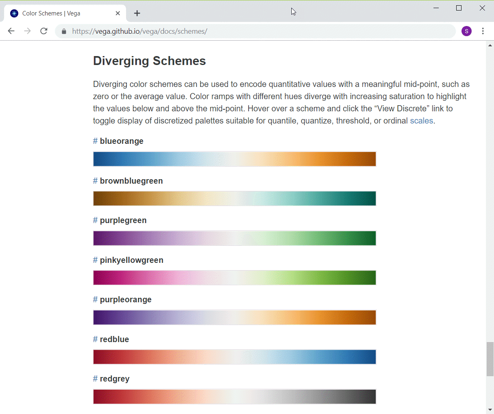

<div class="notes">

The diverging schemes also transition from one hue to another but in the middle the colors lose all their intensity, fading away to white or gray.

</div>

### Colors, Python code to change color schemes

```{python}
import pandas as pd
import altair as alt
df = pd.read_csv("../../common-files/data/houses.csv")
```

```{python, echo=TRUE}
ch = alt.Chart(df).mark_point().encode(
    alt.Color('Bathrooms', scale=alt.Scale(scheme='reds')),
    x='Age',
    y='Price'
)
```

```{python}
ch.save("../images/python/change-colors.html")
```

### Colors, Python output

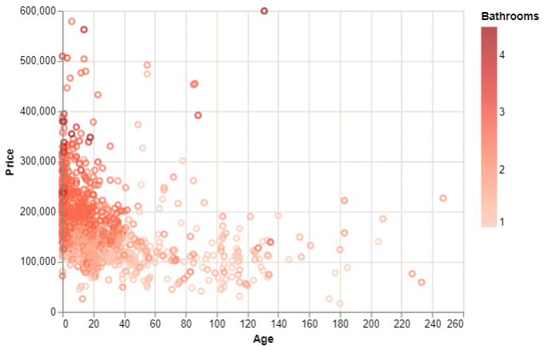

### Colors, R qualitative schemes 

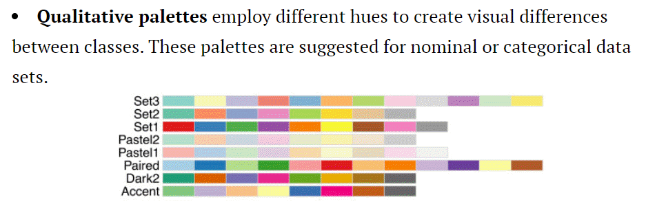

<div class="notes">

You can get color schemes from various sources in R. One of the best and most popular is called Color Brewer. It has color schemes in three areas: qualitative, sequential, and diverging. Here are the qualitative color schemes.

Notice that R does not try to present a categorical color scheme with more than 12 values. These schemes do a fairly good job of keeping each of the colors reasonably different from the others.

</div>

### Colors, R sequential schemes

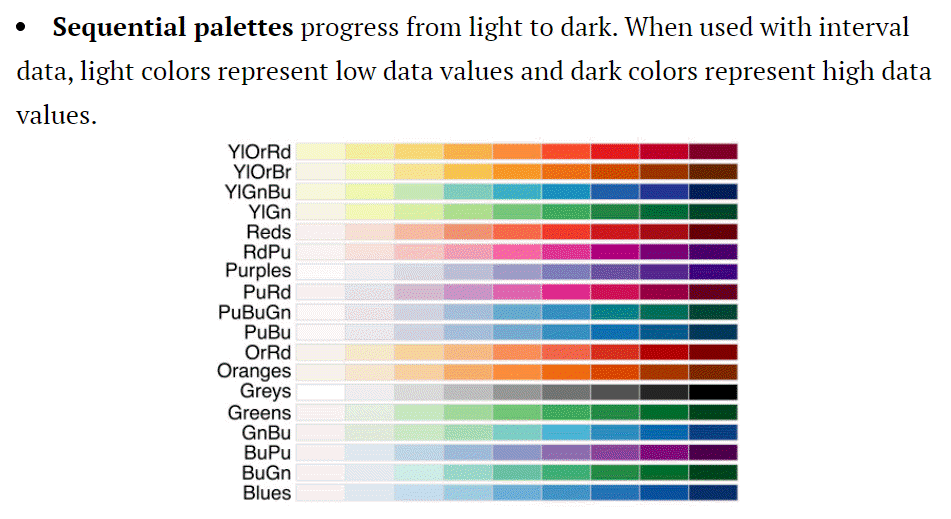

<div class="notes>

These are what color brewer refers to as sequential color schemes. They represent a single color, going from light to dark. These are similar to the single hue schemes in Python/Altair.

</div>

### Colors, R color schemes (3/3)

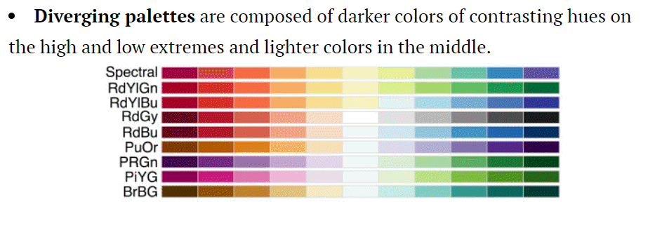

<div class="notes">

These are diverging color schemes, with a relatively light or neutral color in the mddie and darker extremes of two very different colors on either end.

</div>

### Colors, R code for changing color schemes

```
ggplot(saratoga_houses, aes(Age, Price)) + 
  geom_point(aes(color=Bathrooms)) + 
  scale_color_gradient(low="#FFFFFF", high="#FF0000")
```
### Colors, R output

```{r change-gradient}
initiate_image()
saratoga_houses <- read.csv("../../common-files/data/houses.csv")
ggplot(saratoga_houses, aes(Age, Price)) + 
  geom_point(aes(color=Bathrooms)) + 
  scale_color_gradient(low="#FFFFFF", high="#FF0000")
finalize_image()
```

`r display_image`

### Colors, Tableau gradient schemes

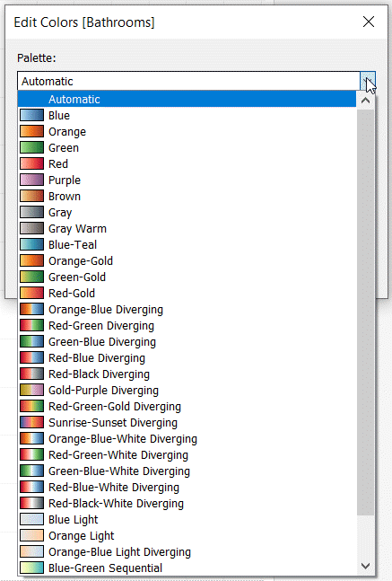

<div class="notes">

Tableau has quite a few choices for a continuous color gradient, but they are not as neatly categorized as the ones in Python/Altair and R.

https://help.tableau.com/current/pro/desktop/en-us/viewparts_marks_markproperties_color.htm

</div>

### Discrete color options in Tableau

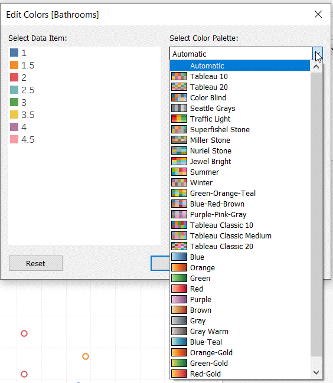

<div class="notes">

The discrete choices (for representing categories using color) are also quite diverse, but they seem hard to group into any pattern.

</div>

### Colors, Tableau output

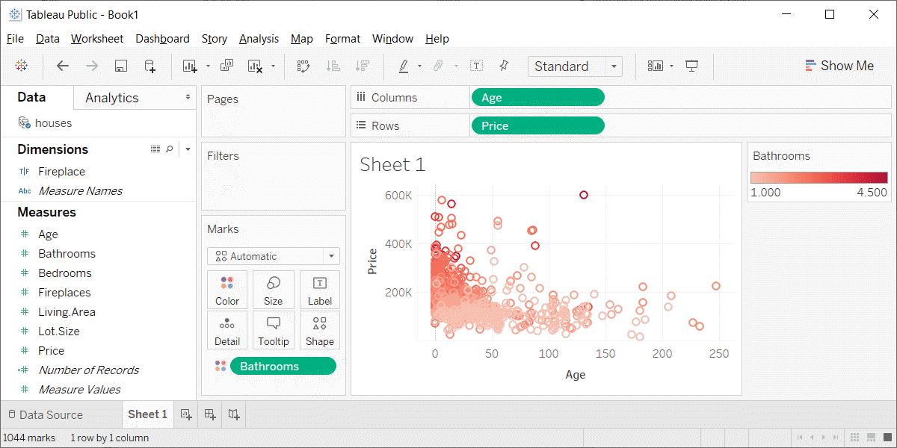

<div class="notes">

Here's what the Tableau output looks like.

</div>

### Colors, HSV system

+ H = Hue
  + Color wheel
  + Red, yellow, green, cyan, blue, and magenta
+ Saturation
  + How colorful
  + Low saturation produces white or various shades of gray
+ Value
  + How dark
  + Low values produce dark color
  + 0 produces black

<div class="notes">

The HSV system has three parameters, hue, saturation, and value. Hue is a color wheel including red, yellow, green, cyan, blue, and magenta, or some mixture of these colors. Saturation is a measure of intensity or colorfulness. Unsaturated colors produce white or various shades of gray. Value is a measure of darkness and a value of zero is totally black.

</div>

### Colors, HSV system

```{r hsv-1}
twist <- 0.03
initiate_image()
n1 <- 200
t <- 0.5*(0:(n1-1))/n1
m1 <- n1
v <- (m1:0)/m1
x1 <- rep(cos( 2*3.14159*t+twist), m1+1)
y1 <- rep(sin(-2*3.14159*t+twist), m1+1)-4*rep(rev(v), each=n1)
c1 <- c(hsv(h=rep(t, m1+1), rep(v, each=n1), rep(v, each=n1))) 
dg1 <- data.frame(x=x1, y=y1, co=c1)
n2 <- 300
x2 <- 2*rep((0:(n2-1))/n2, each=n2)-1
y2 <- 2*rep((0:(n2-1))/n2, n2)-1
r2 <- sqrt(x2^2+y2^2)
theta <- (pi + atan2(y2, x2))/(2*pi)
c2 <- rep(hsv(h=0, s=0, v=0.5), n2^2)
c2[r2<=1] <- hsv(theta[r2<=1], r2[r2<=1], 1)
dg2 <- data.frame(x=-x2, y=y2, co=c2)
dg3 <- rbind(dg1, dg2[r2<=1, ])
ggplot(dg3, aes(x, y)) + 
  geom_point(col=dg3$co) +
  expand_limits(y=c(-5, 1)) + 
  expand_limits(x=c(-1.2, 1.2)) + 
  theme_void() +
  theme(
    panel.background=element_rect(fill="#808080")
  )
finalize_image()
```

`r display_image`

<div class="notes">

This image shows a cylinder. It is a geometric representation of the HSV color system.

The advantage of the cylindrical HSV system over the RGB cube is that you can more readily visualize gradients, gradual transitions from one color to another.

</div>

### Colors, HSV system, hue only

```{r hsv-2}
sz <- 6 
initiate_image()
n4 <- 600
t4 <- (0:(n4-1))/n4
x4 <- cos( 2*3.14159*t4+twist)
y4 <- sin(-2*3.14159*t4+twist)
c4 <- hsv(t4, 1, 1) 
dg4 <- data.frame(x=x4, y=y4, co=c4)
ggplot(dg4, aes(x, y)) + 
  geom_point(col=dg4$co) +
  expand_limits(y=c(-5, 1)) + 
  expand_limits(x=c(-1.2, 1.2)) + 
  geom_text(x=x4[100], y=y4[100], label="hsv(1/6, 1, 1)", color="black", size=sz) + 
  geom_text(x=x4[200], y=y4[200], label="hsv(1/3, 1, 1)", color="black", size=sz) + 
  geom_text(x=x4[300], y=y4[300], label="hsv(1/2, 1, 1)", color="black", size=sz) + 
  geom_text(x=x4[400], y=y4[400], label="hsv(2/3, 1, 1)", color="black", size=sz) + 
  geom_text(x=x4[500], y=y4[500], label="hsv(5/6, 1, 1)", color="black", size=sz) + 
  geom_text(x=x4[600], y=y4[600], label="hsv(0 or 1, 1, 1)", color="black", size=sz) + 
  theme_void() +
  theme(
    panel.background=element_rect(fill="#808080")
  )
finalize_image()
```

`r display_image`

<div class="notes">

The outside ring at the top of the cylinder gives the hue. The hue is arranged in a circle from 0 to 1. The colors cycle between red on the far right, and (moving clockwise) yellow, green, cyan, blue, magenta, and back to red again.

</div>

### Colors, HSV system, saturation only

```{r hsv-3}
initiate_image()
n5 <- 6
m5 <- 200
t5 <- rep((0:(n5-1))/n5, m5)
u5 <- rep((1:m5)/ m5, each=n5)
x5 <- cos( 2*3.14159*t5+twist)*u5
y5 <- sin(-2*3.14159*t5+twist)*u5
c5 <- hsv(t5, u5, 1) 
dg5 <- data.frame(x=x5, y=y5, co=c5)
ggplot(dg5, aes(x, y)) + 
  geom_point(col=dg5$co) +
  expand_limits(y=c(-5, 1)) + 
  expand_limits(x=c(-1.2, 1.2)) + 
  geom_text(x=x4[100], y=y4[100], label="hsv(1/6, 1, 1)", color="black", size=sz) + 
  geom_text(x=x4[200], y=y4[200], label="hsv(1/3, 1, 1)", color="black", size=sz) + 
  geom_text(x=x4[300], y=y4[300], label="hsv(1/2, 1, 1)", color="black", size=sz) + 
  geom_text(x=x4[400], y=y4[400], label="hsv(2/3, 1, 1)", color="black", size=sz) + 
  geom_text(x=x4[500], y=y4[500], label="hsv(5/6, 1, 1)", color="black", size=sz) + 
  geom_text(x=x4[600], y=y4[600], label="hsv(0 or 1, 1, 1)", color="black", size=sz) + 
  geom_text(x=0,       y=0,       label="hsv(anything, 0, 1)", color="black", size=sz) + 
  theme_void() +
  theme(
    panel.background=element_rect(fill="#808080")
  )
finalize_image()
```

`r display_image`

<div class="notes">

As you move into the center of the cylinder, the color gradually gets sucked away. The degree to which a color is present or not is the saturation. At the very center of the cylinder, you get white...but only at the top of the cylinder. With darker colors, reducing saturation produces various shades of gray. At the very bottom, everything is black.

</div>

### Colors, HSV system, value only

```{r hsv-4}
initiate_image()
n6 <- 6
m6 <- 200
t6 <- rep((0:(n6-1))/n6, m6)

u6 <- rep((1:m6)/ m6, each=n6)
x6 <- cos( 2*3.14159*t6+twist)
y6 <- sin(-2*3.14159*t6+twist)-4*u6
c6 <- hsv(t6, 1, 1-u6) 
dg6 <- data.frame(x=x6, y=y6, co=c6)
ggplot(dg6, aes(x, y)) + 
  geom_point(col=dg6$co) +
  expand_limits(y=c(-5, 1)) + 
  expand_limits(x=c(-1.2, 1.2)) + 
  geom_text(x=x4[100], y=y4[100], label="hsv(1/6, 1, 1)", color="black", size=sz) + 
  geom_text(x=x4[200], y=y4[200], label="hsv(1/3, 1, 1)", color="black", size=sz) + 
  geom_text(x=x4[300], y=y4[300], label="hsv(1/2, 1, 1)", color="black", size=sz) + 
  geom_text(x=x4[400], y=y4[400], label="hsv(2/3, 1, 1)", color="black", size=sz) + 
  geom_text(x=x4[500], y=y4[500], label="hsv(5/6, 1, 1)", color="black", size=sz) + 
  geom_text(x=x4[600], y=y4[600], label="hsv(0 or 1, 1, 1)", color="black", size=sz) + 
  geom_text(x=x4[100], y=y4[100]-4, label="hsv(1/6, 1, 0)", color="black", size=sz) + 
  geom_text(x=x4[200], y=y4[200]-4, label="hsv(1/3, 1, 0)", color="black", size=sz) + 
  geom_text(x=x4[300], y=y4[300]-4, label="hsv(1/2, 1, 0)", color="black", size=sz) + 
  geom_text(x=x4[400], y=y4[400]-4, label="hsv(2/3, 1, 0)", color="black", size=sz) + 
  geom_text(x=x4[500], y=y4[500]-4, label="hsv(5/6, 1, 0)", color="black", size=sz) + 
  geom_text(x=x4[600], y=y4[600]-4, label="hsv(0 or 1, 1, 0)", color="black", size=sz) + 
  theme_void() +
  theme(
    panel.background=element_rect(fill="#808080")
  )
finalize_image()
```

`r display_image`

<div class="notes">

The darkness of a color is known as its value, which is the V in the HSV acronym. The top of the cylinder shows the pure colors, and heading straight down provides a continuous gradient from that pure color to pure black.

</div>

### Colors, HCL system
+ H = hue
  + arranged on a wheel 0-360 degrees
  + 0 = red, 120 = green, 240 = blue
  + 60 = yellow, 180 = cyan, 240 = magenta
+ C = chroma
  + colorfulness relative to a gray of equal luminance
  + not quite same as saturation
+ L = luminance
  + brightness, lightness
+ Not all combinations of HCL work

<div class="notes">

Another color system is the HCL system. 

It has a hue value, just like the hsl system.

Chroma is a measure of how intense the color is. It is like saturation, but represents a relative amount of saturation, relative to a grey value of the same luminance.

Luminance is a meausre of brightness or lightness. The luminance is similar to the V (value)
in the hsv system. It does a better job of matching brightness, because certain colors, such as yellow and green have a naturally higher level of brightness.

For a given value of luminance, there may be restrictions in how far you can move towards the pure colors. For high values of luminance, you can't get near the pure red or pure blue colors, as they don't have enough brightness, especially compared to the yellows and greens. For values of low luminance, the opposite occurs. Pure yellow and pure green are just too bright, but you can get reasonable values for something close to pure red and pure blue.

</div>

### Colors, Luminance of pure colors

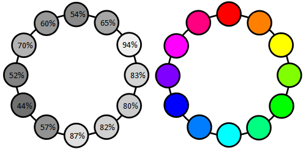

<div class="notes">

This image, borrowed from the excellent website, workwithcolor.com, shows that the pure colors are not equally bright. Yellow is the brigthest color. At 94% luminance, it is almost white. Cyan, at 87% luminance, and green, at 80% luminance, are almost as bright. The remaining colors have much less luminance. Magenta has 70% luminance, red has 54% luminance, and blue, at 44% luminance, is closer to black than it is to white.

</div>

```{r hcl-function}
hcl_plot <- function(lum) {
  d <- 1.75
  twist <- 0.03
  n2 <- 300
  x2 <- d*(2*rep((0:(n2-1))/n2, each=n2)-1)
  y2 <- d*(2*rep((0:(n2-1))/n2, n2)-1)
  r2 <- sqrt(x2^2+y2^2)
  theta <- (pi + atan2(y2, x2))/(2*pi)
  c2 <- rep(hsv(h=0, s=0, v=0.5), n2^2)
  c2 <- hcl(360*theta, 100*r2, 100*lum, fixup=FALSE)
  dg2 <- data.frame(x=-x2, y=y2, co=c2)
  dg3 <- rbind(dg2[!is.na(dg2$co), ])
  g <- ggplot(dg3, aes(x, y)) + 
    geom_point(col=dg3$co) +
    expand_limits(y=c(-1.2*d, 1.2*d)) + 
    expand_limits(x=c(-1.2*d, 1.2*d)) + 
    geom_text(x=d*cos( 0*pi/3), y=d*sin( 0*pi/3), angle= 90, label=  "0 = Red",     color="red", size=sz) + 
    geom_text(x=d*cos(-1*pi/3), y=d*sin(-1*pi/3), angle= 30, label= "60 = Yellow",  color="yellow", size=sz) + 
    geom_text(x=d*cos(-2*pi/3), y=d*sin(-2*pi/3), angle=-30, label="120 = Green",   color="green", size=sz) + 
    geom_text(x=d*cos(-3*pi/3), y=d*sin(-3*pi/3), angle=-90, label="180 = Cyan",    color="cyan", size=sz) + 
    geom_text(x=d*cos(-4*pi/3), y=d*sin(-4*pi/3), angle= 30, label="240 = Blue",    color="blue", size=sz) + 
    geom_text(x=d*cos(-5*pi/3), y=d*sin(-5*pi/3), angle=-30, label="300 = Magenta", color="magenta", size=sz) + 
    theme_void() +
    theme(
      panel.background=element_rect(fill="#808080")
    )
  g
}
```

### Colors, Luminance = 90%

```{r hcl-90}
initiate_image()
hcl_plot(18/20)
finalize_image()
```

`r display_image`

<div class="notes">

These are the color values with a luminance of 90%. It favors the green and yellow side of the color wheel.

</div>

### Colors, Luminance=70%

```{r hcl-70}
initiate_image()
hcl_plot(14/20)
finalize_image()
```

`r display_image`

<div class="notes">

A lower value of luminance, like 70% shown here, will allow you to extend to some of the less bright dark colors like red and blue. 

</div>

### Colors, Luminance=50%

```{r hcl-50}
initiate_image()
hcl_plot(10/20)
finalize_image()
```

`r display_image`

<div class="notes">

At a luminance value of 50%, you can no longer get very many shades of yellow or green, as they are too bright.

</div>

### Colors, Luminance=30%

```{r hcl-30}
initiate_image()
hcl_plot(6/20)
finalize_image()
```

`r display_image`

<div class="notes">

At 30% luminance, you are pretty dark and are left mostly on the blue-magenta-red hues.

</div>

### Colors, Opacity (1/3)

```{r opacity-1}
initiate_image()
x <- ((1:9)+0)/10
y <- rep(0, length=length(x))
g1 <- ggplot(data.frame(x, y), aes(x, y)) +
  geom_point(color="red", alpha=x, size=15) +
  expand_limits(y=c(-0.1, 2.1)) + 
  theme(
    panel.background = element_rect(fill = 'white'),
    panel.grid = element_line(color='white')) +
  scale_x_continuous(breaks=x, labels=paste0(100*x, "%")) +
  scale_y_continuous(breaks=NULL) +
  xlab(label="alpha") +
  ylab(label=" ")
g1
finalize_image()
```

`r display_image`

<div class="notes">

There is one more feature of color that is important, opacity. Opacity is the extent to which you can peek through a color to see the background beheath.

</div>

### Colors, opacity (2/3)

```{r opacity-2}
initiate_image()
g2 <- g1 +
  geom_segment(x=0, y=0.3, xend=1, yend=0.3, size=13) +
  geom_segment(x=0, y=0.5, xend=1, yend=0.5, size=13, color="green") +
  geom_point(y=y+0.4, color="red", alpha=x, size=15)
g2
finalize_image()
```

`r display_image`

<div class="notes">

A low degree of opacity does not impy a lighter color. It's only lighter when the background is white, because more of the white is showing through. When the background is black, a low degree of opacity means a dark red. When the background is green, a low degree of opacity produces a darker green with a tint of red.

</div>

### Colors, Opacity (3/3)

```{r opacity-3}
initiate_image()
g3 <- g2 +
  geom_point(x=0.2, y=0.8, color="red", alpha=0.03, size=15) +
  geom_point(x=0.2, y=0.9, color="red", alpha=0.03, size=15) +
  geom_point(x=0.2, y=1.2, color="red", alpha=0.03, size=15) +
  geom_point(x=0.2, y=1.3, color="red", alpha=0.03, size=15) +
  geom_point(x=0.19, y=1.25, color="red", alpha=0.03, size=15) +
  geom_point(x=0.2, y=1.6, color="red", alpha=0.03, size=15) +
  geom_point(x=0.2, y=1.7, color="red", alpha=0.03, size=15) +
  geom_point(x=0.19, y=1.65, color="red", alpha=0.03, size=15) +
  geom_point(x=0.21, y=1.65, color="red", alpha=0.03, size=15)
g3
finalize_image()
```

`r display_image`

<div class="notes">

If two points with high opacity overlap, then the overlap is more opaque. It becomes even more so when three or four points overlap.

</div>

### Colors, CMYK system

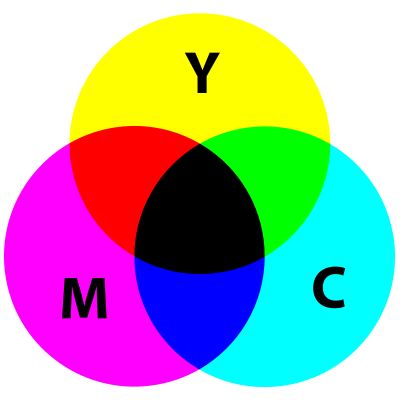

<div class="notes">

When you are printing, more of something makes things darker. This is the exact opposite of a computer monitor, where more of something makes things lighter. Also, printing is typically done on a sheet of white paper, so you don't need to put any ink down in areas that are pure white and you put very little ink down in areas that are nearly white.

</div>

### Colors, CMYK system, combinations
+ Building blocks Cyan (C), Magenta (M), Yellow (Y), Black (K).
  + Subtractive system
+ Cyan plus Magenta equals Blue
+ Cyan plus Yellow equals Green
+ Magenta plus Yellow equals Red
+ All three combined equals Black

<div class="notes">

The building blocks of the CMYK are the colors cyan, magenta, yellow and K=black. You don't want the letter B for black because it might get confused with the B for blue in an RGB system.

The combination of colors in a CMYK system works in a complementary way to RGB. The combinations of cyan and magenta produces blue, cyan plus yellow produces green, and magenta plus yellow produces red.

</div>

### Colors, CMYK system, Why you need black
+ Only in theory does, C+M+Y = Black
  + Too much ink
  + Dull muddy color
+ On screen versus print

<div class="notes">

The CYMK color system adds a fourth color, black, to the mix. In theory, you don't need black, because you can get it with cyan plus magenta plus yellow. But that wastes a lot of expensive ink, and you can also run into trouble by putting some much in a single spot, especially when the image is very dark.

Also, in practice, the combination of cyan, magenta, and yeloow produces a dull muddy color that is not close enough to black. So adding a black ink helps. It also helps to mix in a bit of black ink for some of the other colors close to black on the color spectrum.

The translation of colors from an additive system like RGB to a subtractive system like CMYK is complicated and it is difficult to get something on the computer screen to match perfectly with what gets printed. If you work with printed color materials, you have to do a lot of extra work to get things to look right.

</div>

### Colors, review
+ Kindergarten view of colors
+ RGB color system
  + Gradients
+ HSV color system
  +  Discrete color palettes
+ HCL color system
  + Equal luminance
+ Opacity
+ CYMK system

<div class="notes">

The kindergarten view of colors (red plus yellow equals orange) doesn't work on a computer screen because the screen uses mixtures of light to combine colors. We covered the RGB system including how to create gradients. The HSV system provides a more intuitive description of colors, while CMYK is used when printing, where a subtractive rather than additive color system is needed.

</div>

```{r save-colors-tutorial-files}
save.image("../data/colors-tutorial.RData")
```