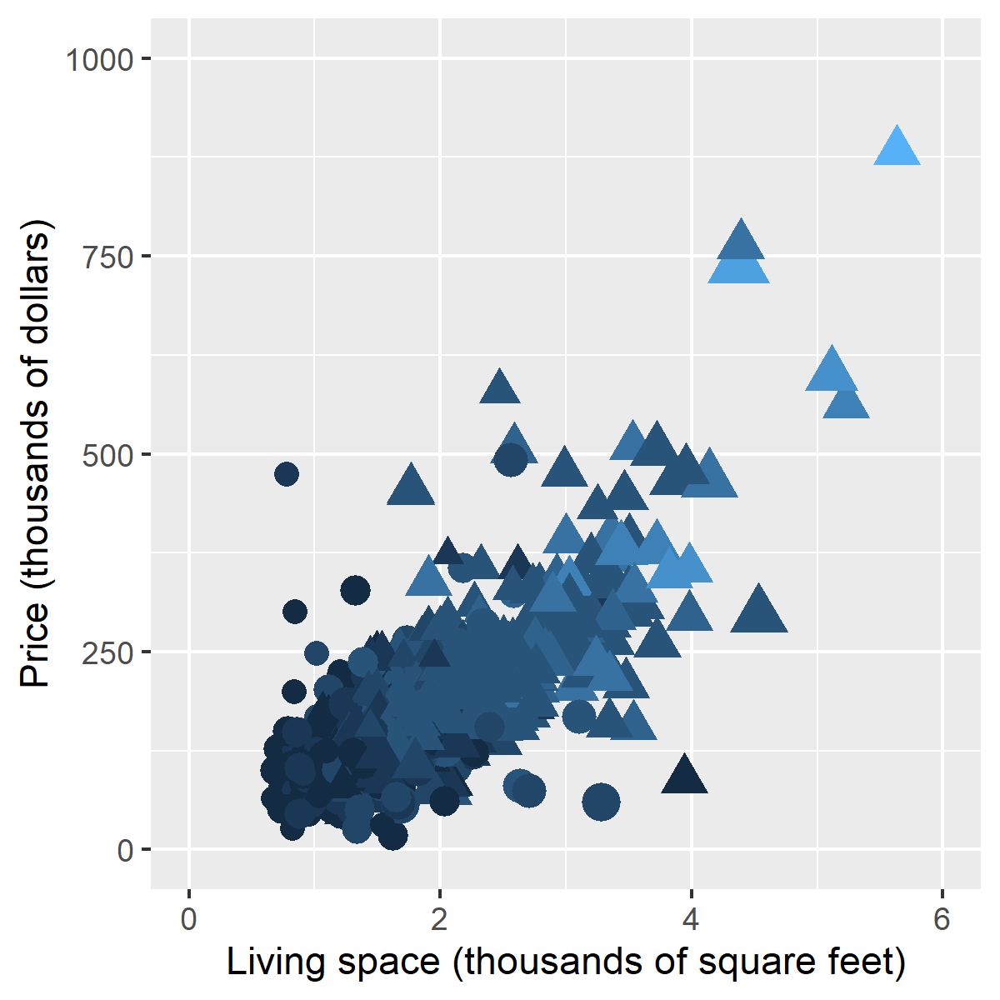

```{r setup}
knitr::opts_chunk$set(echo=FALSE)
suppressMessages(suppressWarnings(library(ggplot2)))
```

### Synopsis

+ Definition of a scatterplot
+ Options you control
  + Location
  + Size
  + Shape
  + Color

<div class="notes">

Here is the abstract associated with this talk. I don't want to read this word for word, but I am including it here so I can refer to it as necessary during the development of this presentation.

"Practical suggestions for improving your scatterplots"

"The scatterplot is a simple display of the relationship between two or sometime three variables. You have a wide range of options for displaying a scatterplot. In particular, you can control the location, size, shape, and color of the points in your scatterplot. Careful selection among these options will allow your audience to rapidly and accurately understand this relationship. Here are some important dos and don'ts. Don't use a gradient to represent a nominal variable. Use open circles rather than closed circles if there is a lot of overprinting. Vary the size or the shape of your data points, but not both. Always pair color with another feature in your plots. Most importantly, never blindly accept the first graph that comes out of your software program. Revise your graphs as often as you revise your writing."

</div>

### Synopsis

+ Recommendations
  + Don't use gradients for categories
  + Open circles if there is overprinting
  + Vary size or shape, not both
  + Pair color with second feature
  + Revise, revise, revise

<div class="notes">

There are five general recommendations I want to make about scatterplots.

</div>

### What software should you use?

+ Use the software you like best
+ What does your boss use?
+ What do your co-workers use?
+ What software are you most comfortable with?
  
<div class="notes">

I'm a big believer in software agnosticism, and this is something that I see in the presentations by The Analysis Factor. It is a mistake to teach as if there is only one good program for data visualization.

If you are not sure what software package to use in this class, let me offer a few suggestions. First, your boss may have a strong opinion about what software that you should use. You can go to your boss and say "My teacher is a really smart guy who says that the _____ package in _____ is the best choice for data visualization." Try it and see what happens. Nothing, I suspect. One of the great tragedies in life is that the wise advice you get in this class carries very little weight in the real world.

If your boss doesn't care, see what most of your co-workers are using. They may not be as smart as I am (put on a false air of pride here) but they are a lot closer to your cubicle when this workshop ends and you have to find a quick answer.

There's also a comfort level here. Do you want a graphical user interface or a programming language. A graphical interface is great for getting work done quickly. A programming language is great for reproducibility and reusability. What fits your working style better? I don't know and it would be arrogant of me to make the presumption that I do know.

One more consideration. Some of you in this class are "ringers." You already know visualization better than I do because you've been doing it for longer, with bigger and more complex data sets. You're just here to see if I know one or two things that you don't already know. If you're a ringer, take the challenge of learning a new software system. It will keep you from getting too bored when I talk about all these things that you already know better than I do.

</div>

### General principles

+ Two quantifiable criteria for an effective graph
  + Speed
  + Accuracy
  
<div class="notes">

Everybody has opinions, but data trumps all. If you want to demonstrate empirically that one particular graph is more effective than another graph, you want to measure one of two things.

First, how quickly can a viewer answer a question about the graph?

Second, how accurately can a viewer answer a question about the graph?

</div>

### Example of an empirical study

:::::: {.columns}
::: {.column}

:::
::: {.column}
+ Simkin D, Hastie R. An Information-Processing Analysis of Graph Perception. Journal of the American Statistical Association 1987: 82(398); 454-465.
  + Which is bigger, left or right?
  + Estimate percentage for smaller value.
:::
::::::

<div class="notes">

An early example of this type of empirical study was done in 1987 by David Simkin and Reid Hastie. They showed graphs like the ones on the left, varying the size and disparity of the bars or pie wedges. They asked two questions. Looking at the the bars/wedges indicated by the dots, which is bigger the one of the left or the one on the right? What is the percentage that you would estimate for the smaller of the two?

The researchers then measured the time it took each subject to answer these questions and how accurate those answers were.

Read the paper for the full answer, but surprisingly, the pie chart turned out to be better in some settings. Better in what sense? Better in speed and accuracy.

</div>

Hierarchy of perception

+ Visually simple tasks
  + Position
  + Length
+ Moderately difficult tasks
  + Angle/slope
  + Area
+ Very difficult tasks
  + Volume
  + Density/Saturation/Hue

<div class="notes">


</div>

### Comparison of color


### Comparison of color


### Comparison of color


### Vermont snowfall scatterplot

```{r vt-read}
vt <- read.table("../data/vermont-cities-snowfall.txt")
names(vt) <- c("Snowfall", "City")
color_codes <- c("red", rep("black", 5), "red", rep("black", 6))
vermont_barchart <- ggplot(vt, aes(Snowfall, City)) + 
  geom_point(color=color_codes) + 
  expand_limits(x=0) +
  ylab(" ") +
  xlab("Yearly snowfall in inches")
ggsave("../images/btv_snow_average04.png", vermont_barchart, width=6, height=3)
```


<div class="notes">

I pulled some snowfall numbers from a different website, so this data is not perfectly consistent with the maps, but it is fairly close.

Notice how much easier it is to pick out which city has more snowfall when you display it as a scatterplot. You are judging the relative position rather than the color.

There are some questions, of course, that are still answered faster and more accurately with the map, such as whether the western edge of the state has more snowfall than the eastern edge.

</div>

### A five dimensional scatterplot
  
```{r read, eval=FALSE}  
fn <- "https://dasl.datadescription.com/download/data/3437"
sa <- read.table(fn, header=TRUE, sep="\t", stringsAsFactors=FALSE)
save(sa, file="../data/saratoga_housing.RData")
write.csv(sa, "../data/saratoga_housing.csv", row.names=FALSE)
```

```{r first-plot}
load("../data/saratoga_housing.RData")
library(ggplot2)
plot_framework <- ggplot(
  sa, aes(Size, Price, shape=factor(Fireplace), color=Baths, size=Bedrooms)) +
  theme(legend.position="none") + 
  expand_limits(x=c(0, 6), y=c(0, 1000))
kitchen_sink_plot <-  plot_framework + geom_point()
ggsave("../images/kitchen-sink-plot.png", kitchen_sink_plot, height=4, width=4)
```



### Highlight two points

```{r second-plot}
# 724, 791
# 724, 212

n <- dim(sa)[1]
p1 <- 915
p2 <- 212
pts <- (1:n) %in% c(p1, p2)
sa$highlight <- ifelse(pts, 1, 0.06)
faded_plot <- plot_framework + geom_point(alpha=sa$highlight)
faded_plot
```

### X position <- Square footage

```{r}
faded_plot + 
  geom_text(x=sa$Size[p1], y=0, label=sa$Size[p1], size=4, color="black") +
  geom_text(x=sa$Size[p2], y=0, label=sa$Size[p2], size=4, color="black")
```

### Y position <- Price

```{r}
faded_plot + 
  geom_text(x=0.2, y=sa$Price[p1], label=round(sa$Price[p1]), size=4, color="black") +
  geom_text(x=0.2, y=sa$Price[p2], label=round(sa$Price[p2]), size=4, color="black")
```

### Size <- Number of bedrooms

```{r}
faded_plot + 
  geom_text(x=sa$Size[p1], y=sa$Price[p1]+75, label=sa$Bedrooms[p1], size=3, color="black") +
  geom_text(x=sa$Size[p2], y=sa$Price[p2]+75, label=sa$Bedrooms[p2], size=5, color="black")
```

### Shape <- Fireplace indicator

```{r}
faded_plot + 
  geom_text(x=sa$Size[p1], y=sa$Price[p1]+75, label="No fireplace", size=4, color="black") +
  geom_text(x=sa$Size[p2], y=sa$Price[p2]+75, label="Fireplace", size=4, color="black")
```

### Color <- Number of bathrooms

```{r}
faded_plot + 
  geom_text(x=sa$Size[p1], y=sa$Price[p1]+75, label=sa$Baths[p1], size=4, color=sa$Baths[p1]) +
  geom_text(x=sa$Size[p2], y=sa$Price[p2]+75, label=sa$Baths[p2], size=4, color=sa$Baths[p2])
```

### X and Y position
+ Biggest issue is overprinting
+ Partial solutions
  + Small size
  + Open symbols
  + Log transformation
  + Opacity
  + Jittering

<div class="notes">


</div>

### Open circles

```{r open}
x0 <- c(12, 13, 14, 14) 
y0 <- c(12, 12, 13, 14)
artificial_data <- data.frame(
  x=c(x0, x0+15),
  y=c(y0+10, y0+10)
)
lims <- c(10, 30)
ggplot(artificial_data, aes(x, y)) +
  theme_void() +
  expand_limits(x=lims, y=lims) +
  geom_point(size=20, shape=rep(c(16, 1), each=4))
```

### Open circles

:::::: {.columns}
::: {.column}

:::
::: {.column}

:::
::::::

<div class="notes">


</div>

### Small size

```{r small-size}
x0 <- c(12, 13, 14, 14) 
y0 <- c(12, 12, 13, 14)
artificial_data <- data.frame(
  x=c(x0, x0+15),
  y=c(y0+10, y0+10)
)
lims <- c(10, 30)
ggplot(artificial_data, aes(x, y)) +
  theme_void() +
  expand_limits(x=lims, y=lims) +
  geom_point(shape=16, size=rep(c(20, 7), each=4))
```

### Small size

:::::: {.columns}
::: {.column}

:::
::: {.column}

:::
::::::

<div class="notes">


</div>

### Opacity

```{r opacity}
x0 <- c(12, 13, 14, 14) 
y0 <- c(12, 12, 13, 14)
artificial_data <- data.frame(
  x=c(x0, x0+15),
  y=c(y0+10, y0+10)
)
lims <- c(10, 30)
ggplot(artificial_data, aes(x, y)) +
  theme_void() +
  expand_limits(x=lims, y=lims) +
  geom_point(shape=16, size=20, alpha=rep(c(1, 0.2), each=4))
```

### Opacity

:::::: {.columns}
::: {.column}

:::
::: {.column}

:::
::::::

<div class="notes">


</div>

### Log scale

```{r log-scale00}
y0 <- seq(-4, 3, length=100)
x0 <- 2^y0
artificial_data <- data.frame(
  x=x0,
  y=y0
)
log_plot00 <- 
  ggplot(artificial_data, aes(x, y)) +
    theme_void() +
    expand_limits(x=c(-2, 9), y=c(-7, 6)) +
    geom_line()
ggsave("../images/log-plot00.png", log_plot00, width=4, height=4)
```


### Log scale

```{r log-scale01}
a <- 0.3
b <- 0.8
log_plot01 <- log_plot00 + 
    geom_segment(x=a, y=-4.1, xend=a, yend=log2(a)) +
    geom_segment(x=b, y=-4.1, xend=b, yend=log2(b)) +
    geom_segment(x=-0.3, y=log2(a), xend=a, yend=log2(a)) +
    geom_segment(x=-0.3, y=log2(b), xend=b, yend=log2(b)) +
    geom_text(x=a, y=-5, label=a, angle=90) +
    geom_text(x=-1, y=log2(a), label=round(log2(a), 1)) +
    geom_text(x=b, y=-5, label=b, angle=90) +
    geom_text(x=-1, y=log2(b), label=round(log2(b), 1))
ggsave("../images/log-plot01.png", log_plot01, width=4, height=4)
```


### Log scale

```{r log-scale02}
a <- 3
b <- 6
log_plot02 <- log_plot00 + 
    geom_segment(x=a, y=-4.1, xend=a, yend=log2(a)) +
    geom_segment(x=b, y=-4.1, xend=b, yend=log2(b)) +
    geom_segment(x=-0.3, y=log2(a), xend=a, yend=log2(a)) +
    geom_segment(x=-0.3, y=log2(b), xend=b, yend=log2(b)) +
    geom_text(x=a, y=-5, label=a, angle=90) +
    geom_text(x=-1, y=log2(a), label=round(log2(a), 1)) +
    geom_text(x=b, y=-5, label=b, angle=90) +
    geom_text(x=-1, y=log2(b), label=round(log2(b), 1))
ggsave("../images/log-plot02.png", log_plot02, width=4, height=4)
```


### Log scale

:::::: {.columns}
::: {.column}

:::
::: {.column}

:::
::::::

<div class="notes">


</div>


### Jittering

:::::: {.columns}
::: {.column}

:::
::: {.column}

:::
::::::

<div class="notes">


</div>


### Recommended books


<div class="notes">

Edward Tufte is a very interesting person.

</div>

```{r save-everything}
save.image("../data/improving.RData")