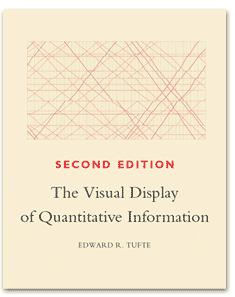

### Synopsis

+ Definition of a scatterplot
+ Options you control
  + Location
  + Size
  + Shape
  + Color

Here is the abstract associated with this talk. I don't want to read this word for word, but I am including it here so I can refer to it as necessary during the development of this presentation.

"Practical suggestions for improving your scatterplots"

"The scatterplot is a simple display of the relationship between two or sometime three variables. You have a wide range of options for displaying a scatterplot. In particular, you can control the location, size, shape, and color of the points in your scatterplot. Careful selection among these options will allow your audience to rapidly and accurately understand this relationship. Here are some important dos and don'ts. Don't use a gradient to represent a nominal variable. Use open circles rather than closed circles if there is a lot of overprinting. Vary the size or the shape of your data points, but not both. Always pair color with another feature in your plots. Most importantly, never blindly accept the first graph that comes out of your software program. Revise your graphs as often as you revise your writing."

### Synopsis

+ Recommendations
  + Don't use gradients for categories
  + Open circles if there is overprinting
  + Vary size or shape, not both
  + Pair color with second feature
  + Revise, revise, revise

There are five general recommendations I want to make about scatterplots.

### General principles

+ "I'm the only genius who understands my filing system."
  + This does not apply to graphs
+ Two quantifiable criteria for an effective graph
  + Speed
  + Accuracy

### Recommended books

Edward Tufte is a very interesting person.

