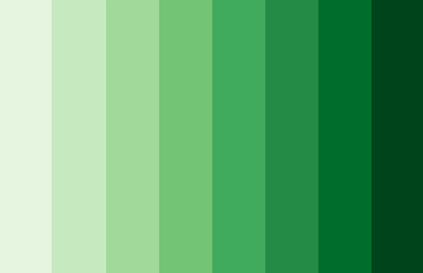

```{r setup}
knitr::opts_chunk$set(echo=FALSE)
suppressMessages(suppressWarnings(library(ggplot2)))
```

### Synopsis

+ Definition of a scatterplot
+ Options you control
  + Location
  + Size
  + Shape
  + Color

<div class="notes">

Here is the abstract associated with this talk. I don't want to read this word for word, but I am including it here so I can refer to it as necessary during the development of this presentation.

"Practical suggestions for improving your scatterplots"

"The scatterplot is a simple display of the relationship between two or sometime three variables. You have a wide range of options for displaying a scatterplot. In particular, you can control the location, size, shape, and color of the points in your scatterplot. Careful selection among these options will allow your audience to rapidly and accurately understand this relationship. Here are some important dos and don'ts. Don't use a gradient to represent a nominal variable. Use open circles rather than closed circles if there is a lot of overprinting. Vary the size or the shape of your data points, but not both. Always pair color with another feature in your plots. Most importantly, never blindly accept the first graph that comes out of your software program. Revise your graphs as often as you revise your writing."

</div>

### Synopsis

+ Recommendations
  + Don't use gradients for categories
  + Open circles if there is overprinting
  + Vary size or shape, not both
  + Pair color with second feature
  + Revise, revise, revise

<div class="notes">

There are five general recommendations I want to make about scatterplots.

</div>

### What software should you use?

+ Use the software you like best
+ What does your boss use?
+ What do your co-workers use?
+ What software are you most comfortable with?
  
<div class="notes">

I'm a big believer in software agnosticism, and this is something that I see in the presentations by The Analysis Factor. It is a mistake to teach as if there is only one good program for data visualization.

If you are not sure what software package to use in this class, let me offer a few suggestions. First, your boss may have a strong opinion about what software that you should use. You can go to your boss and say "My teacher is a really smart guy who says that the _____ package in _____ is the best choice for data visualization." Try it and see what happens. Nothing, I suspect. One of the great tragedies in life is that the wise advice you get in this class carries very little weight in the real world.

If your boss doesn't care, see what most of your co-workers are using. They may not be as smart as I am (put on a false air of pride here) but they are a lot closer to your cubicle when this workshop ends and you have to find a quick answer.

There's also a comfort level here. Do you want a graphical user interface or a programming language. A graphical interface is great for getting work done quickly. A programming language is great for reproducibility and reusability. What fits your working style better? I don't know and it would be arrogant of me to make the presumption that I do know.

One more consideration. Some of you in this class are "ringers." You already know visualization better than I do because you've been doing it for longer, with bigger and more complex data sets. You're just here to see if I know one or two things that you don't already know. If you're a ringer, take the challenge of learning a new software system. It will keep you from getting too bored when I talk about all these things that you already know better than I do.

</div>

### General principles

+ Two quantifiable criteria for an effective graph
  + Speed
  + Accuracy
  
<div class="notes">

Everybody has opinions, but data trumps all. If you want to demonstrate empirically that one particular graph is more effective than another graph, you want to measure one of two things.

First, how quickly can a viewer answer a question about the graph?

Second, how accurately can a viewer answer a question about the graph?

</div>

### Example of an empirical study

:::::: {.columns}
::: {.column}

:::
::: {.column}
+ Simkin D, Hastie R. An Information-Processing Analysis of Graph Perception. Journal of the American Statistical Association 1987: 82(398); 454-465.
  + Which is bigger, left or right?
  + Estimate percentage for smaller value.
:::
::::::

<div class="notes">

An early example of this type of empirical study was done in 1987 by David Simkin and Reid Hastie. They showed graphs like the ones on the left, varying the size and disparity of the bars or pie wedges. They asked two questions. Looking at the the bars/wedges indicated by the dots, which is bigger the one of the left or the one on the right? What is the percentage that you would estimate for the smaller of the two?

The researchers then measured the time it took each subject to answer these questions and how accurate those answers were.

Read the paper for the full answer, but surprisingly, the pie chart turned out to be better in some settings. Better in what sense? Better in speed and accuracy.

</div>

Hierarchy of perception

+ Visually simple tasks
  + Position
  + Length
+ Moderately difficult tasks
  + Angle/slope
  + Area
+ Very difficult tasks
  + Volume
  + Density/Saturation/Hue

<div class="notes">


</div>

### Comparison of color


### Comparison of color


### Comparison of color


### Vermont snowfall scatterplot

```{r vt-read}
vt <- read.table("../data/vermont-cities-snowfall.txt")
names(vt) <- c("Snowfall", "City")
color_codes <- c("red", rep("black", 5), "red", rep("black", 6))
vermont_barchart <- ggplot(vt, aes(Snowfall, City)) + 
  geom_point(color=color_codes) + 
  expand_limits(x=0) +
  ylab(" ") +
  xlab("Yearly snowfall in inches")
ggsave("../images/btv_snow_average04.png", vermont_barchart, width=6, height=3)
```


<div class="notes">

I pulled some snowfall numbers from a different website, so this data is not perfectly consistent with the maps, but it is fairly close.

Notice how much easier it is to pick out which city has more snowfall when you display it as a scatterplot. You are judging the relative position rather than the color.

There are some questions, of course, that are still answered faster and more accurately with the map, such as whether the western edge of the state has more snowfall than the eastern edge.

</div>

### A five dimensional scatterplot
  
```{r read, eval=FALSE}  
fn <- "https://dasl.datadescription.com/download/data/3437"
sa <- read.table(fn, header=TRUE, sep="\t", stringsAsFactors=FALSE)
save(sa, file="../data/saratoga_housing.RData")
write.csv(sa, "../data/saratoga_housing.csv", row.names=FALSE)
```

```{r first-plot}
load("../data/saratoga_housing.RData")
library(ggplot2)
plot_framework <- ggplot(
  sa, aes(Size, Price, shape=factor(Fireplace), color=Baths, size=Bedrooms)) +
  theme(legend.position="none") + 
  expand_limits(x=c(0, 6), y=c(0, 1000))
kitchen_sink_plot <-  plot_framework + geom_point()
ggsave("../images/kitchen-sink-plot.png", kitchen_sink_plot, height=4, width=4)
```


### Highlight two points

```{r second-plot}
# 724, 791
# 724, 212

n <- dim(sa)[1]
p1 <- 915
p2 <- 212
pts <- (1:n) %in% c(p1, p2)
sa$highlight <- ifelse(pts, 1, 0.06)
faded_plot <- plot_framework + geom_point(alpha=sa$highlight)
faded_plot
```

### X position <- Square footage

```{r}
faded_plot + 
  geom_text(x=sa$Size[p1], y=0, label=sa$Size[p1], size=4, color="black") +
  geom_text(x=sa$Size[p2], y=0, label=sa$Size[p2], size=4, color="black")
```

### Y position <- Price

```{r}
faded_plot + 
  geom_text(x=0.2, y=sa$Price[p1], label=round(sa$Price[p1]), size=4, color="black") +
  geom_text(x=0.2, y=sa$Price[p2], label=round(sa$Price[p2]), size=4, color="black")
```

### Size <- Number of bedrooms

```{r}
faded_plot + 
  geom_text(x=sa$Size[p1], y=sa$Price[p1]+75, label=sa$Bedrooms[p1], size=3, color="black") +
  geom_text(x=sa$Size[p2], y=sa$Price[p2]+75, label=sa$Bedrooms[p2], size=5, color="black")
```

### Shape <- Fireplace indicator

```{r}
faded_plot + 
  geom_text(x=sa$Size[p1], y=sa$Price[p1]+75, label="No fireplace", size=4, color="black") +
  geom_text(x=sa$Size[p2], y=sa$Price[p2]+75, label="Fireplace", size=4, color="black")
```

### Color <- Number of bathrooms

```{r}
faded_plot + 
  geom_text(x=sa$Size[p1], y=sa$Price[p1]+75, label=sa$Baths[p1], size=4, color=sa$Baths[p1]) +
  geom_text(x=sa$Size[p2], y=sa$Price[p2]+75, label=sa$Baths[p2], size=4, color=sa$Baths[p2])
```

### X and Y position
+ Biggest issue is overprinting
+ Partial solutions
  + Small size
  + Open symbols
  + Log transformation
  + Opacity
  + Jittering

<div class="notes">


</div>

### Open circles

```{r open}
x0 <- c(12, 13, 14, 14) 
y0 <- c(12, 12, 13, 14)
artificial_data <- data.frame(
  x=c(x0, x0+15),
  y=c(y0+10, y0+10)
)
lims <- c(10, 30)
ggplot(artificial_data, aes(x, y)) +
  theme_void() +
  expand_limits(x=lims, y=lims) +
  geom_point(size=20, shape=rep(c(16, 1), each=4))
```

### Open circles

:::::: {.columns}
::: {.column}

:::
::: {.column}

:::
::::::

<div class="notes">


</div>

### Small size

```{r small-size}
x0 <- c(12, 13, 14, 14) 
y0 <- c(12, 12, 13, 14)
artificial_data <- data.frame(
  x=c(x0, x0+15),
  y=c(y0+10, y0+10)
)
lims <- c(10, 30)
ggplot(artificial_data, aes(x, y)) +
  theme_void() +
  expand_limits(x=lims, y=lims) +
  geom_point(shape=16, size=rep(c(20, 7), each=4))
```

### Small size

:::::: {.columns}
::: {.column}

:::
::: {.column}

:::
::::::

<div class="notes">


</div>

### Opacity

```{r opacity}
x0 <- c(12, 13, 14, 14) 
y0 <- c(12, 12, 13, 14)
artificial_data <- data.frame(
  x=c(x0, x0+15),
  y=c(y0+10, y0+10)
)
lims <- c(10, 30)
ggplot(artificial_data, aes(x, y)) +
  theme_void() +
  expand_limits(x=lims, y=lims) +
  geom_point(shape=16, size=20, alpha=rep(c(1, 0.2), each=4))
```

### Opacity

:::::: {.columns}
::: {.column}

:::
::: {.column}

:::
::::::

<div class="notes">


</div>

### Log scale

```{r log-scale00}
y0 <- seq(-4, 3, length=100)
x0 <- 2^y0
artificial_data <- data.frame(
  x=x0,
  y=y0
)
log_plot00 <- 
  ggplot(artificial_data, aes(x, y)) +
    theme_void() +
    expand_limits(x=c(-2, 9), y=c(-7, 6)) +
    geom_line()
ggsave("../images/log-plot00.png", log_plot00, width=4, height=4)
```


### Log scale

```{r log-scale01}
a <- 0.3
b <- 0.8
log_plot01 <- log_plot00 + 
    geom_segment(x=a, y=-4.1, xend=a, yend=log2(a)) +
    geom_segment(x=b, y=-4.1, xend=b, yend=log2(b)) +
    geom_segment(x=-0.3, y=log2(a), xend=a, yend=log2(a)) +
    geom_segment(x=-0.3, y=log2(b), xend=b, yend=log2(b)) +
    geom_text(x=a, y=-5, label=a, angle=90) +
    geom_text(x=-1, y=log2(a), label=round(log2(a), 1)) +
    geom_text(x=b, y=-5, label=b, angle=90) +
    geom_text(x=-1, y=log2(b), label=round(log2(b), 1))
ggsave("../images/log-plot01.png", log_plot01, width=4, height=4)
```


### Log scale

```{r log-scale02}
a <- 3
b <- 6
log_plot02 <- log_plot00 + 
    geom_segment(x=a, y=-4.1, xend=a, yend=log2(a)) +
    geom_segment(x=b, y=-4.1, xend=b, yend=log2(b)) +
    geom_segment(x=-0.3, y=log2(a), xend=a, yend=log2(a)) +
    geom_segment(x=-0.3, y=log2(b), xend=b, yend=log2(b)) +
    geom_text(x=a, y=-5, label=a, angle=90) +
    geom_text(x=-1, y=log2(a), label=round(log2(a), 1)) +
    geom_text(x=b, y=-5, label=b, angle=90) +
    geom_text(x=-1, y=log2(b), label=round(log2(b), 1))
ggsave("../images/log-plot02.png", log_plot02, width=4, height=4)
```


### Log scale

:::::: {.columns}
::: {.column}

:::
::: {.column}

:::
::::::

<div class="notes">


</div>


### Jittering

:::::: {.columns}
::: {.column}

:::
::: {.column}

:::
::::::

<div class="notes">


</div>

### Symbols

```{r too-many-symbols}
ggplot(sa, aes(Size, Price, shape=factor(Bedrooms))) + geom_point()
```

<div class="notes">

This plot has two problems. First, it uses too many symbols. It turns the graph into a kind of puzzle where you are constantly going back and forth between the legend and the graph itself because no one can remember what all seven of the symbols represent.

The second problem is that number of bedrooms is not categorical. You want the greatest distinction to be between 1 bedrooms and 7 bedrooms and differences smaller than that should have proportionately less distinction.

</div>

### Symbols

```{r symbol-choices}
sa$FourPlusBedrooms <- ifelse(sa$Bedrooms>=4, "4+ BR", "1-3 BR")
ggplot(sa, aes(Size, Price, shape=FourPlusBedrooms)) + 
  geom_point() +
  scale_shape_manual(values = c(4, 1))
```

### Symbols

```{r symbol-text}
ggplot(sa, aes(Size, Price, label=Bedrooms)) + 
  geom_text()
```

### Size

```{r size-bedrooms}
ggplot(sa, aes(Size, Price, size=Bedrooms)) + 
  geom_point(shape=1)
```

### Colors, Everything I know about colors, I learned in Kindergarten.


<div class="notes">

It was probably in Kindergarten where you learned the basic way to combine primary colors. Yellow plus red equals orange, Yellow plus blue equals green. Red plus blue equals purple/violet.

It doesn't work that way on a computer screen because screens use light to create colors and lights blend in different ways than paints or crayons.

Before you tackle ths computer system for colors, you need to review binary and hexadecimal number systems.

</div>

### Colors, Codes for colors
+ #rrggbb format
  + #000000 is pure black
  + #FFFFFF is pure white
  + #FF0000 is pure red
  + #00FF00 is pure green
  + #0000FF is pure blue
+ You can mix and match to get 16,777,216 colors
  + #800080 is purple, #FF69B4 is pink, #40E0D0 is turquoise
  
<div class="notes">

The RGB format uses six hexadecimal digits to represent colors. A hexidecimal of all zeros is pure black and at the other extreme, a hexidecimal of all F's is pure white. 

The first two hexidecimal digits represent the red channel. The highest value FF for the red channel combined with zeros for the other two channels (#FF0000) equals pure red. 

The next two digits represent the green channel. #00FF00, giving the maximum to the green channel and the minimum to the other two channels produces a pure green. 

The last two digits represent the blue channel, and #0000FF represents pure blue.

You can combine these in a variety of ways. You end up with an almost unlimited number of colors. Six hexadecimal digits allow you to produce 16^6 or 16,777,216 different colors.

</div>

### Colors, Red plus green equals yellow

```{r red-plus-green}
add_colors <- function(c1, c2, c3) {
  df <- data.frame(
    x=rep(2, 3),
    y=3:1,
    b=c(c1, c2, c3)
  )
  ggplot(df, aes(x, y)) +
    geom_text(color=df$b, size=18, label=df$b) +
    expand_limits(x=c(0, 4), y=c(0, 4)) +
    geom_text(x=0.25, y=2, label="+", size=18) +
    geom_segment(x=0.75, y=1.5, xend=3.25, yend=1.5, size=3) +
    theme_void() +
    theme(
      panel.background=element_rect(fill="#808080"))
}
red_plus_green <- add_colors("#FF0000", "#00FF00", "#FFFF00")
ggsave("../images/red-plus-green.png", red_plus_green, width=4, height=4)
```


<div class="notes">

Whne you combine colors in the RGB system, they become lighter in color. So if you add red light (FF in the red channel) to green light (FF in the green chanel), you get yellow, which is FF in both the red and green channels.

</div>

### Colors, Red plus blue equals magenta

```{r red-plus-blue}
a3 <- c("#FF0000", "#FF0000", "#00FF00")
b3 <- c("#00FF00", "#0000FF", "#0000FF")
c3 <- c("#FFFF00", "#FF00FF", "#00FFFF")
red_plus_blue <- add_colors("#FF0000", "#0000FF", "#FF00FF")
ggsave("../images/red-plus-blue.png", red_plus_blue, width=4, height=4)
```


<div class="notes">

Red plus blue gives you #FF00FF, which is magenta, a light purplish red.

</div>

### Colors, Green plus blue equals cyan

```{r green-plus-blue}
green_plus_blue <- add_colors("#00FF00", "#0000FF", "#00FFFF")
ggsave("../images/green-plus-blue.png", green_plus_blue, width=4, height=4)
```


<div class="notes">

Green plus blue gives you #00FFFF, which is cyan, a greenish blue color.

</div>


### Color


<div class="notes">

It's a well known fasion mistake to wear too many colors at the same time. Maybe this guy could get away with it, but most of us would look like idiots if we tried to dress that way.

There's a similar lesson for data visualization.

</div>

### Recommendations, Don't overuse colors.


<div class="notes">

Naomi Robbins, an expert on data visualization, made an interesting observation. You would never make each word in a sentence a different color. So why would you make every bar, every point, and every line a different color?

Too many colors dilutes the impact that color can have.

You can use a second color to add emphasis. Or maybe a gradient between two different colors could work. Doing more than this is usually a big mistake.

</div>

### Count the fives

```{r count-nine-colors}
set.seed(123547)
n <- 30
x <- runif(n)
y <- runif(n)
z <- factor(1+floor(9*runif(n)))
df <- data.frame(x, y, z)
count_fives01 <- ggplot(df, aes(x, y, color=z)) +
  geom_text(label=z, size=6) +
  theme(legend.position="none")
ggsave("../images/count-fives01.png", count_fives01, width=4, height=4)
```


<div class="notes">

Here's an exercise that adapted from Olson and Bergen.

How many fives are there in this picture. I've used a different color for each number to make it easier for you to pick out any particular number. It takes a while, but you can see that there are three 5's, clustered in the lower right corner of the graph.

Did the colors help? Well, not all that much. It is hard to pick out nine colors and not have a few of them look very similar. In particular, the 5's and the 6's are pretty close, as are the 8's and the 9's.

</div>

### Count the fives

```{r count-two-colors}
set.seed(123547)
n <- 30
x <- runif(n)
y <- runif(n)
z <- factor(1+floor(9*runif(n)))
df <- data.frame(x, y, z)
co <- ifelse(z==5, "red", "black")
count_fives02 <- ggplot(df, aes(x, y)) +
  geom_text(label=z, size=6, color=co) +
  theme(legend.position="none")
ggsave("../images/count-fives02.png", count_fives02, width=4, height=4)
```


<div class="notes">

When you use a bit of restraint and only show two colors, you make the process of identifying all the fives much easier.

</div>

### Discrete colors

```{r discrete-colors}
library(RColorBrewer)
discrete_palette <- display.brewer.pal(8, "Dark2")
ggsave("../images/discrete-palette.png", discrete_palette, width=4, height=4)
```


### Simple gradient

```{r simple-gradient}
library(RColorBrewer)
simple_gradient <- display.brewer.pal(9, "Greens")
ggsave("../images/simple-gradient.png", simple_gradient, width=4, height=4)
```



### Discrete colors

```{r diverging-gradient}
library(RColorBrewer)
diverging_gradient <- display.brewer.pal(9, "RdYlGn")
ggsave("../images/diverging-gradient.png", diverging_gradient, width=4, height=4)
```


### Recommended books


<div class="notes">

Edward Tufte is a very interesting person.

</div>

```{r save-everything}
save.image("../data/improving.RData")