```{r setup, echo=FALSE}
knitr::opts_chunk$set(echo=FALSE)
suppressMessages(suppressWarnings(library(ggplot2)))
```

### What is a scatterplot?

```{r read, eval=FALSE}  
# This chunk only needs to be read one time.
fn <- "https://dasl.datadescription.com/download/data/3437"
sa <- read.table(fn, header=TRUE, sep="\t", stringsAsFactors=FALSE)
save(sa, file="../data/saratoga_housing.RData")
write.csv(sa, "../data/saratoga_housing.csv", row.names=FALSE)
```

```{r simple-plot}
load("../data/saratoga_housing.RData")
library(ggplot2)
simple_framework <- ggplot(
  sa, aes(Size, Price)) +
  expand_limits(x=c(0, 6), y=c(0, 1000)) +
  xlab("Living space (thousands of square feet)") +
  ylab("Price (thousands of dollars)")
simple_plot <-  simple_framework + 
  geom_point(size=1, shape=1)
ggsave(
  "../images/simple-plot.png", 
  simple_plot, height=4, width=4)
```

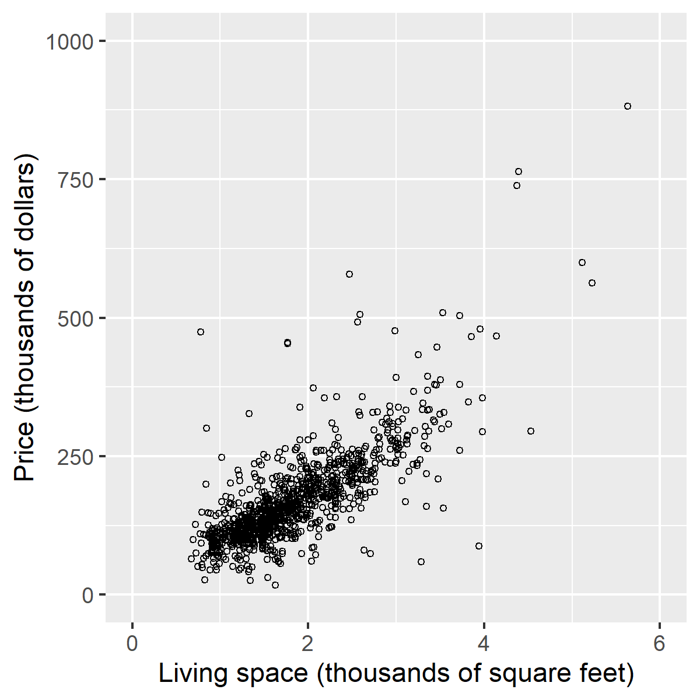

<div class="notes">

This shows a simple scatterplot. The x-axis represents the size of a house and the y-axis represents the price that the house sold for.

</div>

### Synopsis

+ Definition of a scatterplot
+ Options you control
  + Location
  + Size
  + Shape
  + Color

<div class="notes">

Here is the abstract associated with this talk. I don't want to read this word for word, but I am including it here so I can refer to it as necessary during the development of this presentation.

"Practical suggestions for improving your scatterplots"

"The scatterplot is a simple display of the relationship between two or sometime three variables. You have a wide range of options for displaying a scatterplot. In particular, you can control the location, size, shape, and color of the marks in your scatterplot. Careful selection among these options will allow your audience to rapidly and accurately understand this relationship. Here are some important dos and don'ts. Don't use a gradient to represent a nominal variable. Use open circles rather than closed circles if there is a lot of overprinting. Vary the size or the shape of your data marks, but not both. Always pair color with another feature in your plots. Most importantly, never blindly accept the first graph that comes out of your software program. Revise your graphs as often as you revise your writing."

</div>

### Synopsis

+ Recommendations
  + Don't use gradients for categories
  + Open circles if there is overprinting
  + Vary size or shape, not both
  + Pair color with second feature
  + Revise, revise, revise

<div class="notes">

There are five general recommendations I want to make about scatterplots.

</div>

### Your main homework assignment
+ What one thing will you do differently?
  + Write down during the webinar
  + Share at the end
  + Not graded
  
<div class="notes">

Normally, I do not assign work in these webinars, but I have a special favor to ask. As you are listening to this talk, you may discover something that makes you do things differently from now on. If so, jot that down so you can share it with me at the end of the class. If you didn't discover anything that you will do differently, that's okay also.

</div>

### General principles

+ Two quantifiable criteria for an effective graph
  + Speed
  + Accuracy
  
<div class="notes">

Everybody has opinions, but data trumps all. If you want to demonstrate empirically that one particular graph is more effective than another graph, you want to measure one of two things.

First, how quickly can a viewer answer a question about the graph?

Second, how accurately can a viewer answer a question about the graph?

This second point is particularly important. Your graph is not a puzzle that challenges your reader to stare long and hard to find the hidden patterns. If a reader looks at your graph and does not immediately undestand the message that you are trying to convey with this graph, then you should go back to the drawing board. 

</div>

### Example of an empirical study

:::::: {.columns}
::: {.column}

:::
::: {.column}
+ Simkin D, Hastie R. An Information-Processing Analysis of Graph Perception. Journal of the American Statistical Association 1987: 82(398); 454-465.
  + Which is bigger, left or right?
  + Estimate percentage for smaller value.
:::
::::::

<div class="notes">

An early example of this type of empirical study was done in 1987 by David Simkin and Reid Hastie. They showed graphs like the ones on the left, varying the size and disparity of the bars or pie wedges. They asked two questions. Looking at the the bars/wedges indicated by the dots, which is bigger the one of the left or the one on the right? What is the percentage that you would estimate for the smaller of the two?

The researchers then measured the time it took each subject to answer these questions and how accurate those answers were.

Read the paper for the full answer, but surprisingly, the pie chart turned out to be better in some settings. Better in what sense? Better in speed and accuracy.

</div>

### A five dimensional scatterplot
  
```{r first-plot}
load("../data/saratoga_housing.RData")
library(ggplot2)
sb <- sa
sb$Fireplace <- factor(sa$Fireplace)
plot_framework <- ggplot(
  sb, aes(Size, Price, shape=Fireplace, color=Baths, size=Bedrooms)) +
  theme(legend.position="none") + 
  expand_limits(x=c(0, 6), y=c(0, 1000)) +
  xlab("Living space (thousands of square feet)") +
  ylab("Price (thousands of dollars)")
kitchen_sink_plot <-  plot_framework + geom_point()
ggsave("../images/kitchen-sink-plot.png", kitchen_sink_plot, height=4, width=4)
```


<div class="notes">

Here's a plot that shows the five features that you have available in a scatterplot. This is not a plot format that I would recommend, just one that illustrates a basic concept.

The dataset comes from a website called DASL which is short for Data And Story Library. It represents a survey of housing prices in Saratoga, New York. For each house sale, there is information about the house, such as square footaage, number of bedrooms, number of bathrooms, and whether the house has a fireplace.

</div>

### Highlight two marks

```{r second-plot}
# 724, 791
# 724, 212

n <- dim(sa)[1]
p1 <- 915
p2 <- 212
pts <- (1:n) %in% c(p1, p2)
sa$highlight <- ifelse(pts, 1, 0.06)
faded_plot <- plot_framework + geom_point(alpha=sa$highlight)
ggsave("../images/faded-plot.png", faded_plot, width=4, height=4)
```


<div class="notes">

I want to highlight just two data marks in this graph to show what the five dimensions are going to be.

</div>

### X dimension <- Linving space

```{r}
x_dimension <- faded_plot + 
  geom_text(x=sa$Size[p1], y=0, label=round(sa$Size[p1], 1), size=4, color="black") +
  geom_text(x=sa$Size[p2], y=0, label=round(sa$Size[p2], 1), size=4, color="black")
ggsave("../images/x-dimension.png", x_dimension, width=4, height=4)
```


<div class="notes">

The X dimension shows the size in thousands of square feet for each house. The two houses hightlighted have 1,300 and 5,200 square feet.

</div>

### Y dimension <- Price

```{r}
y_dimension <- faded_plot + 
  geom_text(x=0.2, y=sa$Price[p1], label=round(sa$Price[p1]), size=4, color="black") +
  geom_text(x=0.2, y=sa$Price[p2], label=round(sa$Price[p2]), size=4, color="black")
ggsave("../images/y-dimension.png", y_dimension, width=4, height=4)
```

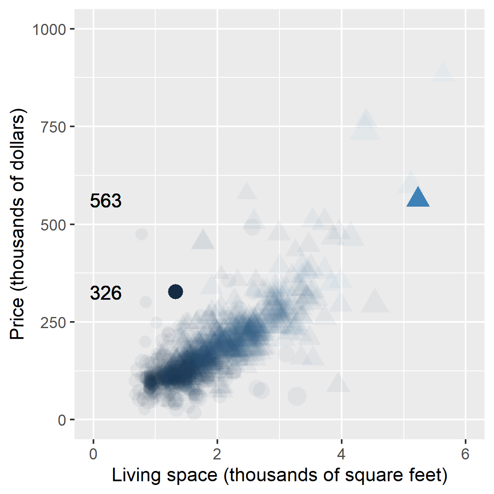

<div class="notes">

The Y dimension shows the price in thousands of dollars for each house. The two houses sold for 326 thousand dollars and 563 thousand dollars.

</div>


### Size dimension <- Number of bedrooms

```{r}
size_dimension <- faded_plot + 
  geom_text(x=sa$Size[p1], y=sa$Price[p1]+75, label=sa$Bedrooms[p1], size=3, color="black") +
  geom_text(x=sa$Size[p2], y=sa$Price[p2]+75, label=sa$Bedrooms[p2], size=5, color="black")
ggsave("../images/size-dimension.png", size_dimension, width=4, height=4)
```


<div class="notes">

The size of the data mark is proportional to the number of bedrooms. The smaller of the two highlighted marks is a house with three bedrooms. The larger is a house with four bedrooms.

</div>


### Shape <- Fireplace indicator

```{r}
shape_dimension <- faded_plot + 
  geom_text(x=sa$Size[p1], y=sa$Price[p1]+75, label="No fireplace", size=4, color="black") +
  geom_text(x=sa$Size[p2], y=sa$Price[p2]+75, label="Fireplace", size=4, color="black")
ggsave("../images/shape-dimension.png", shape_dimension, width=4, height=4)
```

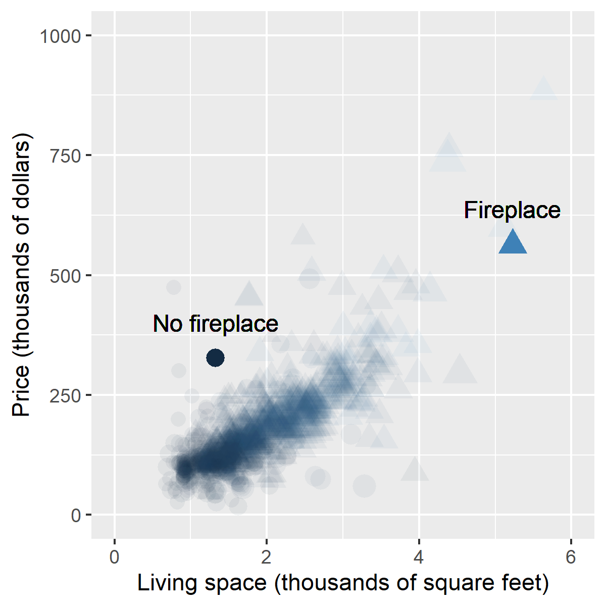

<div class="notes">

The shape of the mark indicates whether the house has a fireplace. A triangle represents a house with a fireplace and a circle represents a house without a fireplace.

</div>

### Color <- Number of bathrooms

```{r}
color_dimension <- faded_plot + 
  geom_text(x=sa$Size[p1], y=sa$Price[p1]+75, label=sa$Baths[p1], size=4, color=sa$Baths[p1]) +
  geom_text(x=sa$Size[p2], y=sa$Price[p2]+75, label=sa$Baths[p2], size=4, color=sa$Baths[p2])
ggsave("../images/color-dimension.png", color_dimension, width=4, height=4)
```


<div class="notes">

The color of the data mark indicats how many bathrooms a house has. The black data mark indicates only one bathroom and the blue data mark indicates four bathrooms.

</div>

### Five dimensions of a scatterplot

:::::: {.columns}
::: {.column}

:::
::: {.column}
+ Dimensions
  + X <- Living space
  + Y <- Price
  + Size <- Bedrooms
  + Shape <- Fireplace
  + Color <- Baths
:::
::::::

<div class="notes">

Here's what open circles do to a scatter plot of living space versus price. It only helps a little, but you can start to see the difference between regions that have a moderate amount of data versus a much larger amount of data.

</div>

### Break #1

+ What have you learned
  + Five dimensions of a scatterplot (x, y, size, shape, and color)
+ What's coming up next
  + Mitigating the problem of overprinting

<div class="notes">

Let me stop again and see if there are any questions.

</div>

### Mitigating overprinting
+ Cluster of tightly packed points
+ Partial solutions
  + Open symbols
  + Small size
  + Log transformation
  + Opacity
  + Jittering

<div class="notes">

The biggest problem with many graphs is overprinting. So much data ends up producing a big black uninterpretable blob.  More often than not, it makes it harder for you to properly interpret a plot.

There are several solutions that can help somewhat with overprinting.

</div>

### Mitigating overprinting: Open symbols

```{r open}
x0 <- c(12, 13, 14, 14) 
y0 <- c(12, 12, 13, 14)
artificial_data <- data.frame(
  x=c(x0, x0+15),
  y=c(y0+10, y0+10)
)
lims <- c(10, 30)
open_circles <- ggplot(artificial_data, aes(x, y)) +
  theme_void() +
  expand_limits(x=lims, y=lims) +
  geom_point(size=20, shape=rep(c(16, 1), each=4))
ggsave("../images/open-circles.png", open_circles, width=4, height=4)
```


<div class="notes">

If you look at the figure to the left, it looks like it might be three or maybe four data marks all clustered together. There is a bit of an indentation in the southeast corner of this blog that gives a hint that it is really four rather than three data marks. The figure on the right uses open circles and you can tell much faster that there are indeed four data marks.

</div>

### Mitigating overprinting: Open symbols

:::::: {.columns}
::: {.column}

:::
::: {.column}

:::
::::::

<div class="notes">

Here's what open circles do to a scatter plot of living space versus price. It only helps a little, but you can start to see the difference between regions that have a moderate amount of data versus a much larger amount of data.

</div>

### Mitigating overprinting: Small size marks

```{r small-size}
x0 <- c(12, 13, 14, 14) 
y0 <- c(12, 12, 13, 14)
artificial_data <- data.frame(
  x=c(x0, x0+15),
  y=c(y0+10, y0+10)
)
lims <- c(10, 30)
small_size <- ggplot(artificial_data, aes(x, y)) +
  theme_void() +
  expand_limits(x=lims, y=lims) +
  geom_point(shape=16, size=rep(c(20, 7), each=4))
ggsave("../images/small-size.png", small_size, width=4, height=4)
```


<div class="notes">

If you use smaller data marks, you will be able to separate out the four indvidual data marks in this cluster. There are disadvantages to smaller data marks. They sometimes make it easier for you to ignore outliers. They also cause problems when you want to use different shapes, as the shapes become less distinguishable for smaller sizes. But they work well for mitigating overprinting.

</div>


### Mitigating overprinting: Small size marks

:::::: {.columns}
::: {.column}

:::
::: {.column}

:::
::::::

<div class="notes">

In the living space by price scatterplot, the smaller marks make it much easier to see where the individual data points are.

You can shrink this down to a single pixel, if you like. The plot looks like dust specks. Sometimes that ends up revealing a lot more of what is going on near the center of the data blob.

</div>

### Mitigating overprinting: Opacity

```{r opacity}
x0 <- c(12, 13, 14, 14) 
y0 <- c(12, 12, 13, 14)
artificial_data <- data.frame(
  x=c(x0, x0+15),
  y=c(y0+10, y0+10)
)
lims <- c(10, 30)
transparent_marks <- 
  ggplot(artificial_data, aes(x, y)) +
  theme_void() +
  expand_limits(x=lims, y=lims) +
  geom_point(shape=16, size=20, alpha=rep(c(1, 0.2), each=4))
ggsave("../images/transparent-marks.png", transparent_marks, width=4, height=4)
```


<div class="notes">

Opacity is the degree to which you can see through a data mark to whatever is behind it. Opacity is sometimes referred to as transparency. It is usually a number between 0 and 1 with an opacity of 1 or a transaparency of 0 representing totally opaque or no transparency.

A data mark with partial opacity appears lighter than a fully opaque data mark because you can see through it to the white background. When two points with partial opacity overlap, however, the area of overlap appears less transparent or more opaque. This usually means that the overlap is darker.

Notice with the partial opacity data points to the right that you can identify overlapping areas, which helps you to quickly identify that there are four data points in this cluster.

</div>

### Mitigating overprinting: Opacity

:::::: {.columns}
::: {.column}

:::
::: {.column}

:::
::::::

<div class="notes">

Here is a comparison to fully opaque data marks to semi-transparent data marks. The effect can sometimes minimize the effect of outliers, but it does help reveal the structure of the main cluster of data. The carker gray colors represent areas with a moderate number of data values and the totally black colors represent areas with many more data values.

</div>

### Mitigating overprinting: Log scale

```{r log-scale00}
y0 <- seq(-4, 3, length=100)
x0 <- 2^y0
artificial_data <- data.frame(
  x=x0,
  y=y0
)
log_plot00 <- 
  ggplot(artificial_data, aes(x, y)) +
    theme_void() +
    expand_limits(x=c(-2, 9), y=c(-7, 6)) +
    geom_line()
ggsave("../images/log-plot00.png", log_plot00, width=4, height=4)
```


<div class="notes">

Often your data is crowded in the lower left corner of your graph. This is caused by skewness in your variables. A log transformation can often help in such a situation.

Here's a picture of the log function. It is steep on the left (first derivative much larger than 1) and closer to flat on the right (first derivative much smaller than 1).

</div>


### Mitigating overprinting: Log scale

```{r log-scale01}
a <- 0.3
b <- 0.8
log_plot01 <- log_plot00 + 
    geom_segment(x=a, y=-4.1, xend=a, yend=log2(a)) +
    geom_segment(x=b, y=-4.1, xend=b, yend=log2(b)) +
    geom_segment(x=-0.3, y=log2(a), xend=a, yend=log2(a)) +
    geom_segment(x=-0.3, y=log2(b), xend=b, yend=log2(b)) +
    geom_text(x=a, y=-5, label=a, angle=90) +
    geom_text(x=-1, y=log2(a), label=round(log2(a), 1)) +
    geom_text(x=b, y=-5, label=b, angle=90) +
    geom_text(x=-1, y=log2(b), label=round(log2(b), 1))
ggsave("../images/log-plot01.png", log_plot01, width=4, height=4)
```


<div class="notes">

The steepness on the left means that the log function tends to stretch out small values. The data points 0.3 and 0.8 are half a unit apart, but after the log transformation they are 1.4 units apart.

</div>


### Mitigating overprinting: Log scale

```{r log-scale02}
a <- 3
b <- 6
log_plot02 <- log_plot00 + 
    geom_segment(x=a, y=-4.1, xend=a, yend=log2(a)) +
    geom_segment(x=b, y=-4.1, xend=b, yend=log2(b)) +
    geom_segment(x=-0.3, y=log2(a), xend=a, yend=log2(a)) +
    geom_segment(x=-0.3, y=log2(b), xend=b, yend=log2(b)) +
    geom_text(x=a, y=-5, label=a, angle=90) +
    geom_text(x=-1, y=log2(a), label=round(log2(a), 1)) +
    geom_text(x=b, y=-5, label=b, angle=90) +
    geom_text(x=-1, y=log2(b), label=round(log2(b), 1))
ggsave("../images/log-plot02.png", log_plot02, width=4, height=4)
```


<div class="notes">

The relative flatness on the right means that the log function tends to squeeze large values together. The values of 3 and 6 are 3 units apart, but after a log transformation, they are only 1 unit apart.

By stretching the values stuck in a large blob in the lower left corner of the graph and squeezing the few outlying values elsewhere, you often end up with a spread of data that is much more uniform across the plotting area.

A small hint: don't try a log transformation, unless your data has a large relative range. If your largest value is not at least three times as large as your smallest value, then the log transformation is unlikely to have an impact.

Also, you can't use a log transformation if you have zeros or negative values in your data.

</div>

### Mitigating overprinting: Log scale

:::::: {.columns}
::: {.column}

:::
::: {.column}

:::
::::::

<div class="notes">

Notice how the plot on the log scale tends to fill up the plotting area a bit more efficiently. This helps reduce overprinting a bit.

</div>

### Mitigating overprinting: Jittering

:::::: {.columns}
::: {.column}

:::
::: {.column}
:::
::::::

<div class="notes">

I have to switch to a different set of variables to better illustrate jittering. The Y axis is still price, but the X axis is now the number of bedrooms, and most of the data values are now squished together into vertical lines.

You could use a boxplot here, but jittering is also effective. Jittering is a random shift of datapoints to the left or right (sometimes up and down as well) to help spread the data out a little bit.

</div>

### Mitigating overprinting: Jittering

:::::: {.columns}
::: {.column}

:::
::: {.column}

:::
::::::

<div class="notes">

I have to switch to a different set of variables to better illustrate jittering. The Y axis is still price, but the X axis is now the number of bedrooms, and most of the data values are now squished together into vertical lines.

You could use a boxplot here, but jittering is also effective. Jittering is a random shift of datapoints to the left or right (sometimes up and down as well) to help spread the data out a little bit.

</div>

### Mitigating overprinting: Combination

:::::: {.columns}
::: {.column}

:::
::: {.column}

:::
::::::

<div class="notes">

Here's a plot that combines three of these partial solutions: size, open circles, and a log scale.

I'm not sure if this would be my final plot, but I think it is a big improvement over the original plot on the left.

</div>

### Break #2

+ What you have learned
  + Strategies for mitigating overprinting
+ What's coming next
  + Issues with shape and size
+ What one thing will you do differently?
  
<div class="notes">

Let's stop and see if there are any questions.

Remember to think about what you might do differently. If you have something, write it down so we can share this at the end of the talk.

</div>

### Problem with open and closed shapes together

```{r open-and-closed}
open_closed01 <- 
  ggplot(sb, aes(Size, Price, shape=Fireplace)) + 
  xlab("Living space (thousands of square feet)") +
  ylab("Price (thousands of dollars)") +
  scale_shape_manual(values = c(1, 16)) +
  geom_point()
ggsave("../images/open-closed01.png", open_closed01, width=4, height=4)
open_closed02 <- 
  ggplot(sb, aes(Size, Price, shape=Fireplace)) + 
  xlab("Living space (thousands of square feet)") +
  ylab("Price (thousands of dollars)") +
  scale_shape_manual(values = c(16, 1)) +
  geom_point()
ggsave("../images/open-closed02.png", open_closed02, width=4, height=4)
```

:::::: {.columns}
::: {.column}

:::
::: {.column}

:::
::::::

<div class="notes">

In a fight between open and closed symbols, the closed symbols always win. Notice in the left side plot, it looks like most of the houses have fireplaces (Fireplace=1 is the closed circle). In the second plot, it looks like most of the houses do not have fireplaces (Fireplace=0 is the closed circle). In fact the split is pretty close to even. `r round(100*sum(sa$Fireplace)/length(sa$Fireplace))`% of the houses have fireplaces.

</div>


### Don't use too many shapes

```{r too-many-symbols}
sb <- sa
sb$Bedrooms <- factor(sa$Bedrooms)

too_many_symbols <- 
  ggplot(sb, aes(Size, Price, shape=Bedrooms)) + 
  xlab("Living space (thousands of square feet)") +
  ylab("Price (thousands of dollars)") +
  scale_shape_manual(values = 0:6) +
  geom_point()
ggsave("../images/too-many-symbols.png", too_many_symbols, width=4, height=4)
```


<div class="notes">

This plot has two problems. First, it uses too many symbols. It turns the graph into a kind of puzzle where you are constantly going back and forth between the legend and the graph itself because no one can remember what all seven of the symbols represent.

The second problem is that number of bedrooms is not categorical. You want the greatest distinction to be between 1 bedrooms and 7 bedrooms and differences smaller than that should have proportionately less distinction.

</div>

### An alternative with only two shapes

```{r symbol-choices}
sa$FourPlusBedrooms <- ifelse(sa$Bedrooms>=4, "4+ BR", "1-3 BR")
two_symbols <- 
  ggplot(sa, aes(Size, Price, shape=FourPlusBedrooms)) + 
  xlab("Living space (thousands of square feet)") +
  ylab("Price (thousands of dollars)") +
  geom_point() +
  scale_shape_manual(values = c(4, 1))
ggsave("../images/two-symbols.png", two_symbols, width=4, height=4)
```

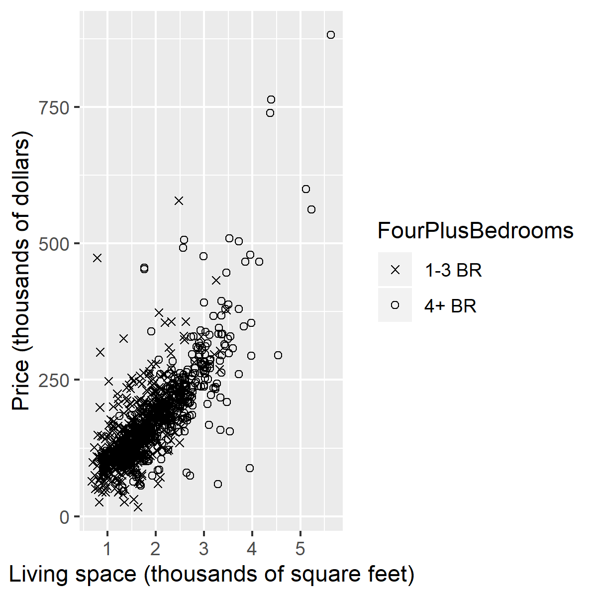

<div class="notes">

Here is a better plot. You lose a bit of information by using only two shapes, but the plot is simpler and easier to interpret.

</div>


### Using text instead of symbols

```{r symbol-text01}
number_codes <- 
  ggplot(sa, aes(Size, Price, label=Bedrooms)) + 
  xlab("Living space (thousands of square feet)") +
  ylab("Price (thousands of dollars)") +
  geom_text()
ggsave("../images/number-codes.png", number_codes, width=4, height=4)
```

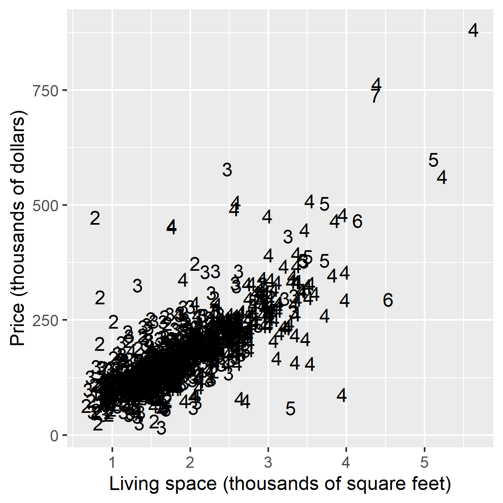

<div class="notes">

Sometimes a simple bit of text works better than symbols. In most software system, it is pretty easy to print the actual number where mark should be. It works great for single digit numbers, and sometimes even for two digit numbers

</div>

### Using text instead of symbols

```{r symbol-text02}
sa$Fireplace_code <- ifelse(sa$Fireplace==1, "Y", "N")
letter_codes <- ggplot(sa, aes(Size, Price, label=Fireplace_code)) + 
  xlab("Living space (thousands of square feet)") +
  ylab("Price (thousands of dollars)") +
  geom_text()
ggsave("../images/letter-codes.png", letter_codes, width=4, height=4)
```

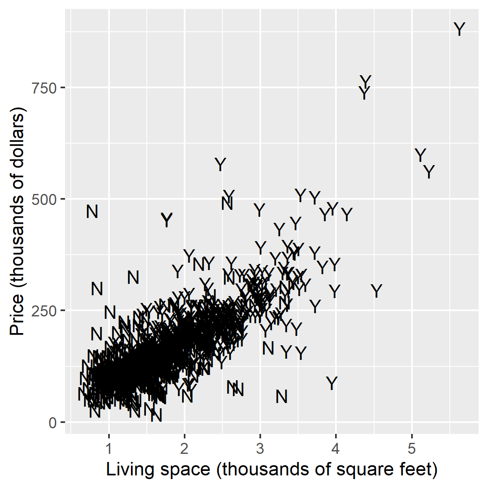

<div class="notes">

Here's another example using letters.

Other examples might be M for male and F for female, T for treatment and C for control.

</div>

### Example using size: the bubble chart

```{r size-bedrooms}
bubble_chart <- 
  ggplot(sa, aes(Size, Price, size=Bedrooms)) + 
  xlab("Living space (thousands of square feet)") +
  ylab("Price (thousands of dollars)") +
  geom_point(shape=1)
ggsave("../images/bubble-chart.png", width=4, height=4)
```

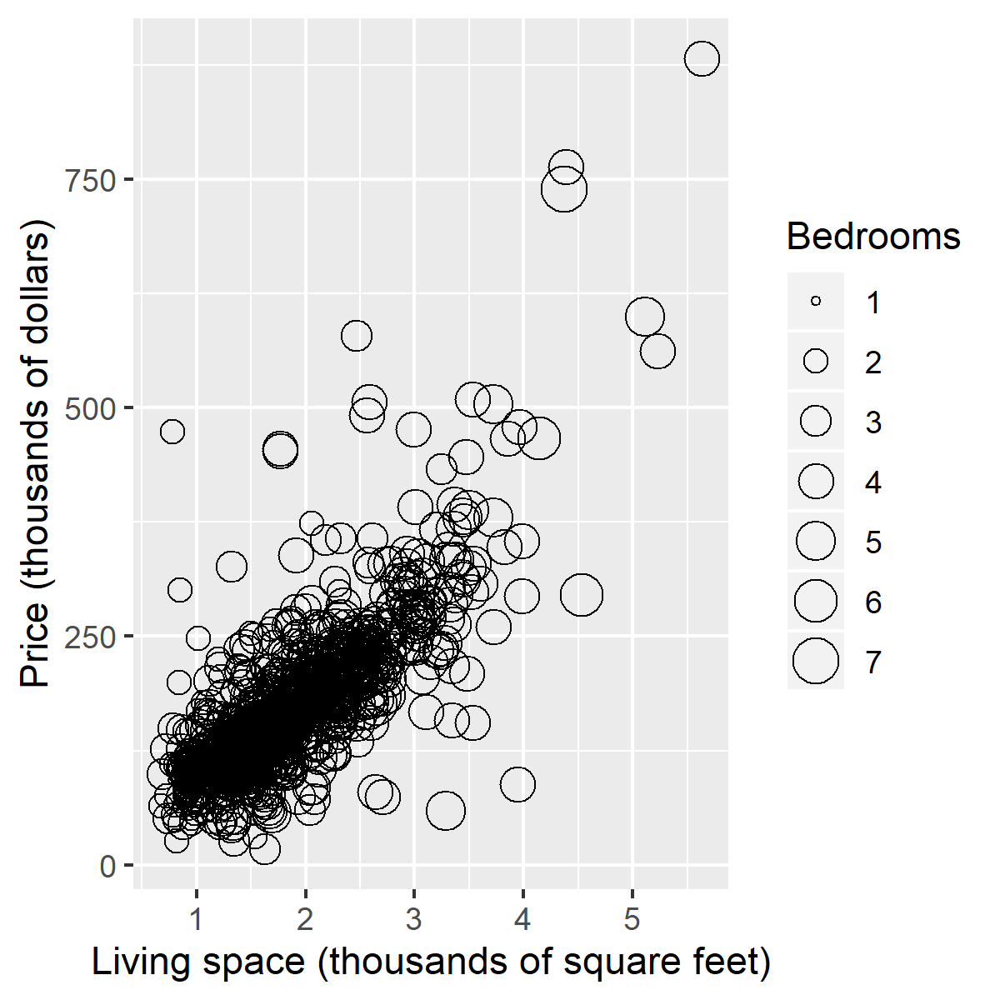

<div class="notes">

This plot shows how the size of the mark can indicate a third variable. In this case, it is the number of bedrooms. This type of plot is often called a bubble chart. We've seen far too many bubble charts since the start of the COVID-19 crisis, and those bubbles are getting bigger all the time.

</div>

### Never use size for categorical data

```{r size-categorical}
acre_splits <- quantile(sa$Acres, probs=c(0.25, 0.5, 0.75))

sa$Style <- 1 + 
  (sa$Acres > acre_splits[1]) +
  (sa$Acres > acre_splits[2]) +
  (sa$Acres > acre_splits[3])
size_categorical <- 
  ggplot(sa, aes(Size, Price, size=Style)) + 
  xlab("Living space (thousands of square feet)") +
  ylab("Price (thousands of dollars)") +
  geom_point(shape=1)
ggsave("../images/size_categorical.png", width=4, height=4)
```


<div class="notes">

Never use size for a categorical variable. You'll be able to make easy categorical distinctions on the categories that just happen to have the most extreme values, but the choice of values for a categorical variable are arbitrary.

You want all categories to be well distinguished from the other values, but with size, the values in the middle are difficult to distinguish.

Here, you can easily tell the difference between an A-frame style (size=1) and a Victorian style (size=4). But it is a bit harder to distinguish between a Ranch style (size=2) and a Split-level (size=3).

</div>

### Size: proportional to area or radius?

```{r area-versus-diameter}
size_values <- 
  data.frame(
    x=rep(1:9, 3),
    y=rep(1:3, each=9),
    z=rep(c(rep("\U25EF", 18), 1:9)),
    s=c(3*(1:9), 3*sqrt(1:9), rep(5, 9))
  )
area_chart <- 
  ggplot(size_values, aes(x, y, label=z)) + 
  geom_text(size=size_values$s) +
  expand_limits(y=c(0, 4)) +
  expand_limits(x=c(-1, 10)) +
  geom_text(x=0, y=1, label="Radius", size=5) +
  geom_text(x=0, y=2, label="Area", size=5) +
  theme_void()
ggsave(
  "../images/area-chart.png", 
  area_chart, width=8, height=4)
```


<div class="notes">

Example: Ranch, Split-level, Two-story, Victorian

Never use size for a categorical variable. You want all the categories to be equally distinguishable, and categories given the middle sizes end up looking too much alike.

If size represents a continuous variable, do you want the size to be proportion to the diameter of your circle (or the length of your square)? Or would it be better to make the area of your circle or square proportional to the data value. There's been a lot written on this, and the general consensus is to use area.

</div>

### Size and shape don't mix

```{r size-and-shape}
p1 <- 103
p2 <- 409
co <- rep("black", dim(sa)[1])
co[p1] <- "red"
co[p2] <- "red"
size_and_shape <- 
  ggplot(sa, aes(Size, Price, size=Bedrooms, shape=factor(Fireplace))) + 
  xlab("Living space (thousands of square feet)") +
  ylab("Price (thousands of dollars)") +
  scale_shape_manual(values = c(0, 1)) +
  theme(legend.position="none") +
  geom_point(color=co)
ggsave("../images/size-and-shape.png", size_and_shape, width=4, height=4)
```

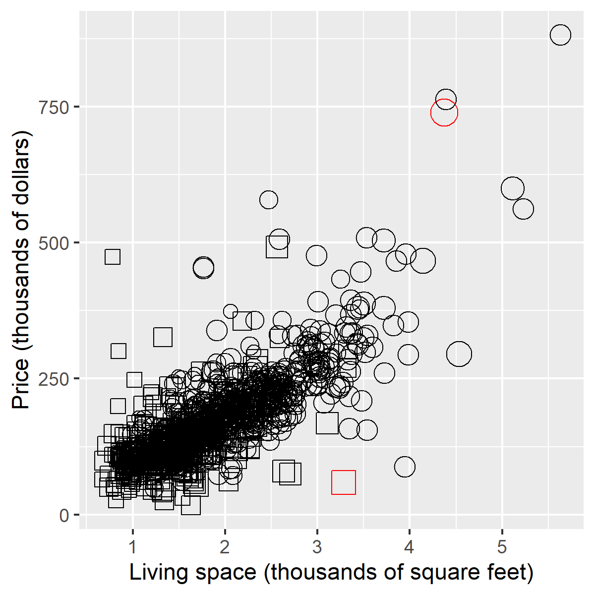

<div class="notes">

It is difficult to compare the size of two marks when they have different shapes. Take this graph, for instance. Identify the house with the most bedrooms. Is it that red square near the middle bottom or the red circle near the top right?

The size of the circle is clearly going to be the diameter, but do you measure the size of the square by one of its sides of by its diagonal? The size of the square is less than the diameter of the circle, but the diagonal is not.

</div>

### Break #3

+ What have you learned
  + Issues with shapes and sizes
+ What's coming next
  + Issues with color
+ What one thing will you do differently?
  
<div class="notes">

Let's stop again and see if there are any questions.

If you have heard something that makes you want to do something differently, write it down, please.

</div> 

### Colors, Everything I know about colors, I learned in Kindergarten.


<div class="notes">

It was probably in Kindergarten where you learned the basic way to combine primary colors. Yellow plus red equals orange, Yellow plus blue equals green. Red plus blue equals purple/violet.

It doesn't work that way on a computer screen because screens use light to create colors and lights blend in different ways than paints or crayons.

Before you tackle ths computer system for colors, you need to review binary and hexadecimal number systems.

</div>

### Colors, Codes for colors
+ #rrggbb format
  + #000000 is pure black
  + #FFFFFF is pure white
  + #FF0000 is pure red
  + #00FF00 is pure green
  + #0000FF is pure blue
+ You can mix and match to get 16,777,216 colors
  + #800080 is purple, #FF69B4 is pink, #40E0D0 is turquoise
  
<div class="notes">

The RGB format uses six hexadecimal digits to represent colors. A hexidecimal of all zeros is pure black and at the other extreme, a hexidecimal of all F's is pure white. 

The first two hexidecimal digits represent the red channel. The highest value FF for the red channel combined with zeros for the other two channels (#FF0000) equals pure red. 

The next two digits represent the green channel. #00FF00, giving the maximum to the green channel and the minimum to the other two channels produces a pure green. 

The last two digits represent the blue channel, and #0000FF represents pure blue.

You can combine these in a variety of ways. You end up with an almost unlimited number of colors. Six hexadecimal digits allow you to produce 16^6 or 16,777,216 different colors.

</div>

### Colors, Red plus green equals yellow

```{r red-plus-green}
add_colors <- function(c1, c2, c3) {
  df <- data.frame(
    x=rep(2, 3),
    y=3:1,
    b=c(c1, c2, c3)
  )
  ggplot(df, aes(x, y)) +
    geom_text(color=df$b, size=18, label=df$b) +
    expand_limits(x=c(0, 4), y=c(0, 4)) +
    geom_text(x=0.25, y=2, label="+", size=18) +
    geom_segment(x=0.75, y=1.5, xend=3.25, yend=1.5, size=3) +
    theme_void() +
    theme(
      panel.background=element_rect(fill="#808080"))
}
red_plus_green <- add_colors("#FF0000", "#00FF00", "#FFFF00")
ggsave("../images/red-plus-green.png", red_plus_green, width=4, height=4)
```


<div class="notes">

Whne you combine colors in the RGB system, they become lighter in color. So if you add red light (FF in the red channel) to green light (FF in the green chanel), you get yellow, which is FF in both the red and green channels.

</div>

### Colors, Red plus blue equals magenta

```{r red-plus-blue}
a3 <- c("#FF0000", "#FF0000", "#00FF00")
b3 <- c("#00FF00", "#0000FF", "#0000FF")
c3 <- c("#FFFF00", "#FF00FF", "#00FFFF")
red_plus_blue <- add_colors("#FF0000", "#0000FF", "#FF00FF")
ggsave("../images/red-plus-blue.png", red_plus_blue, width=4, height=4)
```


<div class="notes">

Red plus blue gives you #FF00FF, which is magenta, a light purplish red.

</div>

### Colors, Green plus blue equals cyan

```{r green-plus-blue}
green_plus_blue <- add_colors("#00FF00", "#0000FF", "#00FFFF")
ggsave("../images/green-plus-blue.png", green_plus_blue, width=4, height=4)
```


<div class="notes">

Green plus blue gives you #00FFFF, which is cyan, a greenish blue color.

</div>

### Basic colors have different luminance

```{r unequal-luminance}
x <- rep(0:9, each=10)
y <- rep(0:9, 10)
co <- ifelse(x < 4.5, "#0000FF", "#FFFF00")
unequal_luminance <- 
  ggplot(data.frame(x, y), aes(x, y)) + 
  theme_void() +
  geom_point(color=co, size=22, shape="square") +
  geom_point(x=2, y=5, color="#808080", size=22) +
  geom_point(x=7, y=5, color="#808080", size=22) 
ggsave("../images/unequal-luminance.png", unequal_luminance, width=4, height=4)
```

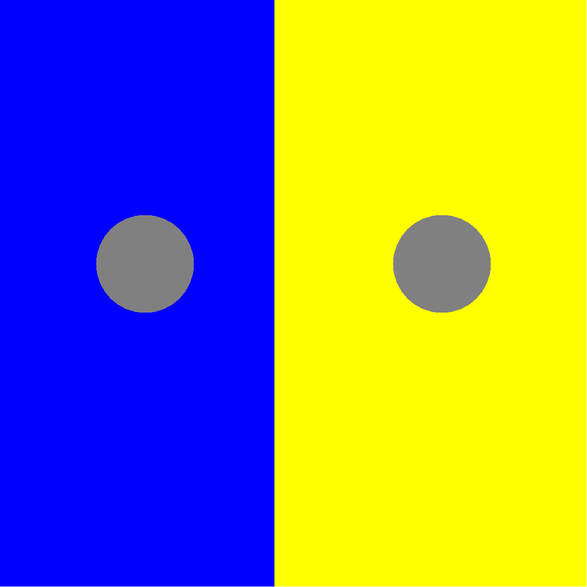

<div class="notes">

Among the basic colors, yellow is an outlier. It has a much higher luminance. meaning that at the same level of brightness on your computer monitor, it stimulates your optic nerves more than other colors.

This can lead to trouble. Notice the two gray dots shown on two different backgrounds. The gray in both cases is exactly halfway between black and white, but it appears darker when contrasted with yellow, because yellow has so much luminance.

</div>

### An attempt to equalize luminance

```{r equalize-luminance}
co <- ifelse(x < 4.5, "#DDDDFF", "#FFFF00")
equalize_luminance <- 
  ggplot(data.frame(x, y), aes(x, y)) + 
  theme_void() +
  geom_point(color=co, size=22, shape="square") +
  geom_point(x=2, y=5, color="#808080", size=22) +
  geom_point(x=7, y=5, color="#808080", size=22) 
ggsave("../images/equalize-luminance.png", equalize_luminance, width=4, height=4)
```


<div class="notes">

You can fix this by making blue lighter (closer to white).

Higher luminance colors tend to dominate a graphic image. You should try to use colors of roughly equal luminance to avoid this.

If you mix colors of different luminance, you will create artefacts that are unrelated to your data. The higher luminance colors will either tend to unfairly dominate the picture, or they will fade into the backgound and be lost.

</div>

### Color


<div class="notes">

It's a well known fasion mistake to wear too many colors at the same time. Maybe this guy could get away with it, but most of us would look like idiots if we tried to dress that way.

There's a similar lesson for data visualization.

</div>

### Recommendations, Don't overuse colors.


<div class="notes">

Naomi Robbins, an expert on data visualization, made an interesting observation. You would never make each word in a sentence a different color. So why would you make every bar, every point, and every line a different color?

Too many colors dilutes the impact that color can have.

You can use a second color to add emphasis. Or maybe a gradient between two different colors could work. Doing more than this is usually a big mistake.

</div>

### Count the fives

```{r count-nine-colors}
set.seed(123547)
n <- 30
x <- runif(n)
y <- runif(n)
z <- factor(1+floor(9*runif(n)))
df <- data.frame(x, y, z)
count_fives01 <- ggplot(df, aes(x, y, color=z)) +
  geom_text(label=z, size=6) +
  theme(legend.position="none")
ggsave("../images/count-fives01.png", count_fives01, width=4, height=4)
```


<div class="notes">

Here's an exercise that adapted from Olson and Bergen.

How many fives are there in this picture. I've used a different color for each number to make it easier for you to pick out any particular number. It takes a while, but you can see that there are three 5's, clustered in the lower right corner of the graph.

Did the colors help? Well, not all that much. It is hard to pick out nine colors and not have a few of them look very similar. In particular, the 5's and the 6's are pretty close, as are the 8's and the 9's.

</div>

### Count the fives

```{r count-two-colors}
set.seed(123547)
n <- 30
x <- runif(n)
y <- runif(n)
z <- factor(1+floor(9*runif(n)))
df <- data.frame(x, y, z)
co <- ifelse(z==5, "red", "black")
count_fives02 <- ggplot(df, aes(x, y)) +
  geom_text(label=z, size=6, color=co) +
  theme(legend.position="none")
ggsave("../images/count-fives02.png", count_fives02, width=4, height=4)
```


<div class="notes">

When you use a bit of restraint and only show two colors, you make the process of identifying all the fives much easier.

</div>

### Discrete colors

```{r discrete-colors, eval=TRUE}
library(RColorBrewer)
display.brewer.pal(9, "Dark2")
```


<div class="notes">

This is a nice set of colors. Each color is distinct from each other color and they are all roughly the same level of luminance. This makes the most sense for categorical data.

</div>

### Discrete colors

```{r discrete-colors-plot}
sb <- sa
sb$Style <- factor(sa$Style)
discrete_colors <- 
  ggplot(sb, aes(Size, Price, color=Style)) + 
  xlab("Living space (thousands of square feet)") +
  ylab("Price (thousands of dollars)") +
  geom_point(shape=1) + 
  scale_color_brewer(palette="Dark2")
ggsave("../images/discrete-colors.png", width=4, height=4)
```

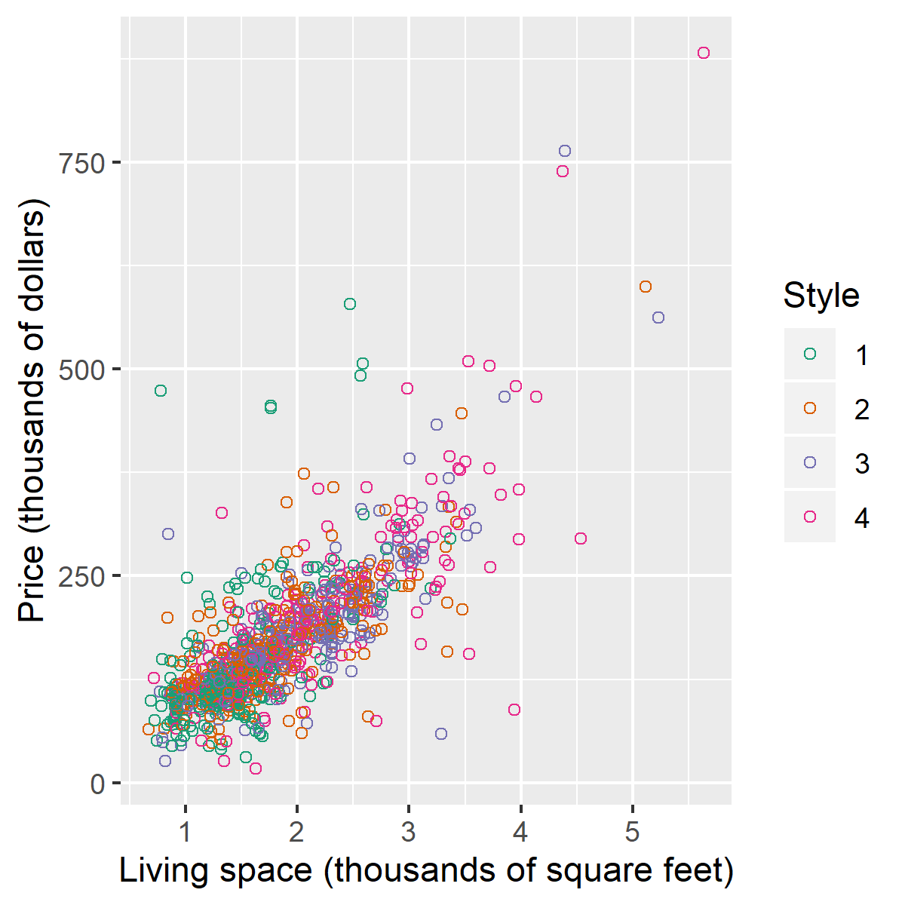

<div class="notes">

This plot shows what the first four discrete colors look like when they are representing the four house styles.

</div>

### Simple gradient

```{r simple-gradient, eval=FALSE}
library(RColorBrewer)
display.brewer.pal(9, "Greens")
```


<div class="notes">

A simple gradient transitions within a single color, usually from lighter shades of that color to darker shades.

Depending on the nature of your plot, one end of the gradient will be emphasized and one end will be de-emphasized.

</div>

### Simple gradient

```{r green-gradient}
sb$Bedrooms <- factor(sa$Bedrooms)
green_gradient <- 
  ggplot(sb, aes(Size, Price, color=Bedrooms)) + 
  xlab("Living space (thousands of square feet)") +
  ylab("Price (thousands of dollars)") +
  geom_point(shape=1) + 
  scale_color_brewer(palette="Greens")
ggsave("../images/green-gradient.png", width=4, height=4)
```


<div class="notes">

This shows what the green gradient looks like when applied to the number of bedrooms. Notice that the light green colors tend to fade into the background. This means that the low end of the scale is de-emphasized, and you tend to pay greater attention to those houses with a lot of bedrooms.

</div>

### Simple gradient

```{r green-gradient-reverse}
green_gradient_reverse <- 
  ggplot(sb, aes(Size, Price, color=Bedrooms)) + 
  xlab("Living space (thousands of square feet)") +
  ylab("Price (thousands of dollars)") +
  geom_point(shape=1) + 
  scale_color_brewer(palette="Greens", direction=-1)
ggsave("../images/green-gradient-reverse.png", width=4, height=4)
```


<div class="notes">

You can reverse this, so that the darker colors are associated with the smaller number of bedrooms.

That's a feature of most simple gradients. They tend to emphasize data at the upper extreme or data at the lower extreme. There are times when you definitely want this. In a plot using rates of a particular disease or illness, for example, you would want to focus on areas where the rates are unusually high. In a plot using signal strength for cell phone connections, you might want the opposite. You'd emphasize low values so that you would know where you needed extra cell phone towers.

</div>

### Diverging gradient

```{r diverging-gradient, eval=FALSE}
display.brewer.pal(9, "RdYlGn")
```


<div class="notes">

A diverging gradient moves between two distinct colors and takes a side trip in the middle to a third color. Typically, the middle color in a diverging gradient has a much higher luminence or a much lower luminence than the two extremes and is intended to fade into the background. The diverging gradient tends to emphasize the extremes and de-emphasize the middle.

</div>

### Diverging gradient

```{r diverging-gradient-example}
diverging_gradient_example <- 
  ggplot(sb, aes(Size, Price, color=Bedrooms)) + 
  xlab("Living space (thousands of square feet)") +
  ylab("Price (thousands of dollars)") +
  geom_point(shape=1) + 
  scale_color_brewer(palette="RdYlGn")
ggsave("../images/diverging-gradient-example.png", width=4, height=4)
```


<div class="notes">

Here is a plot using a diverging gradient to display the number of bedrooms. The houses with only one or two bedrooms are on the orange/red end of the gradient, and the houses with 5 or 7 bedrooms (there aren't that many of them) are on the green end of the gradient.

</div>

### Pairing color
+ Avoids problems reproduction
  + Poor quality
  + Black and white
+ Helps those with color blindness
+ Especially important for discrete scales
  
<div class="notes">

Color by itself is fragile. It looks nice on your computer screen, but sometimes the reproduction on a sheet of paper is not as good. It can really hurt you if you can only print on a black and white printer.

If some of your viewers have color blindness, they may miss out on an important feature of your plot.

The need to pair color with size or shape is especially important for categorical variables. The continuous variables will use a gradient that almost always has variations in luminance that is still discernable by people with color blindness. And the variations in luminance are not lost in a black and white reproduction.

</div>

### Pairing color

```{r discrete-letters}
sa$Style_letters <- "A"
sa$Style_letters[sa$Style==2] <- "R"
sa$Style_letters[sa$Style==3] <- "S"
sa$Style_letters[sa$Style==4] <- "V"
discrete_letters <- 
  ggplot(sa, aes(Size, Price, color=Style_letters, label=Style_letters)) + 
  xlab("Living space (thousands of square feet)") +
  ylab("Price (thousands of dollars)") +
  geom_text() + 
  theme(legend.position="none") +
  scale_color_brewer(palette="Dark2")
ggsave("../images/discrete-letters.png", width=4, height=4)
```


<div class="notes">

This graph combines the letters A, R, S, and V with the four discrete colors. It makes it a bit easier to pick out the particular housing styles. A-frames, for example, tend to have less living space. Victorian houses, in contrast, tend to have more living space.

</div>

### Break #4

+ What have you learned
  + Issues with color
+ What's next
  + Curse of dimensionality
  + Recommended books
+ What one thing will you do differently?

<div class="notes">

Just one more break. Are there any questions?

Also, please remember to write down anything that you've learned today that you will do differently in the future.

</div>

### The curse of dimensionality
+ Univariate vs bivariate vs multivariate
+ Multivariate with k>3 is very hard.
+ More dimensions = Slower comprehension

<div class="notes">

In your basic Statistics class, you learned about univariate statistics like means and standard deviations. These are one dimensional statistics because they involve only one variable. Then you learned about bivariate statistics, statistics that involve two variables. Simple examples of bivariate statistics include correlation and simple linear regression. Then you moved to multivariate statistics. These were the most complicated statistics because they involved three or more variables. A simple example is multiple linear regression or discriminant analysis.

You thought you were done. The cases 1 dimension, 2 dimension and 3 or more dimensions seems to about cover every possible case. But there is a difference between a 3 dimensional mutlivariate statistic (one that that uses 3 variables) and a 5, 50, or 500 dimensional multivariate statistic.

The same is true for data visualization. There are one dimensional approaches such as histograms, two dimensional approaches such as scatterplots, and multidimensional approaches that use other features like size, shape, and color. A three dimensional relationship that you illustrate on a scatterplot is not too hard, but what do you do with 5, 50, or 500 variables?

It's tempting to try to cram more and more information into a single plot, but this will hurt you more than it will help. A complex graph will slow your readers down and reduce their accuracy in understanding your message.

The problem with most graphs is they tend to overwhelm your short term memory. You have to keep too much coding in the forefront of your thought processes, and some of it ends up slipping away, so you have to pause and refresh your short term memory.

</div>

### The curse of dimensionality

+ Signs of too much information
  + A big legend
  + Too much similarity in colors or symbols
  + Need for explanatory notes

<div class="notes">

Some warning signs of a graph that is too complex are:

A legend that takes up more than a small fraction of your graphing region.

An overload of colors or symbols that forces you to make some of them very similar.

A need for an elaborate explanation of how your graph works.

</div>

### The curse of dimensionality
+ Solutions that don't solve the problem
  + Three dimensional plots
  + Scatterplot matrices
  + Panels
  + Animation
  
<div class="notes">

There have been many attempts 

</div>

### Three dimensional plots

```{r three-dimensional-plot}
library(scatterplot3d)
png("../images/three-dimensional.png",
  width=400, height=400)
scatterplot3d(
  sa$Size, 
  sa$Price, 
  sa$Bedrooms,
  xlab="Linving space",
  ylab="Price in thousands",
  zlab="Number of bedrooms")
quiet <- dev.off()
```


<div class="notes">

This is pretty much the default option for a three dimensional scatterplot in R. You can spend forever changing the viewpoint angle, but it is very very hard to do this well.

The main problem with a three dimensional scatterplot is that when you display it on a two dimensional computer screen, there are an infinite number of data points in three dimensions that correspond to a single pixel on your two dimensional screen.

</div>

### The curse of dimensionality


<div class="notes">

If that weren't bad enough, the three dimensional perspective distorts distance and direction. This simple illustration was not an M.C. Escher creation, but one that Escher used for much more elaborate artistry. The simple staircase shown here was developed by Roger Penrose.

Notice that three steps on one side of the stairs equals five steps on the opposite side. Also notice that the stairs seem to climb continuously.

</div>

### Scatterplot matrices

```{r scatterplot matrices}
png("../images/scatterplot-matrix.png",
  width=400, height=400)
pairs(
  ~ Size + Price + Bedrooms + Baths,   data=sa)
quiet <- dev.off()
```


<div class="notes">

This is a scatterplot matrix. You get to see all six of the possible pairwise scatterplots involving the four variables (living space, price, bedrooms, and bathrooms).

You lose a lot of resolution when you shrink each plot so much, and it's a bad tradeoff, more often than not.

</div>

### The curse of dimensionality

```{r panel}
panel_plot <- ggplot(sa, aes(Size, Price)) +
  geom_point() +
  facet_wrap(vars(Bedrooms))
ggsave(
  "../images/panel-plot.png",
  panel_plot, width=4, height=4)
```


<div class="notes">

There are also options for panels or facets where you plot subsets of the data in different graphs that are laid out in a rectangular grid.

This has the exact same problem as the scatterplot matrix. What you gain by adding a variable is lost by the smaller size that you have to endure.

</div>

### The curse of dimensionality


<div class="notes">

Animation offers a way to add another dimension. It looks impressive, but you have to spend too much time with the animation. 

There are visualization tools like slider bars and effects that occur when your mouse hovers over a data point.

These can sometimes help, but more often than not, they end up being cheap gimmicks that make you look impressive (wow, look at those programming skills), but which often add very little information.

</div>

### The curse of dimensionality
+ A line in the sand 
  + Never more than three dimensions
  + Never more than two colors (or one gradient)
  + Never more than two symbols

<div class="notes">

Let me draw a line in the sand that you should never cross without the risk of losing your readers.

Never try to fit more than three dimensions into a scatterplot. If you use both color and shape or both color and size, they have to be for the same variable.

Don't use more than two colors unless it is a gradient for a continuous variable.

Never use more than two shapes.

Every step you take beyond this baseline forces you to pay a price. Quite honestly, the gain in information by adding more symbols or colors or dimensions is usually so small that you end up with a net loss.

</div>

### Recommended books

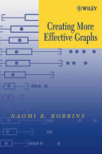

<div class="notes">

If you want to learn more about data visualization, start with this book. It is very applied and very easy to read.

Unfortunately, it may be out of print.

</div>

### Recommended books


<div class="notes">

Stephen Few's book goes into things in more depth. That might be intimidating to a novice, but it makes it an excellent second book to read. Like the Robbins book, it is very applied.

</div>

### Recommended books


<div class="notes">

Your third book should be Visual Revelations by Howard Wainer. Dr. Wainer is a great story teller and you learn a lot from each story that he tells. This book takes a look at data visualization from many many years ago and points out lessons that you can learn from this. It's teaching through analogy.

</div>

### Recommended books


<div class="notes">

Edward Tufte is a very interesting person. He looks beyond the world of graphics to more general principles of information design. That makes it much more high level. You are supposed to be inspired by the examples that Dr. Tufte presents. That's hard for a pure beginner, but once you have some of the more applied books under your belt, you will really appreciate the lessons that are offered in this book. It will help you develop an eye for what works and what doesn't work.

</div>

### Recommended books


<div class="notes">

I learned more from this book than any other. It might be a bit dated today, but it helps you understand why a graph works from the underlying issues of the psychology of perception. This is also a good book to read if you want to see some of the pioneering changes that were made in data visualization just before the turn of the century.

</div>

### Recommended books


<div class="notes">

This book has had a tremendous impact on data visualizaiton software, but it took ten years because no one really understood what the book was trying to say. It is a very difficult read, full of theory. It is probably best for those who write software rather than those who use it. Still, even for someone who is a user and not a programmer, the principlies elucidated in this book will help you think about graphs in a more fundamental structure.

</div>

### Your main homework assignment
+ What one thing will you do differently?
  + Share it in the chat box
  + Totally optional
  
<div class="notes">

Remember that I asked you about this earlier and reminded you during each break. If you have discovered something that makes you do things differently from now on, I'd love it if you could share that in the chat box. It's totally optional, of course.

</div>


### Conclusion
+ Mitigating overprinting
+ Some things don't mix
+ Don't jam too much in
+ Revise, revise, revise

<div class="notes">

Here are the general points that I covered. 

Strategies for mitigating overprinting include using open symbols, smaller symbols, opacity, log transformation, and jittering.

You have options to modify size, shape, and color, but some of these don't mix well. Open symbols disappear behind closed symbols, changing both size and shape is confusing, as are too many shapes or colors.

Finally, never accept the default options that come with a graph. Revise your graphs as often as you rewrite your text.

</div>

```{r save-everything}
save.image("../data/improving.RData")